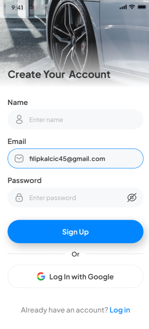
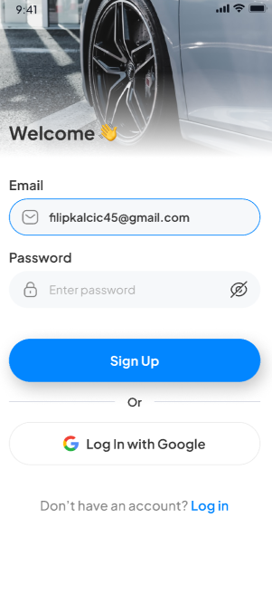
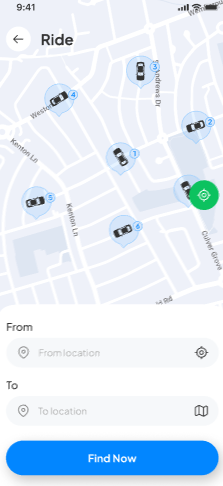
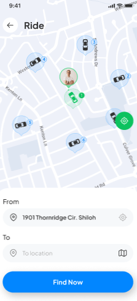
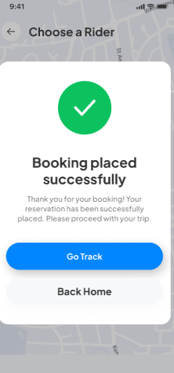
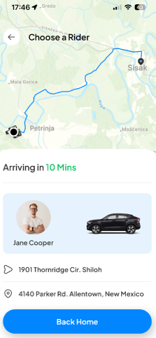
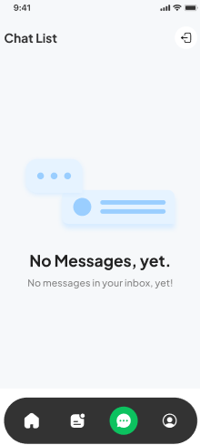
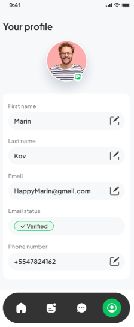

<div align="center">

#  Djir

**A full-stack ride-hailing mobile app built with React Native, Expo & a serverless Postgres backend.**

[](https://expo.dev/)
[](https://reactnative.dev/)
[](https://www.typescriptlang.org/)
[](https://www.nativewind.dev/)
[](LICENSE)

</div>

---

## Overview

**Djir** is a cross-platform (iOS, Android & web) ride-hailing application. Users sign up,
locate themselves on a live map, search for a destination, pick from nearby drivers with
real-time fare and ETA estimates, and pay securely in-app. Ride history is persisted to a
serverless Postgres database.

The app is built around Expo Router's file-based routing — including its **server API routes**,
which means the mobile client and the backend live in a single codebase and deploy together.

## ✨ Features

- **Onboarding** — a swipeable, illustrated welcome flow for first-time users.
- **Authentication** — email/password sign-up with email OTP verification and Google OAuth, powered by [Clerk](https://clerk.com/). Sessions are persisted with `expo-secure-store`.
- **Live map & location** — the user's current position is resolved with `expo-location` and rendered on Google Maps, alongside nearby drivers.
- **Smart ride search** — destination autocomplete via the Google Places API, with route lines and turn-by-turn directions drawn on the map.
- **Driver selection** — each available driver shows a computed ETA and fare price based on the route distance and time.
- **In-app payments** — full Stripe payment flow (card + Apple Pay) using the Stripe Payment Sheet.
- **Ride history** — completed rides are saved to and read back from Postgres, joined with driver details.
- **Profile** — view account details managed through Clerk.
- **Polished UX** — bottom sheets (`@gorhom/bottom-sheet`), reanimated transitions, and a custom design system styled with NativeWind (Tailwind) and the Plus Jakarta Sans typeface.
- **🧠 Smart pricing (ML)** — ETAs and fares are predicted by XGBoost models (trip duration + dynamic surge) trained on a **Databricks lakehouse** and served to the app, with a deterministic fallback. See the [ML Platform](ml-platform/).

## 🛠 Tech Stack

| Layer | Technology |
| --- | --- |
| Framework | React Native 0.74, Expo SDK 51 |
| Routing | Expo Router 3 (file-based routes **and** server API routes) |
| Language | TypeScript |
| Styling | NativeWind / TailwindCSS |
| Auth | Clerk (email OTP + Google OAuth) |
| Database | Neon (serverless PostgreSQL) via `@neondatabase/serverless` |
| Payments | Stripe (`@stripe/stripe-react-native` + Stripe server SDK) |
| Maps | `react-native-maps`, Google Places & Directions APIs |
| Geocoding | Geoapify (reverse geocoding for driver positions) |
| State | Zustand |
| **Data & ML** | **Databricks · Delta Lake · MLflow · Unity Catalog · XGBoost · FastAPI** |

## 🧱 Architecture

```
Mobile client (Expo Router screens)
        │
        ├── Zustand stores ........ local UI state (location, selected driver)
        │
        └── fetch() ─────────────► Expo Router API routes  (app/(api)/…)
                                          │
                                          ├── Neon serverless Postgres  (users, drivers, rides)
                                          └── Stripe REST API           (payment intents)
```

API routes under [`app/(api)`](app/\(api\)) run server-side and are the only place the database
URL and Stripe secret key are ever used — they are never exposed to the client bundle.

## 🧠 ML Platform — Smart Pricing

Djir isn't just a UI— it's the front-end of a real **data + ML platform**.
Ride events flow into a **Databricks lakehouse** (medallion: Bronze → Silver →
Gold), two **XGBoost** models learn the city's traffic and demand, and the app
calls a serving endpoint for a live, condition-aware price.

> **Same trip, different price:** Tresnjevka → Donji grad is **€5.86** on a quiet
> weekday afternoon and **€9.74** on a rainy Saturday night — predicted from
> 64,610 simulated Zagreb rides.

| Model | Predicts | Test MAE | vs. naive baseline | R² |
| --- | --- | --- | --- | --- |
| **ETA** | trip duration | 3.18 min | **−58%** | 0.883 |
| **Surge** | price multiplier | 0.065× | **−75%** | 0.938 |

The whole pipeline (data simulator → training → MLflow → serving) runs locally in
**one command** and the trained models are wired into the booking flow with a
deterministic fallback, so the app never breaks if the endpoint is down.

→ **[Explore the ML platform & runbook](ml-platform/)**  ·  **[Architecture & decision records](docs/architecture.md)**

## 📁 Project Structure

```
djir/
├── app/
│   ├── (api)/            # Server API routes (Stripe, users, rides, drivers, predict-price)
│   ├── (auth)/           # Welcome, sign-in, sign-up screens
│   ├── (root)/           # Authenticated app: tabs + ride-booking flow
│   ├── _layout.tsx       # Root layout, fonts, Clerk provider
│   └── index.tsx         # Entry redirect
├── components/           # Reusable UI (Map, RideCard, CustomButton, …)
├── constants/            # Static data, icon & image maps
├── lib/                  # Auth helpers, fetch hook, map utils, smart pricing (pricing.ts)
├── store/                # Zustand stores
├── types/                # Shared TypeScript declarations
├── assets/               # Fonts, icons & images
├── ml-platform/          # 🧠 ML platform: simulator, Databricks notebooks, models, FastAPI serving
├── docs/                 # Architecture, decision records & screenshots
└── schema.sql            # Database schema + sample driver seed data
```

## 🚀 Getting Started

### Prerequisites

- [Node.js](https://nodejs.org/) 18+ and npm
- The [Expo Go](https://expo.dev/go) app on a physical device, or an iOS Simulator / Android Emulator
- Free accounts for the services below (all have generous free tiers)

### 1. Clone & install

```bash
git clone https://github.com/FilipKalcic1/djir.git
cd djir
npm install
```

### 2. Configure environment variables

Copy the example file and fill in your own keys:

```bash
cp .env.example .env
```

| Variable | Where to get it |
| --- | --- |
| `EXPO_PUBLIC_CLERK_PUBLISHABLE_KEY` | [Clerk dashboard](https://dashboard.clerk.com/) → API Keys |
| `DATABASE_URL` | [Neon](https://neon.tech/) → connection string |
| `EXPO_PUBLIC_PLACES_API_KEY` | [Google Cloud](https://console.cloud.google.com/) → enable **Places API** |
| `EXPO_PUBLIC_DIRECTIONS_API_KEY` | Google Cloud → enable **Directions API** |
| `EXPO_PUBLIC_GEOAPIFY_API_KEY` | [Geoapify](https://www.geoapify.com/) → API Keys |
| `EXPO_PUBLIC_STRIPE_PUBLISHABLE_KEY` | [Stripe dashboard](https://dashboard.stripe.com/apikeys) (publishable) |
| `STRIPE_SECRET_KEY` | Stripe dashboard (secret) |
| `ML_ENDPOINT_URL` *(optional)* | URL of the [Djir smart-pricing endpoint](ml-platform/) — the app falls back to a built-in heuristic if unset |

### 3. Set up the database

Run the contents of [`schema.sql`](schema.sql) against your Neon database (the Neon SQL Editor
works well). It creates the `users`, `drivers` and `rides` tables and seeds a handful of sample
drivers so the home screen has something to show.

### 4. Run the app

```bash
npx expo start
```

Then scan the QR code with Expo Go, or press `i` / `a` to open a simulator.

> **Note:** Google Maps, native Stripe payments and Apple/Google OAuth work best in a
> development build or simulator — some native features are limited inside the Expo Go sandbox.

## 📜 Available Scripts

| Command | Description |
| --- | --- |
| `npm start` | Start the Expo dev server |
| `npm run android` | Open on Android |
| `npm run ios` | Open on iOS |
| `npm run web` | Open in the browser |
| `npm run lint` | Lint the project |

## 📸 Screenshots

> The complete Djir experience — designed in Figma, from first launch to live ride tracking.

### 🚀 Onboarding & Authentication

<table>
  <tr>
    <td align="center" width="25%"><br /><sub><b>Splash</b></sub></td>
    <td align="center" width="25%"><br /><sub><b>Onboarding</b></sub></td>
    <td align="center" width="25%"><br /><sub><b>Onboarding</b></sub></td>
    <td align="center" width="25%"><br /><sub><b>Onboarding</b></sub></td>
  </tr>
  <tr>
    <td align="center"><br /><sub><b>Get started</b></sub></td>
    <td align="center"><br /><sub><b>Sign up</b></sub></td>
    <td align="center"><br /><sub><b>Sign in</b></sub></td>
    <td></td>
  </tr>
</table>

### 🚕 Booking a Ride

<table>
  <tr>
    <td align="center" width="25%"><br /><sub><b>Nearby drivers</b></sub></td>
    <td align="center" width="25%"><br /><sub><b>Set pickup</b></sub></td>
    <td align="center" width="25%"><br /><sub><b>Current location</b></sub></td>
    <td align="center" width="25%"><br /><sub><b>Choose a rider</b></sub></td>
  </tr>
  <tr>
    <td align="center"><br /><sub><b>Ride details</b></sub></td>
    <td align="center"><br /><sub><b>Booking confirmed</b></sub></td>
    <td align="center"><br /><sub><b>Live tracking</b></sub></td>
    <td></td>
  </tr>
</table>

### 📋 Rides, Chat & Profile

<table>
  <tr>
    <td align="center" width="25%"><br /><sub><b>Ride history</b></sub></td>
    <td align="center" width="25%"><br /><sub><b>Chat</b></sub></td>
    <td align="center" width="25%"><br /><sub><b>Profile</b></sub></td>
    <td></td>
  </tr>
</table>

## 🗺 Roadmap

- [ ] Real-time driver tracking
- [ ] In-app chat with drivers
- [ ] Ride scheduling
- [ ] Push notifications

## 📄 License

Released under the [MIT License](LICENSE).

## 👤 Author

**Filip Kalčić** — [@FilipKalcic1](https://github.com/FilipKalcic1)
