<div align="center">


# Djir

**A ride-hailing app for Zagreb: Expo and React Native on a serverless Postgres backend, with Stripe payments and ML-priced fares.**

[](https://expo.dev/)
[](https://reactnative.dev/)
[](https://www.typescriptlang.org/)
[](https://stripe.com/)
[](#-built-to-be-trusted)
[](LICENSE)

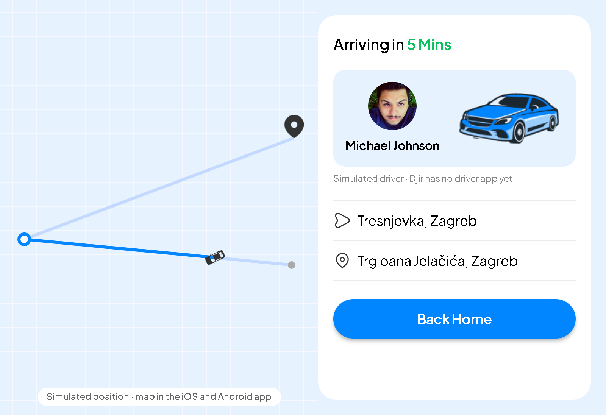

<sub>One ride from set-off to drop-off, rendered from the app's real tracking components with fixture data. The web build draws the whole route on a grid; on iOS and Android the map shows the current leg on a real map.</sub>

</div>

## 🚕 Overview

Riders sign up, find themselves on the map, pick a destination and a pickup time, and choose a driver. The fare comes from a quote the server signs. They pay in the app with Stripe, then watch the driver arrive. Scheduled rides can be cancelled for a refund until the driver sets off, and a local notification reminds the rider shortly before.

The mobile app and its backend live in one codebase: Expo Router serves the screens **and** the API routes. With a model endpoint set, prices come from two XGBoost models ([ML platform](ml-platform/)). The committed models were trained locally by the same code the Databricks notebooks run. A deterministic fallback prices whenever the endpoint is unset (the default), slow or down.

## ✨ Features

### 🚗 Live ride tracking

<table>
  <tr>
    <td align="center">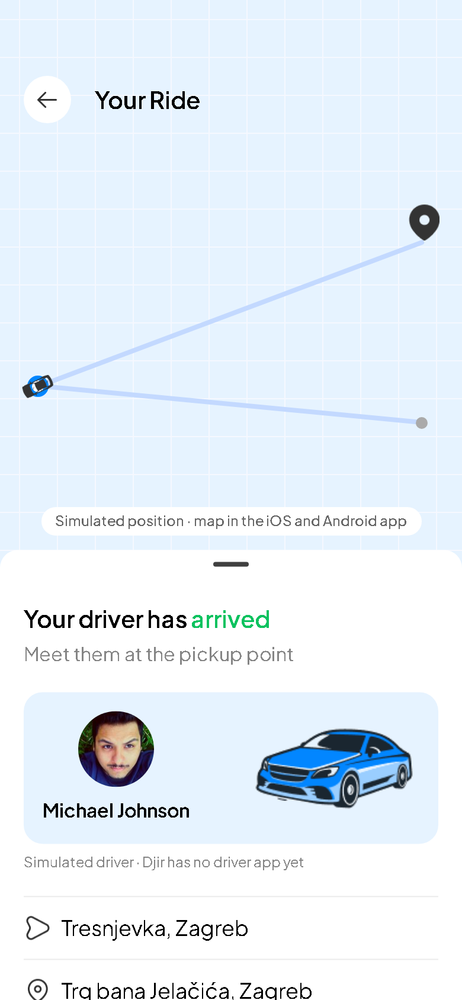<br /><sub><b>Driver arrived</b></sub></td>
    <td align="center">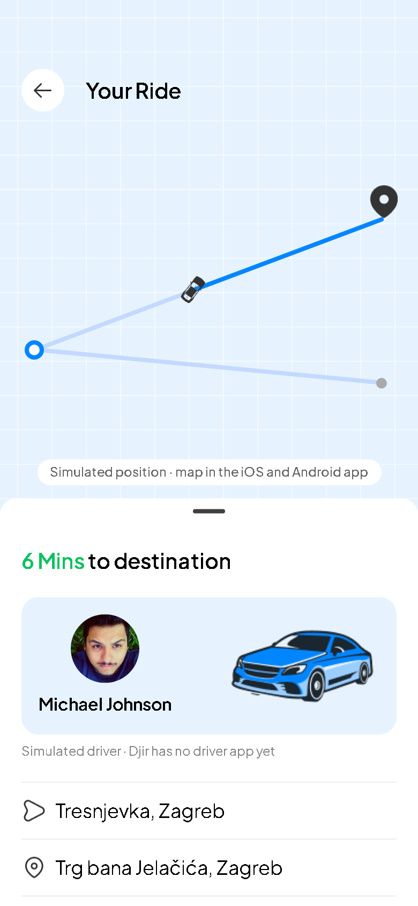<br /><sub><b>On the trip</b></sub></td>
    <td align="center">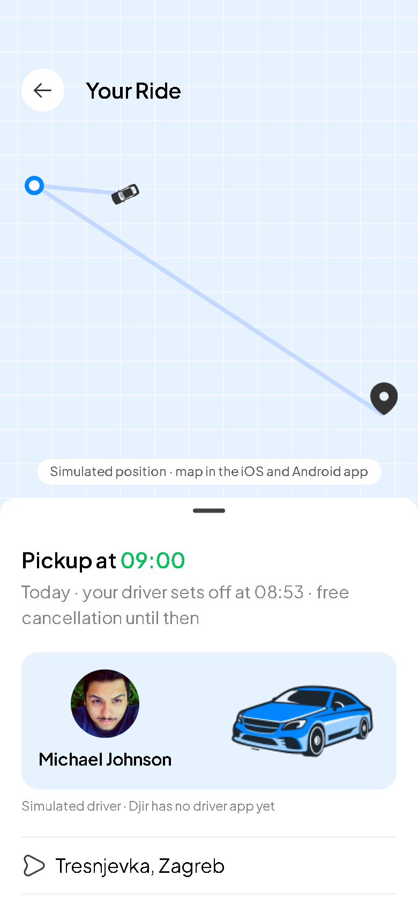<br /><sub><b>Scheduled · free cancel</b></sub></td>
    <td align="center">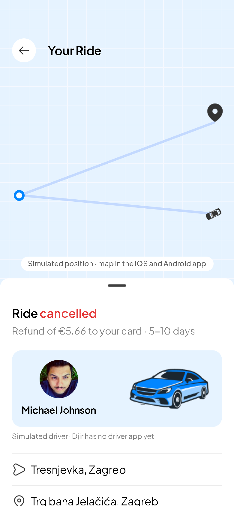<br /><sub><b>Cancelled · refunded</b></sub></td>
  </tr>
</table>

- **One source of truth.** A ride's phase (scheduled → en route → arrived → on trip → completed) is a pure function of the ride row and the clock. No phase is stored and no background job advances it, so reopening the app after a crash picks the ride up where it is.
- **The car you picked is the car you track.** The driver card, the Book Ride screen and the first "Arriving in" show the same pickup time: booking stores the minutes the driver card showed. <!-- claim:B7 -->
- **Honest about the simulation.** Djir has no driver app, so the car's position along the route is simulated, and the screen says so. The timeline itself comes from the booking: the pickup minutes and trip ETA the rider was shown, and the payment time (or the booked slot, for a scheduled ride).
- **Four ways in.** Go Track after paying, the Home banner, a ride in history, or a tapped reminder.

### 🗓️ Ride scheduling, cancel and reminders

<table>
  <tr>
    <td align="center">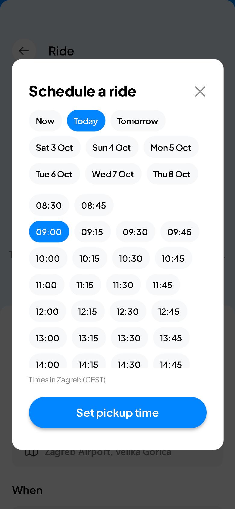<br /><sub><b>Pick a pickup time</b></sub></td>
    <td align="center">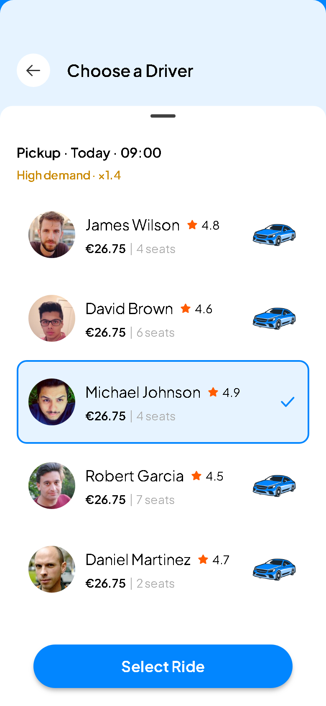<br /><sub><b>Re-priced for that time</b></sub></td>
    <td align="center">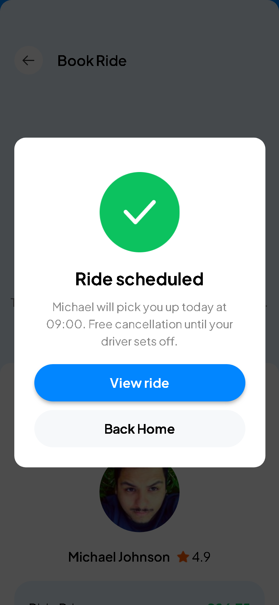<br /><sub><b>Ride scheduled</b></sub></td>
    <td align="center">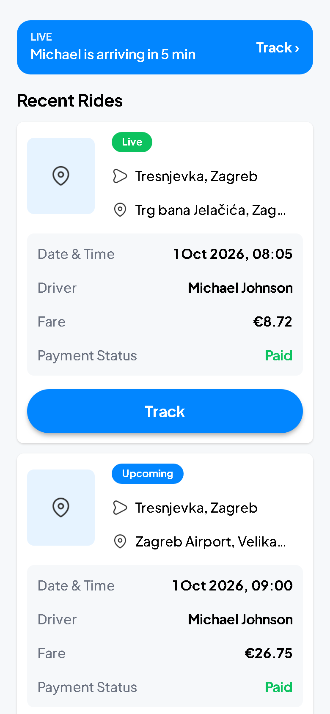<br /><sub><b>Home banner + ride cards</b></sub></td>
  </tr>
</table>

<sub>Fares in these renders come from the fallback formula (<code>lib/pricing.ts</code>); the chart below uses the ML models. The last image stacks Home's banner over the ride cards.</sub>

- **15-minute slots.** From 30 minutes to 7 days ahead, labelled on the Zagreb clock. On the October night the clocks go back, the repeated hour reads "02:15 CEST" and then "02:15 CET".
- **Time-aware prices.** Choosing a time re-prices the drivers, and a surge shows as "High demand · ×1.4".
- **Free cancellation.** A Stripe refund until the driver sets off.
- **Local reminders.** A notification 10 minutes before the driver leaves; tapping it opens the ride. Reminders are rebuilt from ride history each time it loads, so they follow a cancel, a new device or a sign-out.

## 📈 Priced by time and weather

<p align="center">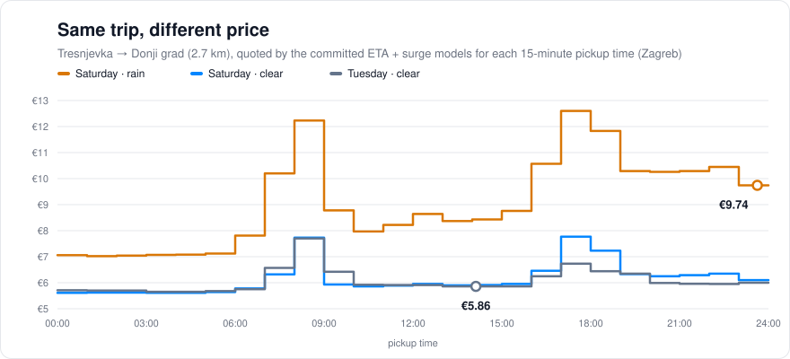</p>

Tresnjevka → Donji grad costs €5.86 on a quiet Tuesday afternoon and €9.74 on a rainy Saturday night. <!-- claim:B4 -->
The chart is drawn from the committed models by `ml-platform/scripts/plot_price_by_time.py`, and a test fails if it goes stale. <!-- claim:B10 -->
Every price uses the Zagreb wall clock, even when the request arrives as a UTC instant. <!-- claim:B3 -->

| Model | Predicts | Test MAE | Naive baseline | Djir's own heuristic |
| --- | --- | --- | --- | --- |
| **ETA** | trip duration | 3.18 min | 7.58 min (model −58%) | 3.12 min (model +2%) |
| **Surge** | price multiplier | 0.065× | 0.263× (model −75%) | 0.193× (model −66%) |

The metrics above are what `ml-platform/models/metrics.json` records; a test ties this table to it. <!-- claim:B9 -->
The honest reading: the data is synthetic, and the ETA model does not beat the heuristic that shares the simulator's physics (3.18 vs 3.12 min). The surge model beats it by a wide margin, partly because the heuristic's own surge is miscalibrated. The committed models load cleanly with the pinned scikit-learn and XGBoost versions. <!-- claim:B8 -->

→ [ML platform & runbook](ml-platform/) · [Architecture & decision records](docs/architecture.md)

## 🧭 How it works

**Booking and payment.** The server signs the quote and charges only the signed amount.

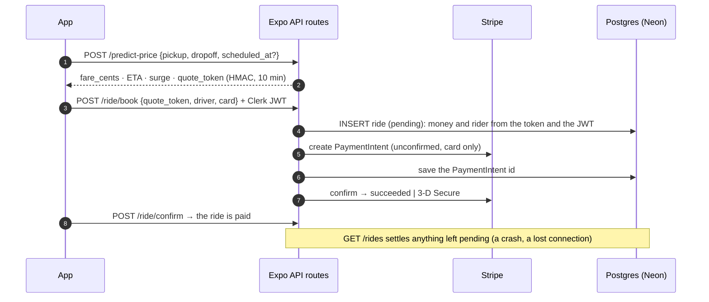

**Ride phases**, computed from the ride row and the clock (no phase is stored):

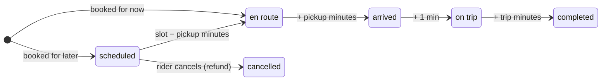

## 🛡 Built to be trusted

- **You pay exactly the price you saw.** The server signs each quote; booking charges the signed amount and ignores any amount or user id in the request. <!-- claim:B5 -->
- **Every succeeded payment has exactly one visible ride.** A reserve-first booking flow and a reconcile step keep that true through 11 crash, race and backlog scenarios, tested against a real Postgres (PGlite). <!-- claim:B6 -->
- **Authenticated API.** Clerk session tokens are checked on the server without a network call; only the driver list and quotes are public.
- **One clock.** Hours and weekdays come from a dependency-free Zagreb clock that matches the tz database for every hour from 2020 to 2035. <!-- claim:B2 -->
- **One price formula, two languages.** The TypeScript fallback prices to the cent like the Python library on 442 golden trips (30 of them straddling the DST switches, 12 with an ETA on a rounding tie) plus 30 rounding cases, all exported from Python. <!-- claim:B1 -->
- **Tests that bite.** Each critical v1.0 bug, put back into the code by `npm run mutants`, makes its tests fail. <!-- claim:B11 -->
- **Enforced gates.** 100% line coverage for `lib/`, `server/` and the API routes, and 90% for hooks, services and the tracking, scheduling and payment components. <!-- claim:B12 -->
- **Enforced layers.** ESLint keeps `lib/` pure (no React, no I/O, no current time) and keeps server code out of the app bundle.

The full story is in [`docs/REVIEW.md`](docs/REVIEW.md) (what was broken), [`docs/BUILD_PLAN.md`](docs/BUILD_PLAN.md) (how v1.1 was specified and graded) and [`docs/architecture.md`](docs/architecture.md) (the decisions).

## 🛠️ Tech stack

| Layer | Technology |
| --- | --- |
| App | React Native 0.74 · Expo SDK 51 · Expo Router 3 (screens **and** API routes) · TypeScript |
| UI | NativeWind (Tailwind) · Plus Jakarta Sans · `@gorhom/bottom-sheet` · `react-native-maps` |
| State | Zustand |
| Auth | Clerk (email + password with email verification, Google OAuth), verified server-side with WebCrypto |
| Payments | Stripe Payment Sheet (deferred intent) · `stripe` on the server |
| Database | Neon serverless Postgres |
| Reminders | `expo-notifications` (local) |
| ML platform | Databricks · Delta Lake · MLflow · Unity Catalog · XGBoost · FastAPI |
| Quality | Jest (server + client projects) · Testing Library · PGlite · pytest · ESLint · GitHub Actions |

## 📁 Project structure

```
app/          screens and API routes: (api)/ · (auth)/ · (root)/ incl. track-ride
components/   UI: props in, JSX out (TrackingSheet, ScheduleModal, Payment, RideCard, …)
hooks/        React state and effects (useRides, useRideTracking, useDriverQuotes, …)
lib/          pure logic: Zagreb clock, pricing, schedule, ride phases, reminders
services/     client I/O: API calls, the payment-sheet handler, reminders, auth
server/       server only: auth, signed quotes, payments and reconcile, validation
store/        Zustand stores, each with reset()
db/           migrations/001_v1_1.sql (a fresh database uses the root schema.sql)
docs/         review · build plan · architecture · gallery (render source) · images
ml-platform/  simulator · Databricks notebooks · models · FastAPI serving · pytest
__tests__/    lib · server · api · db · services · store · components · hooks · screens · meta
```

## 🚀 Getting started

**Prerequisites:** Node.js 20 (see `.nvmrc`), and Expo Go on a device or an iOS or Android simulator. The maps and Stripe (including 3-D Secure returns) work best in a native build: `npx expo run:ios` or `npx expo run:android` (Android maps then need `GOOGLE_MAPS_ANDROID_API_KEY`).

```bash
git clone https://github.com/FilipKalcic1/djir.git
cd djir
npm install
cp .env.example .env.local      # then fill it in: each variable is explained there
```

| Variable | Where to get it |
| --- | --- |
| `EXPO_PUBLIC_CLERK_PUBLISHABLE_KEY` · `CLERK_JWT_KEY` | [Clerk](https://dashboard.clerk.com/) → API Keys (the JWT public key, PEM) |
| `QUOTE_SIGNING_SECRET` | any random string of 32+ characters (`openssl rand -hex 32`) |
| `DATABASE_URL` | [Neon](https://neon.tech/) connection string |
| `EXPO_PUBLIC_STRIPE_PUBLISHABLE_KEY` · `STRIPE_SECRET_KEY` | [Stripe](https://dashboard.stripe.com/apikeys) (test keys) |
| `EXPO_PUBLIC_PLACES_API_KEY` · `EXPO_PUBLIC_DIRECTIONS_API_KEY` · `GOOGLE_MAPS_ANDROID_API_KEY` | [Google Cloud](https://console.cloud.google.com/) |
| `EXPO_PUBLIC_GEOAPIFY_API_KEY` | [Geoapify](https://www.geoapify.com/) (history thumbnails; optional) |
| `EXPO_PUBLIC_API_ORIGIN` | where the API routes are served: `http://localhost:8081/` in development, your deployed origin in production. **Required for iOS and Android** (left empty, their API calls fail closed); the web build can leave it empty |
| `ML_ENDPOINT_URL` · `EXPO_PUBLIC_TRACKING_SPEEDUP` | optional: the [model endpoint](ml-platform/) (unset, the fallback formula prices), a demo speed-up for tracking |

**Database.** Run [`schema.sql`](schema.sql) on a new database, or [`db/migrations/001_v1_1.sql`](db/migrations/001_v1_1.sql) on a v1.0 one (`psql "$DATABASE_URL" -f …` or the Neon SQL editor).

```bash
npx expo start                  # then i / a, or scan the QR code with Expo Go
```

## 📜 Scripts

| Command | What it does |
| --- | --- |
| `npm start` · `npm run ios` · `npm run android` · `npm run web` | run the app |
| `npm test` | both Jest projects (server: Node + PGlite; client: jest-expo + Testing Library) |
| `npm run check` | typecheck, lint (with the layer rules), tests with coverage gates: what CI runs |
| `npm run mutants` | put each critical v1.0 bug back and require its tests to fail |
| `npm run docs:shots` | re-render the README images from `docs/gallery` (needs Chrome, Chromium or Edge; `CHROME_PATH` picks one); its manifest lets a test fail when a render is stale or edited by hand |
| `cd ml-platform && pip install -r requirements-dev.txt && pytest` | the ML platform's tests (Python 3.12, as in CI; a venv is advised, see [ml-platform](ml-platform/)) |

## 🎨 Design

The app was designed in Figma first. These are **design** screens for the flows not rendered above; the images above are the built components.

<table>
  <tr>
    <td align="center"><br /><sub><b>Onboarding</b></sub></td>
    <td align="center"><br /><sub><b>Get started</b></sub></td>
    <td align="center">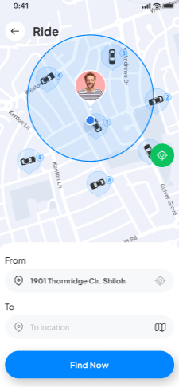<br /><sub><b>Find a ride</b></sub></td>
    <td align="center">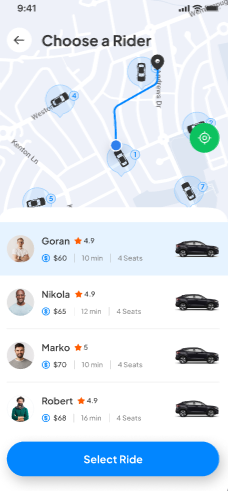<br /><sub><b>Choose a driver</b></sub></td>
  </tr>
</table>

<details>
<summary><b>More design screens</b></summary>

<table>
  <tr>
    <td align="center"><br /><sub><b>Onboarding 2</b></sub></td>
    <td align="center"><br /><sub><b>Onboarding 3</b></sub></td>
    <td align="center">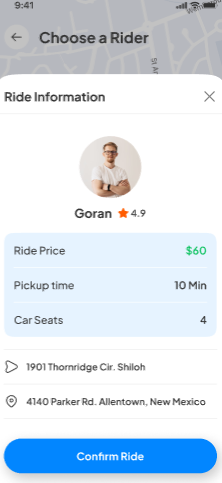<br /><sub><b>Ride details</b></sub></td>
    <td align="center">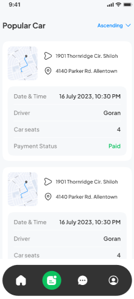<br /><sub><b>Ride history</b></sub></td>
  </tr>
</table>

</details>

## 🗺️ Roadmap

- [x] Real-time driver tracking (simulated driver position), awaiting on-device QA
- [x] Ride scheduling with free cancellation and refunds, awaiting on-device QA
- [ ] Push notifications: local ride reminders ship today; remote push needs a sender and an EAS project
- [ ] In-app chat with drivers: needs a driver app, so it is not faked with a bot

## 📄 License

Released under the [MIT License](LICENSE).

## 👤 Author

**Filip Kalčić** — [@FilipKalcic1](https://github.com/FilipKalcic1)
