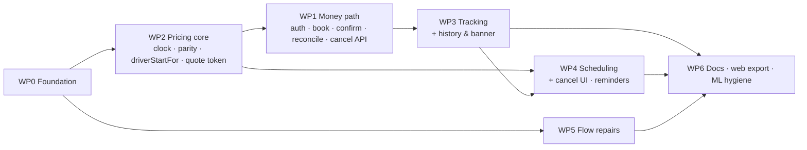

# Djir — Build Plan for v1.1.0

> **Goal:** finish the roadmap the right way. First repair what the [review](REVIEW.md) found, then ship **fewer features, each done completely**.
> **Rule:** a work package (WP) is done only when **every** checklist item passes, verified by graders who did not write it. Any open item sends it back. Every pass is logged in [§10](#10-iteration-log).

## 0. Plan self-assessment

**What 10/10 means for this plan:** every critic lens (product, engineering, process) reports **zero blocker and zero major gaps**, and every minor gap is either fixed or waived below with a reason. Below 10, a lens scores **9** while only minors are open, and **8** or less while a blocker or major is open. From r6 on the grade is computed, not judged: the [finding ledger](#appendix-d--finding-ledger) gives every graded finding its lens, its severity after the skeptic pass and its disposition (fixed, waived or open), and `rid-map` recomputes each lens's grade from it and checks the latest row below against it. The graders' own lenses: product = PP; process = G, PG, TQ (plan and test quality); engineering = TSR, WP1, ENG, and the ML/docs grader (F, M, WP6R2).

| Rev | Product · Process · Engineering | What was missing → what changed |
| --- | --- | --- |
| r1 | 6 · 5 · 5 | **Money:** two ways to lose money → a reserve-first booking flow and a one-shot sheet handler. **Scheduling:** no way to cancel a prepaid ride → cancel with a refund. **Tracking:** no entry points, copy or Figma list → WP3 tables. **Grading:** criteria were judgement calls → checklists, an R-id map and a claims register. **Tests:** SQL was only mocked → a PGlite tier. |
| r2 | 7 · 6 · 7 | **Money:** money could move before the PaymentIntent id was saved → a **three-step** booking (create → save → confirm). Reconcile had no rules → a **transition table**. Now-rides were timed from reservation → timed from **`paid_at`**. **Android sheet:** retries corrected per platform. **Product:** Cancel UI, a *View ride* entry point, the **active-ride banner**, RideCard states, a surge line, scheduling element tables, and **local ride reminders**. **Grading:** a DAG; TEST/CMD proofs with R-id-prefixed titles and a meta test; red → green evidence; state tables with testIDs; style-token assertions; exact scripts and ESLint rules. **Cut:** road geometry (Directions), the rate limit, `azp` config. |
| r3 | 8 · 7 · 8 | **Product:** history didn't refresh after booking or cancelling → focus refetch (**H6/H7**); one banner line for every phase → **B1a–c, B3, B4**; a tapped reminder went nowhere → it opens the ride (**N5**); Android asked for permission before a channel existed (**N6**). **Engineering:** an unknown payment outcome could lead to a second charge → the sheet locks and reconcile settles it (**P8, E3**); reminders were scheduled once at booking → re-derived from history on every load (**N7**), worded with clock times, with exact alarms on Android; the refund key, reconcile scope, P3 threshold, picker clock, DST "Tomorrow" and `iss` fail-closed were fixed. **Process:** red → green couldn't run the new tests against the old API → **mutants** (C3); money-path rows had no IDs → **M, PT, E, X**; R33/R34/R59 were CMDs → a **TEST**; README claims were not linked to Appendix B → **anchors + a docs test**; the Jest config and lint rules were unguarded → **meta tests**; every state table gets a **QA** column. |
| r4 | **7 · 6 · 6** (independent graders, 85 findings: 19 major, 66 minor; §10) | r4 was the build (impl 1: WP0–WP6 by 7 writers) plus small plan fixes (the tree-hash command, exact lint globs, K8's tie rule, slot-chip labels, the P1/P6 wording, the API origin). **Graders found — product:** a refused slot (`slot_unavailable`) and a failed pre-sheet re-quote both fell to Book Ride's "Choose a driver first."; §12 step 9 could not pass at ×20 speed; history had no loading/empty/error rows; copy drifted (Q1, the P4 hint, chat, J2). **Engineering:** reconcile could starve newer pending rows and `LIMIT 100` counted failed rows; a sheet that failed after a booking could book twice (P9 missing); the reconcile rules were untested; N3's "asked" flag lived in the iOS Keychain; a reminder tap replayed on every remount; README B9 and the "30 half-cent ties" claim were untested or false; `run_local.py` overwrote the committed models; no image showed tracking. **Process:** rid-map accepted describe titles, mid-title IDs, `.each` arrays anywhere and its own file; nothing read the testID or QA columns; C5's wording was stricter than its test; §0 r4 pointed at a §10 row that did not exist; Appendix A had no status and several CMDs could not be pasted. |
| r5 | **8 · 7 · 8** self-graded; the independent graders then gave **7 · 7.5 · 8** (53 findings: 4 major after the skeptic pass, 49 minor; §10) | **Product:** K6 built on the client (back to Find ride, the picker open with the K5 notice), **P3c** (a failed re-quote keeps the fare and the button), **P9** (never a second booking), **P10**, K4 now stays on Find ride, **K10–K12**, **H8–H10**, **B1d**, cancel results **X9–X13**, N3 on the OS status, N5 once per tap, **N8–N9**, the "Simulated driver" caption, §12 step 9 split into **9a/9b** and new steps 7b, 8b, 11b, 16. **Engineering:** reconcile takes turns (`reconciled_at`, **M10**), the history filter runs in SQL (**M11**), **PT3b, PT4b, E6**, E4 is a 502, refunds use a new key per attempt and check `refund.status` (X1, X5, X8), bad JWT signatures are 401s, ids are capped at int4, the 15-minute grid is enforced (K2), `paid_at` is the charge time everywhere, the migration normalises statuses and guards NOT NULL (**DB1–DB3**). **Process:** rid-map is strict (only it/test titles that start with the ID; `.each` IDs only from the literal array; meta files never prove a §4 row; cited files checked for TEST rows; indented tables parsed); every QA cell must name a §12 step or `auto`; every state/element row needs its testID in a components/ or screens/ test; Figma and Surfaces rows got IDs (**F1–F8, W1–W10**), MP got testID and QA columns; J1/J2 steps are numbered and mapped (**J1a–J2d**); Appendix B references must be real titles; Appendix A has a Status column and exact CMDs; the §8 examples and the §9 coverage table are checked against the code and `jest.config.js`; verdicts per WP in §10. **What held r5 below 10** (the r5 graders' majors, all fixed in r6, Appendix D): PP2-2, the confirm list had no state for drivers that failed to load; TSR2-1, the native map framed its target under the sheet; PG2-1, §10 contradicted the tree and its own verdicts; PG2-2, no finding ledger, so the grade could not be traced. |
| r6 | **10 · 9 · 9** computed from Appendix D (self-graded; an independent grading of r6 is owed) | **Product:** the confirm list's driver load has states and a 10 s timeout (**Q5, Q6**, §12 **3b**); the Home banner follows the tracker at ×20 and on refocus (PP2-1); a failed X9 check has its own result (**X14**); a tapped reminder is cleared from the OS (N5); the stale-slot copy no longer says "passed" (K4–K6); every §12 step names the rows it shows. **Engineering:** the native map frames its target above the sheet (**MP7**); an unknown refund outcome is checked once, answered 504 and repaired on the next read (**X20–X23**, `cancel_requested_at`); an unpaid ride cannot be cancelled (**X22**); E2–E4 carry codes the app reads (`card_rejected`, `not_charged`); no 500 names a setting (**E7**); reconcile takes the newest never-checked row first (M10 on the first read); S4 names the set-off day (**T12**); phase changes are announced on both platforms; notebook 07 and `generate_data.py` no longer write into `models/`; a CI `serving` job. **Process:** one run of every gate on the frozen tree, recorded in §10 (PG2-1); a ledger of both gradings with checked proofs, and the grade computed from it (Appendix D, PG2-2); verdicts derived from Appendix A and §12; testIDs checked per test, not per file; K6's app half split from its server rule (**K13**) so it needs a screen test; a hash of the frozen rows (§2); `scripts/*.mjs` linted; client SDKs barred from server code; every imported package declared; a manifest that ties the README renders to their inputs (D4). **Rows:** added Q5, Q6, E7, X14, X20–X23, T12, MP7, K13 and §12 step 3b; changed, stronger or corrected: C1, C5, E2, E3, E4, E6, M10, X5, X8, X9, X11, P3c, P4, P8, K4, K5, K6, K10, N5, S2, S4, H10, MP5, W10's QA, R29, R42, R44, R54, R57, R66, R67, R70, R74; W9's live-region clause, dropped in r6 for want of a test, is back in r6.1 with its test. **What holds r6 below 10:** product has nothing open. Process and engineering each have open minors that wait on the owner: `WP0-CI-never-run` (G9, PG2-8, TQ2-3, WP6R2-6: the workflow has never run, so the POSIX-only cases, the pinned toolchain on Linux and the serving image have not either; a push, or a Docker or WSL run, closes it). `WP6-readme-captions` (TSR2-7) was closed in r6.1. |
| r7 | **10 · 9 · 9** computed from Appendix D (unchanged: no graded finding changed; this pass is the Expo SDK 57 upgrade, self-checked, not graded) | **Expo SDK 57**: React Native 0.86 (New Architecture only), React 19, Expo Router 57, Reanimated 4, bottom-sheet 5, Stripe 0.64 and Clerk 2.20, so the app runs in today's Expo Go (R58 re-proven, WP0's dependency table). **Replaced:** `react-native-swiper` and `react-native-modal`, which crash on React Native 0.86 (`ViewPropTypes` and `BackHandler.removeEventListener` are gone), by a paging `FlatList` in `welcome.tsx` and `components/AppModal` on React Native's own `Modal`. **Expo Go with an empty `.env.local`** (**EG1–EG7**, WP0): a Setup-needed screen instead of a crash, a public `GET /(api)/health` that names missing server settings, the dev server as the API origin under `npx expo start`, a Payment that names its missing key, and popular Zagreb places when there is no Places key (**W11**). **Bugs the upgrade exposed, fixed with tests:** every reminder would have fired at once (expo-notifications 57 reads a trigger without `type` as immediate; N1); expo-router 57's `navigate` pushes onto a stack, so K6's return to Find ride, the tracker's Back Home and the auth links use `dismissTo`; bottom-sheet 5's dynamic sizing moved the tracker's sheet off its 45% rest (MP7); on SDK 57 a bare `expo lint` skips `lib/`, `server/`, `hooks/`, `services/`, `store/` and `scripts/`, so the script is `expo lint .`. **Rows:** added EG1–EG7, W11 and §12 steps 0, 17 and 18; changed R31 (deferred → fixed: Clerk 2.20 ships clerk-js 5.128.0), R33's proof (the dev origin, EG4), R70's proof (the SDK 57 export output) and D4's input count; none weakened. |
| r7.1 | **10 · 9 · 9** computed from Appendix D (unchanged: no graded finding changed; this pass is the Clerk Core 3 migration, reviewed twice by agents that did not write it, not graded) | **Clerk Core 3**: `@clerk/expo` 4.7.2 (`@clerk/clerk-js` 6.35.0) in place of the deprecated `@clerk/clerk-expo` 2.20, whose import logged "Clerk - DEPRECATION WARNING", a yellow toast on every launch in Expo Go (**EG8**). Sign-in and sign-up keep Clerk's Core 2 hooks from `@clerk/expo/legacy`; a lint rule bans the old package in every file; `Tabs` comes from `expo-router/js-tabs`, since the root export is deprecated. **Two reviews found 7 defects, each fixed with tests that failed first.** The first ran the real clerk-js 5.128 and 6.35 builds: 5.128 took React Native for offline and answered a failed request with null, while 6.35 throws. So a launch with Clerk unreachable left a blank screen for good → "Can't connect" with Retry (EG8); an offline sign-out skipped the store reset, the reminder cancel and the way to sign-in (R52, N4); offline, `getToken` retried for about 2.7 minutes → the wait counts towards the 10 s load timeout and ends after 10 s at the latest (H10, S2, P7, P8, X9); `setActive` now fails when its session touch does → the activation is tried twice, then sign-in and sign-up retry only the activation (EG8, R10, R15); Clerk's endpoint URL was shown as an error → one plain line (R20). The second found that `@clerk/react` 6 loads ReactDOM's client on iOS and Android too → `react` and `react-dom` are pinned together (`meta/jest-config`), and that the ban missed `require()`, `jest.mock()` and `import()` → it covers them. **Rows:** added EG8, and named it in §12 steps 0 and 3b (3b now starts on "Can't connect"); changed R31's proof (clerk-js 6.35.0 under `@clerk/expo` 4.7.2, still past the ≤ 5.88.0 range); none weakened. |
| r7.2 | **10 · 9 · 9** computed from Appendix D (unchanged: no graded finding changed; this pass fixes the one defect r7.1 found and left, self-checked, not graded) | **A request loop, once signed in** (EG9): `hooks/useFetch` kept `useAuth().getToken` in its dependencies, and `@clerk/expo`'s `useAuth` (like 2.20's) returns a new `getToken` on every render, so every answer re-created `fetchData` and asked again: the drivers (loaded for all of `(root)`) and the history on Home, Rides and the tracker, back to back, for as long as the rider stayed signed in. The shared Clerk mock hands out one `getToken`, so no test saw it. Now `fetchData` reads the latest `getToken` from a ref and depends on the url and options only; the H6 focus refetch, which compares `refetch` across renders, works again as a result. `hooks/useFetch` proves it with a `useAuth` that returns a new `getToken` on every render (one request per url; `refetch` keeps its identity and sends the latest render's token); all three tests fail with the old dependencies. **Docs:** §9 and the WP0/WP6 verdicts no longer say the workflow never ran: the r6.2 tree's ran green on every job (run 36614109430 on `16a0481`, 2026-09-29); the r7 workflow (Node 24, the iOS export) has not run, since `sdk-57` is not pushed |

**Minor critique points waived, with reasons:**
- **Drop the cent-exact parity machinery.** Kept. It is already built and costs nothing to run. It is the only thing that backs ADR-006's claim that the fallback prices identically across the platform, and the TS heuristic still prices every quote whenever `ML_ENDPOINT_URL` is unset.
- **Put the Intl oracle in `it.each` rows.** Already one looping test.
- **Paste full command output as CI evidence.** Rejected: §10 keeps one summary line per command.
- **Mutation patches as `.patch` files.** Replaced by a table in `scripts/mutants.json`, read by `scripts/mutants.mjs` (find → replace). A patch breaks on any line-ending or context change; an exact-string target reports itself as *stale* instead, and `__tests__/meta/mutants.test.ts` fails first.
- **r5 — H7 merged into H6.** Both rows were the same code path: the focus refetch replaces the whole history, so a booking made elsewhere (H2's card) and a cancellation made on the tracker (H4's card) show up the same way. The old H7 title claimed a cancelled ride its fixture never had; the useRides test is now titled H6 only. H4 proves how a cancelled card renders; §12 step 7 shows it on a device.
- **r5, reworded in r6 — the state rows with no testID** (TQ2-8). C1's testID rule covers every row that names one; seven state rows name none, each for a reason: P3b and P9 are the sheet handler's own behaviour (proven in `services/payment` and `components/Payment`), P4 and P5 happen inside Stripe's native sheet, P7 is an `Alert`, H6 is the refetch in `hooks/useRides` (no Home or Rides screen test exists; the cards it feeds are proven by H1–H5 and `RideList`, H8–H10), and B3 is the banner rendering nothing at all. B3's test asserts an empty render (`toJSON()` is null), which is stronger than the absence of one testID, so the finding's suggested testID-absence test is not added.
- **r5 — no disclosure on the Home banner or the reminder** (PP-10). Both are one line long and both lead to the tracker, which says "Simulated driver · Djir has no driver app yet" (F8); the README roadmap reads "(simulated driver position)". A second caption in a one-line banner or a notification body would push out the time the rider needs.
- **r5 — a scheduled ride that ends in P7 does not ask for reminder permission** (PP-12, part a; TSR-9, part b). At P7 the ride is not confirmed, so there is no ride id to remind about; the prompt is kept for the next "Ride scheduled" modal, where its context is clear (iOS gives one prompt per install). Cost: a first-time scheduler whose booking hits P7 gets no reminder for that ride.
- **r5 — no "Reminders are off" line after a denial** (PP-12, part b; the affordance ENG-3 asked for). The rider answered the OS prompt a moment earlier, in context; iOS cannot re-prompt, and a permanent line on every scheduled ride would nag about a choice already made. §11 lists the Settings link that would fix it properly.
- **r5 — copy that follows its Figma screen, not each other** (TSR-12). The tracker says "7 Mins" (Figma 14) while the banner, the driver card and Book Ride say "7 min" (Figma 12/13); the confirm list's title, Figma 12's "Choose a Rider", was renamed "Choose a Driver" in r6.2 after the README review, since the rider chooses a driver (R48's test pins the new title). The "7 Mins" / "7 min" split stays a recorded deviation, not a bug.
- **r5 — Android 14+ exact alarms are not requested** (TSR-9, part c). `SCHEDULE_EXACT_ALARM` is declared, but Android 14 denies it by default, so reminders there are inexact (`setAndAllowWhileIdle`). N1's body carries clock times for exactly this reason; r3's "exact alarms on Android" holds on Android 12–13 only.
- **r5 — history does not also UNION live/upcoming rides** (ENG-4). With the paid/refunded filter in SQL (M11), only more than 100 newer paid rides could push a live ride past `LIMIT 100`, which needs 100 bookings inside the 7-day horizon.
- **r5 — no separate "1.5 s slow retrieves" reconcile test** (WP1-MP-2). The M7 budget test makes three retrieves hang and asserts all three are issued before the budget fires; that kills the sequential-settle mutant without racing fake timers against PGlite writes.
- **r5 — `eslint-plugin-jsdoc` not added** (TQ-10). §8's "JSDoc on every lib export" is enforced by a TypeScript-AST check in `__tests__/meta/test-hygiene.test.ts`, with no new dependency.
- **r5 — `restoreMocks: true` not set in Jest** (TQ-8). In Jest 29 it also resets `jest.fn` implementations created in module factories and the shared mocks; each file restores its spies and `fetch` in `afterEach` instead.
- **r5 — Q1 reworded to the built behaviour** (PP-4, PG2-2). r4's Q1 promised that "a price already shown stays until the new one lands"; the build shows "…" on every card while a quote loads, and r5 changed the frozen row to match without the §0 row §2 asks for. Kept: a fare that is about to change should not look bookable, and the signed quote stays in the store (P3c), so Book Ride never unmounts mid-payment. This bullet is that row.
- **r6 — Figma's text colours are kept, below WCAG AA contrast** (TSR2-5, and the contrast part of TSR-11). Measured on white: the `general-400` accent 2.4:1 (the tracker's minutes and "arrived", "Paid", the Book Ride fare), `general-200` captions 3.7:1, the `warning-600` surge line 2.9:1, and white on the green Live badge. These are Figma's palette, pinned by the token rows (the S header, F3, F8, H1, H4, Q4, W6, W10) for C4's fidelity; changing them is a design decision plus a re-render, listed in §11. Fixed in r6: the selected driver card's white check glyph is tinted `primary-500`, so it no longer disappears on `general-600` (R74).
- **r6 — no payment webhook** (ENG2-2). A signed `payment_intent.succeeded` / `payment_failed` route needs a new public endpoint, a `STRIPE_WEBHOOK_SECRET` and a dashboard registration per deploy. Reconcile-on-read settles such a ride on its rider's next `GET /rides`, and since r6 on the first read (never-checked rows newest first, M10). The cost, stated in WP1: until that read the database says `pending` for a real charge, SQL counts of paid rides undercount, and N7 schedules that ride's reminder only then. §11 lists the webhook.
- **r6 — the claim IDs keep their names** (TQ2-7). Appendix B's B1–B12 and the banner rows B1a–B4 share a letter. Renaming the claims needs the README's `claim:` anchors changed with them (not a plan edit); instead rid-map reads the IDs in test titles against §2, §4, §6 and Appendix A only, so a title "B3:" can only mean the banner row, and a claim is named only by its `claim:` anchor. The four titles that said a bare "B1:" now name B1a, B1c or B2.

## 1. Scope

| Roadmap item | Decision | Why |
| --- | --- | --- |
| **Real-time driver tracking** | ✅ Build (flagship) | Designed in Figma (13–14) but never built. The **timeline is predicted from booking data**: the quoted pickup minutes, the ML trip ETA, and the payment or slot time. **The driver, and every movement, arrival and completion, is simulated:** Djir has no driver app. The tracker says so ("Simulated driver · Djir has no driver app yet", F8); the one-line banner and the reminder do not repeat it (waived in §0). |
| **Ride scheduling** | ✅ Build, with cancel + refund | The models are time-aware, so *"same trip, different price"* becomes a visible product feature (the surge line). |
| **Push notifications** | ◐ **Local ride reminders** | A scheduled ride gets a local notification 10 min before the driver sets off (`expo-notifications`, first-party, works in Expo Go). Remote push needs a server sender and an EAS project (§11). |
| In-app chat | ❌ Not now | Chat needs a person on the other end. With no driver app, every reply would be invented: a bot pretending to be a person. The tab says "Chat with your driver is coming soon." §11 lists what it takes. |
| Cancelling a ride booked **now** | ❌ Not now (X3) | A ride booked for now is dispatched the moment it is paid, so cancelling it means releasing a driver who is already on the way, and deciding what that costs. Djir has no driver to release and no cancellation-fee rule. The route refuses it (409), and Book Ride tells the rider before paying: "Rides booked for now can't be cancelled." (W10). |

**Fixes:** every critical and high finding, every medium or low finding on a path the features touch, and any other finding whose fix is a few lines. Everything else is deferred with a reason (Appendix A).

**README roadmap after v1.1** (while §12 is unfilled, the two ticked items say they await on-device QA, as the README does today):

```
- [x] Real-time driver tracking (simulated driver position), awaiting on-device QA
- [x] Ride scheduling with free cancellation and refunds, awaiting on-device QA
- [ ] Push notifications: local ride reminders ship today; remote push needs a sender and an EAS project
- [ ] In-app chat with drivers: needs a driver app, so it is not faked with a bot
```

## 2. Definition of done

- **PASS** means zero open checklist items. Otherwise the result is the list of open item IDs, such as `WP3-C1-S4`. A WP with an Appendix A row marked ❌ cannot read PASS, and a ❌ row cannot read "fixed" (rid-map).
- A WP that needs a device can only reach *"PASS (automated) · device QA pending (§12 steps …)"*. The steps are exactly the §12 steps whose Expected cell names one of the WP's rows or R-ids (rid-map), so the list follows from §12 rather than from memory.
- The checklists in this revision (state tables, edge tables, element tables, Appendix A and B) are **frozen**. Removing or weakening a row needs a §0 row and a reason. `rid-map` hashes the frozen rows (the ID rows of §2, §4 and §6, Appendix A without its Status column, and Appendix B) and requires the hash that the latest plan pass records in §10, so no row changes without a logged revision; the §0 row of that revision lists what it added, changed and weakened.

| # | Criterion | Mechanical check |
| --- | --- | --- |
| C1 | Complete | Every row of a WP's tables that names a testID has `it`/`test` titles starting with the row's ID in `__tests__/components/` or `__tests__/screens/` files, and each of its testIDs is used by one of those tests' own code (the callback, its `.each` table, and the file-level helpers it calls), not merely somewhere in the file. The table's **QA** column names the §12 step that shows it on a device, and that step's Expected cell names the row; or it says `auto` when tests alone prove the row (for example P3b, which the sheet handler proves, and S3 and X11, which the screen tests prove). `__tests__/meta/rid-map.test.ts` checks all of it: the titles and testIDs, that every QA cell is `auto` or an existing §12 step number, and that the step names the row. N/A for WPs with no UI. |
| C2 | Correct | Every edge row (*input → expected*) has a test whose title **starts** with the row's ID or R-id and a colon (`T3: …`, `X7: …`, `R04 R08: …`). Describe titles, IDs in the middle of a title and tests under `__tests__/meta` do not count. An `.each` title counts for the IDs Jest prints for the rows of the literal array passed to that `.each` (rid-map). |
| C3 | Tested | Coverage thresholds pass (§9; rid-map checks that §9's table is exactly `jest.config.js`'s `coverageThreshold`). Both Jest projects run the TZ sentinel. Every R-id marked TEST in Appendix A has an `it`/`test` titled with it **in every test file its Proof cell cites**, and a `test_rNN_…` pytest function for every pytest pattern it cites (rid-map). **R01–R11 have red → green evidence:** `npm run mutants` puts each v1.0 bug back into the v1.1 code, runs only that R-id's tests and requires a failed assertion, then restores the file (§10 records the table; `__tests__/meta/mutants.test.ts` keeps its targets from going stale). The v1.0 baseline itself can't run the new tests, because its API routes no longer exist. |
| C4 | Faithful | Every Figma element row (F) and WP4 surface (W) has an ID and a `testID`, and rid-map checks the testID as in C1. Where a token is named, the test asserts the resolved style (colours read from `tailwind.config.js` through `__tests__/helpers/tokens.ts`); that the assertion is there is checked by review, not by rid-map. Each Figma screen (13, 14, 15) has a device-capture step in §12 (step 15). |
| C5 | Honest | Every README **prose** sentence with a euro amount (`€` then a digit), a percentage (a digit then `%`), or the words *exactly*, *every* or *verified* carries an anchor `<!-- claim:Bn -->` that matches a row of Appendix B. Code blocks, tables, headings, images and galleries are not prose. Other numbers (slot sizes, the ×1.4 surge, the 10-minute reminder lead) are product behaviour proven by their rows (K1–K3, Q4, N1), not claims. `__tests__/meta/claims.test.ts` checks both directions, and that each row's backing reference is a real describe/it/test title in the named file (a trailing "…" makes it a prefix), a pytest function, an npm script or a file. Claim IDs live only in `claim:` anchors and Appendix B: a test title never names a claim, because rid-map reads the IDs in titles against §2, §4, §6 and Appendix A only (so "B3:" in a title is always the banner row). |
| C6 | Consistent | `npm run check` passes (typecheck, lint with the §8 rules, tests with coverage). `npx expo install --check` reports *Dependencies are up to date* (CI runs it on ubuntu; `meta/jest-config` pins the step). The dependency diff against `cee849b` is exactly the list in §4 WP0 (checked by review: `git diff cee849b -- package.json`). |
| C7 | Documented | ADRs per WP (Appendix C) in `docs/architecture.md`. A README section for WP3 and WP4, with renders of the built UI (§4 WP6). |

**Acceptance journeys** (the automated parts are tests; the device parts are §12 steps). rid-map checks that every cited title exists and every §12 cell names a real step.

| ID | Step | Tests | §12 |
| --- | --- | --- | --- |
| J1a | Tracking: book *now* → pay → **Go Track** opens that ride's tracker | `screens/book-ride › P6: onBooked shows …` | 9a |
| J1b | The headlines appear in order: *Arriving in **N Mins*** → *has arrived* → *N Mins to destination* → *Ride complete* | `lib/tracking › T1 T2 T3: %p min → %s` · `components/TrackingSheet › %s: the %s phase reads %p (accent %p), detail %p` | 9b |
| J1c | The first **N** equals the driver card and the Book Ride pickup row | `lib/tracking › R14: DriverCard minutes = stored pickup_minutes = first 'Arriving in'` · `components/DriverCard › R14: the pickup time is …` | 9a |
| J1d | Kill the app mid-trip. On reopen, the Home **banner** reads "Live · … · Track", and the tracker resumes with **the same phase, minutes left and leg progress for the elapsed time** | `hooks/useRideTracking › T10: after an app restart …` · `components/ActiveRideBanner › %s: %s (+%p min) reads %p` | 12 |
| J2a | Scheduling: **When** → the next weekday 08:00. The confirm list shows "High demand · ×N" (×1.4 with the heuristic fallback; with `ML_ENDPOINT_URL` set the surge comes from the model) and the drivers are re-priced | `screens/find-ride › W1 C4: a chosen slot reads …` · `screens/confirm-ride › Q4: a surged quote shows …` | 4 |
| J2b | Pay → "Ride scheduled" → the Home banner reads "Upcoming · Tomorrow · 08:00" with **View** | `components/BookingSuccessModal › W7: shows 'Ride scheduled' …` · `components/ActiveRideBanner › B2: a ride tomorrow reads …` | 6 |
| J2c | **View** → *Pickup at 08:00* → **Cancel ride** → "Ride cancelled · Refund of €X to your card" | `screens/track-ride › X10: 200 → S9 at once …` | 7 |
| J2d | Alternatively, book the earliest slot, receive the **reminder**, tap it, and watch the same screen flip to *Arriving in* | `screens/root-layout › N5: a tapped reminder opens that ride's tracker` | 13 |

## 3. Dependencies (a DAG, not a chain)



- **Ownership is exactly one WP per R-id** (Appendix A).
- R12 and R14 (seeded drivers, pickup vs trip) belong to **WP2**, because the quote and `/ride/book` need them.
- The cancel **route** (X1–X8, X20–X23) belongs to **WP1** with the rest of the money path; the Cancel **button**, its Alert and the results the rider sees (X9–X14) belong to **WP3**.
- History badges, order, refresh and the list states (H) belong to **WP3**; the Figma 13/14 elements (F) to **WP3**; the scheduling surfaces (W) to **WP4**.
- **WP5** owns the auth and booking-screen repairs (R10, R13, R15, R19–R22, R40–R53, R74). **WP6** owns docs, config, the web export and the ML-platform hygiene (R24, R26–R30, R32–R34, R59–R61, R64, R66–R68, R70).

## 4. Work packages

### WP0 — Foundation

**Scripts**

```json
"test": "node --experimental-vm-modules node_modules/jest/bin/jest.js",
"test:coverage": "node --experimental-vm-modules node_modules/jest/bin/jest.js --coverage",
"typecheck": "tsc --noEmit",
"lint": "expo lint .",
"check": "npm run typecheck && npm run lint && npm run test:coverage",
"mutants": "node scripts/mutants.mjs",
"docs:shots": "node scripts/docs-shots.mjs"
```

PGlite's CommonJS build uses a dynamic `import()`, which Jest's VM rejects unless Node runs with `--experimental-vm-modules`. Launching Jest through `node` passes that flag on Windows without needing `cross-env`.

**Dependencies (C6)** — the complete diff against `cee849b`:

| Change | Packages |
| --- | --- |
| Added (runtime) | `expo-notifications` (reminders) · `expo-auth-session` (Clerk's Google OAuth peer, missing before) · r7: `react-native-worklets` 0.10.1 (Reanimated 4 runs its worklets on it) · `expo-crypto` (an optional peer of `@clerk/expo`; `expo-auth-session` 57 depends on it) |
| Added (dev) | `@electric-sql/pglite` · `@testing-library/react-native` · `jest-util` ^29.7.0 · `js-yaml` ^4.1.0 (the last two were already installed transitively at these versions and are now declared; nothing is downloaded) |
| Removed (never imported, R54) | `i` · `npm` · `@react-native-community/clipboard` · `@twotalltotems/react-native-otp-input` · `react-native-keyboard-aware-scroll-view` |
| Removed (r7: they crash on React Native 0.86) | `react-native-swiper` (reads `ViewPropTypes`; replaced by a paging `FlatList` in `app/(auth)/welcome.tsx`) · `react-native-modal` (calls `BackHandler.removeEventListener` on unmount; replaced by `components/AppModal.tsx` on React Native's `Modal`; `react-native-animatable` went with it) · `@react-navigation/native` 6 (never imported; expo-router 57 ships its own navigation) |
| Replaced (r7.1, EG8) | `@clerk/clerk-expo` (^2.1 at `cee849b`, ^2.20 in r7) → `@clerk/expo` ^4.7.2. Clerk deprecated its Core 2 Expo SDK, whose import logs "Clerk - DEPRECATION WARNING": a yellow toast on every launch in Expo Go. `@clerk/expo` 4.7 is its Core 3 successor (peer `expo` >=54 <58); its native module is optional, so Expo Go runs it. The sign-in and sign-up screens keep Core 2's hooks from `@clerk/expo/legacy`. It ships `@clerk/clerk-js` 6.35.0 (R31) |
| Aligned to SDK 57 (R58, `npx expo install --check`; SDK 51 until r6) | `expo` 57.0.26 · `react` / `react-dom` / `react-test-renderer` 19.2.3 · `react-native` 0.86.3 · `expo-router` ~57.0.24 · `@expo/metro-runtime` and every `expo-*` module ~57 · `@expo/vector-icons` 15 · `react-native-reanimated` 4.5.1 · `react-native-gesture-handler` ~2.32 · `react-native-screens` ~4.26 · `react-native-safe-area-context` ~5.7 · `react-native-web` 0.21 · `react-native-maps` 1.27.2 · `@gorhom/bottom-sheet` 5.2.14 · `@stripe/stripe-react-native` 0.64.0 · `jest-expo` ~57 · `eslint-config-expo` ~57 · `@testing-library/react-native` 13.3.3 · `@types/react` ~19.2 · `@types/jest` 29.5.14 · `@babel/core` ^7.29 · `typescript` ~6.0 |

No other package was added in r5: `typescript` was already present; `js-yaml` and `jest-util`, which the meta tests import, were installed transitively and are now declared (grading 2, TQ2-5; `meta/jest-config` requires every package a test or script imports to be declared).

**Jest (`jest.config.js`)**
- **Projects:** `server` (`jest-expo/node`: `lib`, `server`, `api`, `db`, `services`, `store`, `config`, `meta`) and `client` (`jest-expo/ios` + RNTL: `components`, `hooks`, `screens`).
- **Timezone:** `globalSetup` sets `TZ=America/Los_Angeles` in the parent process. A sentinel test runs in **both** projects.

**Helpers** (`__tests__/helpers/`)
- **Shared:** `REPO_ROOT`, `read`, `filesUnder` (`repo.ts`); the plan and title readers used by the meta tests (`plan.ts`); `settle`, `deferred` (`async.ts`); `fetchResponse` (`fetch.ts`).
- **Server:** `signTestJwt`, `testAuthConfig`, `applyTestAuthEnv`, `jsonRequest` (`auth.ts`); `createTestDb` (PGlite + `schema.sql`, `testDb.ts`); `mockStripe` (`paymentIntents`, `refunds` with `create` and `list`) with `stripeBooks`, `stripeReports`, `stripeError`, `stripeShowsRefunds`, `quoteToken`, `asUser`, `post`, `get`, `rows` (`api.ts`); `makeRide`, `MIN` (`rides.ts`); `colors` (`tokens.ts`).
- **Client** (`mocks/`): `expo-router` (recorded `router` calls, `dismissTo` included, `canGoBack` (false after a reset), `useFocusEffect` with `refocus()`, `usePathname`, `useGlobalSearchParams`, `<Redirect>` that renders its target, `Stack`), `expo-notifications` (an in-memory schedule, the OS permission status, past-date triggers refused as on iOS, `tapResponse()`, and the OS's last tap: `receiveTap`, `clearLastNotificationResponseAsync`, a stateful `useLastNotificationResponse`), `expo-secure-store` (a Map), `@clerk/expo` (a mutable `auth`, and Clerk's load `status` behind `useClerk` and `ClerkLoading`; the sign-in and sign-up tests mock `@clerk/expo/legacy` themselves), `@stripe/stripe-react-native` (`presentPaymentSheet` runs the captured `confirmHandler`, as the SDK does; `outcome.afterHandler` sets the sheet's own result), `react-native-maps` (views that keep their props and a ref that records `animateToRegion` and `fitToCoordinates`), `bottom-sheet`, `booking-map`, `ride-layout` (its `ride-layout-back` calls the screen's `onBack`). The `react-native-modal` mock went with the package (r7). Each exports a `reset…()` for `beforeEach`.

**Meta tests (`__tests__/meta`)** — what each one actually guards:

| Test | Guards |
| --- | --- |
| `rid-map` | the rules in C1–C4 and §8 "Tests": only `it`/`test` titles that start with an ID and a colon prove a row; `.each` IDs only from the literal array passed to that `.each`; no file under `__tests__/meta` proves a §4 or §6 row; each testID of a row is used by the own code of a components/ or screens/ test titled with it (with the file-level helpers that code calls); each TEST R-id has a title in every file Appendix A cites and a pytest function for every pattern it cites; each CMD part is an exact command → expected output, or a test title that exists; Appendix A's Status column, where ❌ is never "fixed" and marks its WP open; every QA cell is `auto` or a §12 step whose Expected cell names the row, and every step names a row or R-id; each WP's "device QA pending" list is exactly the steps that name its rows or R-ids; every J step maps to a real title or step; every ID named in a title is a row of §2, §4, §6 or Appendix A (never a claim); every row ID is unique across those; the frozen rows hash to the value the latest plan pass records (§2); the finding ledger (Appendix D) lists every graded finding exactly once, each "fixed" row's proof resolves, each "waived" row has its §0 bullet, each "open" row's item is in a verdict, and §0's latest grade is the one the ledger gives; the §8 examples are the code they name; the §9 coverage table equals `jest.config.js`'s thresholds. The rules themselves have unit tests in the same file. |
| `claims` | README anchors ↔ Appendix B rows, both ways; each backing reference resolves to a real describe/it/test title in its file, a pytest function, an npm script or a file; C5's prose scan; README images exist and have alt text (D1); R32; R61 |
| `test-hygiene` | no `.only`, `.skip`, `.todo`, `xit`, `fit` and no snapshot assertions in any test file; no `istanbul`/`c8`/`v8 ignore` in `lib`, `server`, `services`, `hooks`, `components`, `app` and `store` (the directories Jest measures; `db/` is SQL and `scripts/`, `constants/`, `types/` are not measured); a JSDoc block on every top-level `lib/` export (TypeScript AST) |
| `jest-config` | both projects and their test directories; every test file runs in exactly one project and the sentinel in both; `globalSetup` pins the zone; the §9 thresholds, `collectCoverageFrom`, gated components and exclusions; the `test`, `test:coverage`, `typecheck`, `lint` (`expo lint .`) and `check` scripts; the client setup imports `@testing-library/react-native`, whose v13 entry registers its matchers (the removed `extend-expect` is gone); `engines.node` (`^22.13.0 || ^24.3.0 || >=25.0.0`, checked against the engines of react-native, metro and `@wallet-standard` in the lockfile) and `.nvmrc` (24); `react` and `react-dom` declared at one exact version, the one installed (EG8: `@clerk/react` 6 loads ReactDOM's client on iOS and Android too); the CI workflow (C6: permissions; 20-minute timeouts on the app, ml and serving jobs; the app job's run steps, the iOS bundle export on ubuntu included, and matrix, and setup-node from `.nvmrc` with the npm cache; the ml job's working directory, Python 3.12, `TZ=America/Los_Angeles`, `pip install -r requirements-dev.txt` and `pytest`, and its pip cache; the serving job's docker build and run, `/health` reporting `models_loaded`, uid 10001 and a HEALTHCHECK that reaches `healthy`); every npm package a test or script imports is declared in `package.json` |
| `lint-rules` | each §8 rule fires on at least one file its glob covers (ESLint's Node API) and a clean snippet passes: the lib purity rules on `lib/x.ts`; the server-only imports on every app-bundle glob; the raw-hex rules on `components/X.tsx` and `app/(root)/x.tsx`; `AbortSignal.timeout` on `components/X.tsx` and `services/x.ts`; the device-clock rule on four globs and off under `__tests__/**`; the client SDKs (Expo, Clerk Expo, Stripe React Native) on `server/x.ts` and `app/(api)/y+api.ts`, with `@clerk/backend` and `expo-server-sdk` allowed; the deprecated `@clerk/clerk-expo` and its subpaths, imported or named in `require()`, `require.resolve()`, `jest.mock()` or `import()`, on 12 globs (the app bundle's, `lib/`, `server/`, `app/(api)/`, `__tests__/**` and `scripts/*.mjs`; where a layer rule forbids `@clerk/*` too, after it), while the ban itself leaves `@clerk/expo` and `@clerk/expo/legacy` alone (EG8); `eslint .` reaches `scripts/*.mjs` and each is clean; the four React Compiler-only rules of eslint-plugin-react-hooks 7 are off (rules-of-hooks stays an error, exhaustive-deps a warning) only while the resolved app config enables no compiler; `require()` is allowed under `__tests__/**` and still warned in app code; `expo-env.d.ts`, `coverage/`, `dist/` and `web-build/` are ignored and every layer folder is linted. Not every glob of every rule is exercised. |
| `mutants` | `scripts/mutants.json` holds R01–R11 in order; each find string occurs exactly once in its file and differs from its replacement; R03's create target is absent; each mutant's tests exist and carry its R-id; what counts as a kill (a failed assertion, not a suite that failed to load); the runner restores files after a trial, a timeout, a crash and a signal (the SIGTERM/SIGINT cases run on POSIX only; the SIGTERM case holds the trial open until the signal has been sent, so it does not depend on timing; neither has run yet, open item `WP0-CI-never-run`) |

`npm run mutants` itself is not run by CI or by a meta test; its last result and base are recorded in §10 (B11). The `mutants` and `docs:shots` scripts are not pinned by `jest-config` (claims checks that `mutants` exists).

**Expo Go (SDK 57) and missing keys** (r7: `lib/setup.ts`, `components/SetupNeeded.tsx`, `app/(api)/health+api.ts`, `app.config.ts`, `app/_layout.tsx`, `components/Payment.tsx`; r7.1, Clerk Core 3: `components/ClerkUnreachable.tsx`, `services/auth.ts`, the sign-in and sign-up screens; r7.2: `hooks/useFetch.ts`). The owner runs `npx expo start` and opens the app in Expo Go before any key exists; nothing may crash, and the app says what to add.

| ID | Case | Expected | testID | QA |
| --- | --- | --- | --- | --- |
| EG1 | no `EXPO_PUBLIC_CLERK_PUBLISHABLE_KEY`, or one ClerkProvider would refuse (Clerk's `isPublishableKey` rule) | the root shows "Setup needed" instead of throwing, and ClerkProvider never mounts. The screen lists every `EXPO_PUBLIC_*` key: Clerk Required; Stripe, Places, Directions and Geoapify Optional, each with what it unlocks and where to get it; status Set / Missing / Not a valid key (a Stripe key that is not `pk_` is not valid). A valid key starts ClerkProvider with that key and the SecureStore token cache. It never shows a value | `setup-needed` · `setup-key-{name}` · `setup-key-{name}-status` | 0 |
| EG2 | `GET /(api)/health` | public and never cached (`Cache-Control: no-store`); answers `{ ok, missing }`, naming in order whichever of `DATABASE_URL`, `CLERK_JWT_KEY`, `QUOTE_SIGNING_SECRET` (at least 32 characters) and `STRIPE_SECRET_KEY` are unset or unusable. Never a value or a length: a short secret reads exactly like a missing one | — | 0 |
| EG3 | the Setup-needed screen checks the server | asks `/(api)/health` once on mount ("Checking the API…", Check again disabled); shows each server setting as Missing (with what it is for) or Set; "The API is reachable and every server setting is set." when nothing is missing; "The API is not reachable: <reason>" plus advice when the request fails, times out (8 s) or the answer is not a health report; **Check again** asks again | `setup-server-checking` · `setup-server-{name}` · `setup-server-{name}-status` · `setup-server-ok` · `setup-server-unreachable` · `setup-check-again` | 0 |
| EG4 | `npx expo start` (NODE_ENV `development`) with `EXPO_PUBLIC_API_ORIGIN` unset or empty | the origin is the stand-in `http://localhost:8081/`, so expo-router's native fetch polyfill is installed and Expo Go's relative `/(api)` calls go to the dev server that served the bundle; with NODE_ENV `production`, `test` or unset (a native build's embedded config) it stays `false` (R33 fails closed); a set `EXPO_PUBLIC_API_ORIGIN` always wins | — | 0 |
| EG5 | Payment without a Stripe publishable key (unset, empty, or not `pk_test_`/`pk_live_`) | StripeProvider is not mounted; "Payments aren't set up in this build: add EXPO_PUBLIC_STRIPE_PUBLISHABLE_KEY (pk_test_…) to .env.local and restart npx expo start." (`text-danger-700`) above a disabled Confirm Ride / Schedule Ride; a tap opens no sheet, books nothing and adds no URL listener | `payment-not-set-up` · `payment-confirm` | 18 |
| EG6 | the Payment Sheet's return URL | `Linking.createURL("stripe-redirect")`, the running app's own link (`exp://<dev server>/--/stripe-redirect` in Expo Go, `djir://stripe-redirect` in a build), and that link is handed to `handleURLCallback` | — | auto |
| EG7 | the root layout | everything (the Clerk tree or Setup needed) sits in exactly one `GestureHandlerRootView` with `flex: 1` (bottom-sheet 5); the splash is held from import, nothing renders until the fonts load, then `hideAsync` runs once; a font that fails to load still starts the app, on the system font, and hides the splash | — | 0 |
| EG8 | the app's Clerk SDK, at launch and at sign-in | `@clerk/expo` 4.7 (Clerk Core 3), never the deprecated `@clerk/clerk-expo`, whose import logged "Clerk - DEPRECATION WARNING", a yellow toast on every launch in Expo Go: loading the root logs no warning or error, and Clerk's own "Clerk: … development keys" notice stays out of LogBox (`LogBox.ignoreLogs(["Clerk:"])`); a lint rule bans `@clerk/clerk-expo` and its subpaths in every file, imported or named in `require()`, `require.resolve()`, `jest.*()` or `import()`; `react` and `react-dom` stay at one exact version (`@clerk/react` 6 loads ReactDOM's client on iOS and Android too, and throws as it loads when they differ). Sign-in and sign-up keep Clerk's Core 2 API through `@clerk/expo/legacy` (`signIn.create`; `signUp.create`, `prepareEmailAddressVerification`, `attemptEmailAddressVerification`; then `setActive`). With a valid key the real ClerkProvider starts without Clerk's optional native module, which Expo Go lacks, and loads from the key's Frontend API as a native client. When Clerk can't be reached at launch (`@clerk/clerk-js` 6 gives up after four tries of each request, about 3.5 s, and never tries again), the root shows "Can't connect" · "Djir couldn't reach its sign-in service. Check your internet connection and try again." · **Retry** instead of a blank screen; Retry loads Clerk again, busy until the app starts or the screen comes back. A finished sign-in, sign-up or Google sign-in whose session can't be made active (clerk-js 6's `setActive` fails when its session touch does; 2.20 ignored that) is activated on a second try; if that fails too, sign-in says why in an alert and the next Sign In with the same email retries only the activation, and sign-up keeps its modal open with "Your account is ready, but we couldn't sign you in. Check your connection and tap Verify Email again.", where Verify Email retries only the activation (Clerk would refuse the spent code, and a second sign-in) | `clerk-unreachable` · `clerk-retry` | 0 / 3b |
| EG9 | `useFetch` under `@clerk/expo` (the drivers for all of `(root)`; the history on Home, Rides and the tracker) | one request per url, then another only on `refetch` (a focus return, Retry): `@clerk/expo`'s `useAuth` returns a new `getToken` on every render, and as a dependency it re-created `fetchData` after every answer, a request loop from the first signed-in render. `fetchData` depends on the url, `authenticated` and `timeoutMs` only and reads the latest `getToken` from a ref, so each request still sends the current session's token, and `refetch` keeps its identity across renders (H6's focus refetch compares it) | — | auto |

Once the Clerk key is valid, a missing server setting shows where it bites (E7's generic 500, so Home, Rides and the confirm list show their error states), not on a setup screen; the server confirm still sends `return_url: "djir://stripe-redirect"`, so a redirect-based card check cannot return to Expo Go by itself (native 3-D Secure challenges are unaffected).

EG8's proofs: `screens/clerk-launch` loads and mounts the root with the real `@clerk/expo`, as Expo Go runs it (nothing logged as it loads; a native client without Clerk's native module; "Can't connect", and Retry, while Clerk can't be reached); `screens/sign-in` and `screens/sign-up` drive the Core 2 API of `@clerk/expo/legacy` and the activation tried twice, then retried alone. Outside the row count (meta titles prove no §4 row), `meta/lint-rules` proves the ban on 12 globs and `meta/jest-config` the one `react` / `react-dom` version. EG9's proof: `hooks/useFetch` gives the hook a `useAuth` that returns a new `getToken` on every render, as `@clerk/expo`'s does (the shared mock returns one), and counts the requests.

**Proofs:** R31 `npm ls @clerk/clerk-js` finds 6.35.0, under `@clerk/expo` 4.7.2 · R54 `npm ls` finds neither `i`, `npm` nor the three never-imported packages · R55 `.gitattributes` holds `* text=auto eol=lf` and `npm run lint` passes on Windows · R56 `npm run check` · R57 `scripts/reset-project.js` and the `react-logo*` images are absent · R58 `npx expo install --check` → *Dependencies are up to date* (exact commands in Appendix A).

### WP1 — Money path (ADR-013, ADR-014)

**Booking** (`POST /ride/book`, reserve first):
1. `INSERT` the ride as `pending`. The amount, trip, slot and pickup come from the signed quote, and the rider from the JWT. Nothing is taken from the body. A scheduled slot must still be bookable: inside the K13 window and on the 15-minute UTC grid (K2), otherwise 409 `slot_unavailable` before any INSERT or Stripe call.
2. `paymentIntents.create`, unconfirmed and card-only, with idempotency key `ride-{id}-{uuid}` (ride ids restart after a database reset; Stripe keeps keys for 24 h). If it fails, the ride becomes `failed` and the route answers E4.
3. Save the PaymentIntent id on the row.
4. `paymentIntents.confirm(id, {payment_method, use_stripe_sdk, return_url: "djir://stripe-redirect", expand: ["latest_charge"]})`.
5. On `succeeded`, mark the ride `paid` with `paid_at` = the charge time (`latest_charge.created`; confirm and the E3 retrieve use `expand: ["latest_charge"]`), the same rule as PT1.

The Stripe client is `new Stripe(key, { timeout: 10_000, maxNetworkRetries: 2 })` (E6). The app sets no timeout of its own on `/ride/book`, because one would only reach P8 sooner. The bound that applies first is the client's: iOS's URL session gives up after 60 s, just under E6's worst case of about 65 s, and a host whose request limit is shorter ends the same way. Either way the rider sees P8 without a `ride_id`, and reconcile settles the ride on the next history read. This plan fixes no deploy target; its request limit belongs here once one is chosen.

**Payment state transitions** (`/ride/confirm` and reconcile share one pure function, `nextPaymentState`):

| ID | PaymentIntent status | Ride |
| --- | --- | --- |
| PT1 | `succeeded` | → `paid` (from `pending` **or** `failed`); `paid_at` = the charge time (`latest_charge.created`) |
| PT2 | `canceled` | → `failed` |
| PT3 | `requires_payment_method` · `requires_confirmation` · `requires_action` | stays `pending`; after 30 min → `paymentIntents.cancel` → `failed`. A cancel Stripe refuses (3-D Secure finished meanwhile) is logged with the ride id; the ride stays `pending` and is checked again in turn |
| PT3b | `processing` | stays `pending` at any age (Stripe refuses to cancel a processing PaymentIntent); it is settled once Stripe reports succeeded or a failure |
| PT4 | no PaymentIntent id after 10 min | → `failed` (nothing was ever charged) |
| PT4b | the PaymentIntent id is unknown to Stripe (`resource_missing`, e.g. after a key or account switch) | stays `pending` for 10 min, then → `failed` (this account charged nothing) |

- **Reconcile** runs on `GET /rides`: **pending rows, and paid rows with an open cancel (X23), at most 3 per read**: never checked first, newest first (by when the booking was made or the cancel asked for), then least recently checked (`reconciled_at`, stamped before every attempt), then oldest; in parallel within a 2 s budget. Errors are logged and swallowed.
- **History** returns `paid` and `refunded` rides only, filtered in SQL before the `LIMIT 100` (M11).
- **No payment webhook** (waived in §0, listed in §11): nothing settles a ride except its own rider's history read. A ride whose app died after the charge stays `pending` in the database until that rider next calls `GET /rides` (Home, Rides or the tracker); until then SQL counts of `paid` rides undercount, and N7 schedules the reminder of such a scheduled ride only then.

**Errors**

| ID | Error | Response | Ride |
| --- | --- | --- | --- |
| E1 | `StripeCardError` | 402 with Stripe's message | `failed` |
| E2 | `StripeInvalidRequestError` on confirm | 400 `{ error: "The payment could not be processed. Please try another card.", code: "card_rejected" }` (no Stripe internals; the error is logged with the ride id) | `failed` |
| E3 | connection or API error on confirm | one check within 2 s (retrieve with `expand: ["latest_charge"]`, and a cancel if needed): `succeeded` (paid at the charge time) or `requires_action` → 200 as usual; `requires_payment_method` / `requires_confirmation` (the confirm never took effect) → `paymentIntents.cancel`, then 502 `{ error: "The payment didn't go through, and nothing was charged. Please try again.", code: "not_charged" }`; `canceled` → the same 502 `not_charged`; anything else (`processing`), a cancel Stripe refuses, or no answer in time → **502 `{ error, code: "payment_unknown", ride_id }`** | `failed` for `not_charged`; otherwise stays `pending` (reconcile settles it) |
| E4 | create failed (any Stripe error, including `StripeInvalidRequestError`) | 502 `{ error: "We couldn't start the payment, and nothing was charged. Please try again.", code: "not_charged" }` (the original error is logged) | `failed` (nothing charged) |
| E5 | charged, but marking the ride paid failed | 200 | `pending` → `paid` on the next reconcile |
| E6 | Stripe hangs | each Stripe call gives up after 10 s and is retried at most twice (`timeout: 10_000, maxNetworkRetries: 2`); worst case about 31.5 s per call, about 65 s for `/ride/book` (create + confirm + the 2 s E3 check, cancel included: the retrieve and the cancel share one budget). iOS gives up at 60 s first: P8 without a `ride_id`, settled by reconcile | unchanged (E3/E4 apply) |
| E7 | a server setting missing or invalid (`DATABASE_URL`, `STRIPE_SECRET_KEY`, `CLERK_JWT_KEY` or a key that is not a PEM public key, the Clerk publishable key, `QUOTE_SIGNING_SECRET` unset or shorter than 32 characters), or any unexpected error | 500 "Something went wrong on our side. Please try again later." on every route; the server log names the setting or the error; no setting name reaches the app (Q2 and P3c show the message verbatim) | unchanged (the check runs before any INSERT or Stripe call) |

**The money invariant — every succeeded payment ↔ exactly one visible ride** (PGlite + fake Stripe, `api/booking`)

| ID | Scenario | Expected |
| --- | --- | --- |
| M1 | 3-D Secure completed after 61 s, app killed before `/ride/confirm` | one paid ride; `paid_at` = the charge time |
| M2 | crash after the INSERT, before Stripe | invisible; Stripe never called; `failed` after 10 min |
| M3 | crash after `create`, before the id is saved | never confirmed, so never charged; invisible |
| M4 | unknown outcome on confirm, Stripe actually succeeded | 502, then `paid` on the next history read |
| M5 | `/ride/confirm` and `GET /rides` race | exactly one paid ride |
| M6 | 3-D Secure abandoned | hidden while pending; cancelled at Stripe after 30 min; `failed` |
| M7 | Stripe down or hanging during reconcile | history still loads, after at most the 2 s budget; the 3 rows are asked in parallel |
| M8 | several failed rides and one older pending ride that was charged | the pending one is reconciled (failed rows are never scanned) |
| M9 | a refunded ride whose PaymentIntent still says `succeeded` | stays `refunded` |
| M10 | three pending rows whose check always fails, and one newer ride that was charged | the charged ride is paid and visible on the first history read: reconcile takes never-checked rows first, newest first (by when the booking was made or the cancel asked for), then the least recently checked (`reconciled_at`, stamped before every attempt), then the oldest |
| M11 | more than 100 failed attempts newer than a paid ride | the paid ride stays in history (the paid/refunded filter runs in SQL, before `LIMIT 100`) |

**Cancel** (`POST /ride/cancel`)

| ID | Case | Expected |
| --- | --- | --- |
| X1 | scheduled ride before its driver sets off | refund with a new idempotency key per attempt (`refund-{payment_intent_id}-{uuid}`); ride `refunded`, `cancelled_at` set |
| X2 | cancel twice | the same response; one refund |
| X3 | a ride booked for now (K7) | 409 "Rides booked for now can't be cancelled" |
| X4 | the driver has set off | 409 `not_cancellable` "Your driver is already on the way — this ride can no longer be cancelled"; no refund |
| X5 | Stripe refuses the refund (a 4xx: an invalid request such as a disputed charge, a rate limit, a permission or authentication error), or returns it `failed`/`canceled` | logged 502 "The refund didn't go through, so your ride is still booked. Please try again."; the ride stays paid and booked and its cancel request is dropped; trying again (a new key) can succeed |
| X6 | another rider's ride, or an unknown id | 404; an id beyond Postgres int (> 2147483647) → 400 "ride_id must be between 1 and 2147483647" |
| X7 | already refunded in the dashboard (`charge_already_refunded`) | 200 `refunded` |
| X8 | refund done, the database write failed | 500; the next history read shows the ride refunded (X23); a retry's refund is refused as `charge_already_refunded` (X7) and the cancel completes |
| X20 | the refund's outcome is unknown (a Stripe 5xx, a lost connection, an idempotency conflict, an error without a Stripe type) | logged; Stripe is asked once within 2 s (`refunds.list`, the newest refund); a refund that is `succeeded` or `pending` → the ride `refunded`, `cancelled_at` set, 200 |
| X21 | … and Stripe shows no live refund, or the check fails or does not answer in 2 s | 504 `{ error: "We couldn't confirm the refund. Check your ride again in a moment.", code: "refund_unknown" }`, never "didn't go through"; the ride stays paid with its cancel request open (`cancel_requested_at`) for X23; the app shows X9 |
| X22 | a scheduled ride that is not paid (`pending` or `failed`) | 409 `{ error: "This ride's payment hasn't completed, so there is nothing to cancel.", code: "not_booked" }`; no refund is asked for |
| X23 | a cancel whose answer or database write was lost (X8, X21, a crash after the refund) | the cancel is recorded (`cancel_requested_at`) before the refund is asked for; each `GET /rides` asks Stripe about open cancels together with the pending rows (at most 3 per read, newest question first) and marks the ride `refunded` once Stripe shows a live refund; with none after 2 min the request is dropped and the ride stays booked |

**Payment client states** (`components/Payment.tsx`, rules in `services/payment.ts`)

| ID | State | testID | QA |
| --- | --- | --- | --- |
| P1 | idle: "Confirm Ride" / "Schedule Ride". Book Ride mounts Payment only with a quote and a driver (Payment requires both) | `payment-confirm` | 6 |
| P2 | in flight: button disabled with a spinner | `payment-confirm` (disabled) | 6 |
| P3 | the quote is ≥ 5 min old (`QUOTE_REFRESH_AFTER_MS`): re-quote *before* the sheet. The same fare continues; a new fare shows "Price updated: €A → €B" and needs another tap | `payment-price-updated` | 8 |
| P3b | the quote expired while the sheet was open (409 `quote_expired`): the handler re-quotes; the same fare books with the new token, a new fare fails with "Price updated…"; a re-quote answered 400 `slot_unavailable` is K6 | — (handler) | auto |
| P3c | the re-quote before the sheet failed (offline, timeout, any error except a 400 `slot_unavailable`, which is K6): the fare shown stays (the store keeps the last quote on error), "Couldn't refresh the price. <message>" (`text-danger-700`), the button is enabled again and a tap re-quotes; no sheet opens; Book Ride never falls back to "Choose a driver first." | `payment-requote-error` | 8b |
| P4 | declined (402, or 400 `card_rejected`, E2). **Android:** the first failure's message adds "Close this sheet and tap <button> to try another card", where <button> is the label on screen (Confirm Ride / Schedule Ride); any other 4xx adds "…tap <button> to try again" instead; later handler calls are ignored with no network (Android keeps the first result for the sheet's lifetime). **iOS:** retries in the sheet are allowed | — (native) | 10a / 10b |
| P5 | 3-D Secure cancelled → no ride, nothing shown | — | 5 |
| P6 | success → `/ride/confirm` (3 idempotent retries) → `onBooked(ride)` → Book Ride shows the Figma 13 modal | `booking-success` (Book Ride) | 6 |
| P7 | paid, but confirm failed → an Alert "Payment received — your ride will appear in Rides shortly" (`onPaidUnconfirmed`) | — (Alert) | 11 |
| P8 | outcome unknown (network error, a 5xx other than `not_charged`, or `payment_unknown`): the sheet error adds "Close this sheet and check Rides before booking again", every later handler call gets the same error, and the button is replaced by **Check Rides** (no second payment). `payment_unknown` carries `ride_id`: the P8 view asks `/ride/confirm` in the background (3 idempotent attempts); paid → P6. No "Payment failed" alert on top of the P8 view. A 502 `not_charged` (E3, E4) is a known failure: the server's message, no lock, the button stays | `payment-unknown` | 11 |
| P9 | a ride was booked but the sheet ended without success (3-D Secure closed, a drop while the SDK finishes): later handler calls get the same client secret (never a second booking); Payment asks `/ride/confirm` once — 200 → P6, 409 `payment_incomplete` → P4/P5, anything else → P8 | — (handler + sheet end) | 5 |
| P10 | leaving Book Ride after a payment (Go Track / View ride, Back Home, P7's OK) navigates once even on a double tap, then resets the booking flow; the screen keeps showing the booked trip while it animates out | `booking-success` | 6 |

- `mode.amount` is `quote.fareCents`, the exact integer `/ride/book` charges; `paymentMethodTypes: ["card"]` (R71).
- Every error passes `localizedMessage`, which is the only field iOS displays (R09).
- `initPaymentSheet` is called before **every** `presentPaymentSheet`; an init error is shown, and the sheet is not presented (R75).
- `StripeProvider` (with `urlScheme="djir"`) lives inside `Payment`, which has a `.web` stub, and is mounted only with a publishable key (EG5).
- `djir://stripe-redirect` (in Expo Go `exp://…/--/stripe-redirect`, EG6) is handed to `handleURLCallback`, and the `app/stripe-redirect.tsx` route immediately goes back.

**Auth**
- JWT checks: header `alg === "RS256"`; `exp` and `nbf` within ±5 s; `sub` a non-empty string; `iss` equal to `https://` + `atob(pk.split("_")[2])` with the trailing `$` removed. If the issuer can't be derived from the publishable key, every request is a 500 (**fail closed**). Any header, payload **or signature** that does not decode is a 401, never a 500.
- The PEM's `\n` escapes are normalised.
- If `crypto.subtle` is missing, the server fails fast (Node 20+).
- On the client, `fetchAPI(url, { getToken })` reads a fresh session token per request, inside the request's `timeoutMs`, and gives up on it after `TOKEN_TIMEOUT_MS` (10 s) at the latest: offline, `@clerk/clerk-js` 6 retries a token for about 2.7 minutes (r7.1). It sends the app-relative `/(api)/…` URL; Expo Router's fetch polyfill resolves it against the configured origin (R33), which under `npx expo start` is the dev server that served the bundle (EG4).

**Routes:** public ones are **`GET /driver`**, **`POST /predict-price`** and **`GET /health`** (names only, EG2); the rest need a session (`api/route-inventory` lists every route and fails on a new one). Removed: `/(stripe)/*`, `/ride/create`, `/ride/[id]` and `/user`. Ids are integers from 1 to 2147483647 (`requireInt`).

### WP2 — Pricing core (ADR-006, ADR-011)

- **Clock.** The EU DST rule with no `Intl`. An oracle compares it with Node's `Intl` every hour from 2020 to 2035.
- **Offsets.** `scheduled_at` and the ML `when` must carry `Z` or `±hh:mm`: TS answers 400, Python 422 (an offset-less time is ambiguous in the repeated October hour). Python also answers 422 for a `when` outside the Zagreb years 2000–2100.
- **Parity.** `pyRound` plus distance rounded to 3 dp. A 442-trip golden fixture (30 DST-edge trips, 12 trips whose ETA sits on a rounding tie where `Math.round` and Python's `round` disagree) plus 30 `pyRound` cases is asserted in Jest; pytest checks the fixture is fresh, that it contains the ETA ties, and that no trip ≤ 60 km can put the fare on a rounding tie.
- **Quotes.**
  - Server: the ML call has a 2.5 s timeout (`ML_TIMEOUT_MS`) with a shape check, then falls back to the heuristic. A trip over 60 km is a 422 (R69). A `scheduled_at` outside the K13 window or off the 15-minute grid is a 400 `slot_unavailable` (K2, K13). The response carries `server_time`.
  - The quote token is HMAC-SHA256 over `base64url(payload)`, checked with `subtle.verify` **before** `JSON.parse`, and lives 10 min. A secret shorter than 32 characters or unset is a 500 that names no setting (E7).
  - The app never computes prices itself.
- **Driver placement.** `driverStartFor(driverId, pickup)` is seeded by the driver id **only** (the pickup is just the ring's centre), on a 1.5–4 km ring. `pickupMinutesFor` rounds **up**.
- **Rounding rule:** every ETA rounds **up**. That covers `pickupMinutesFor`, `trip_minutes = ceil(eta)`, the headline minutes and `formatMinutes`, and it makes "the first Arriving in = pickup_minutes" exact.

**Quote client states** (`hooks/useDriverQuotes`, confirm list)

| ID | State | testID | QA |
| --- | --- | --- | --- |
| Q1 | loading: "Finding prices…"; every card shows "…" (the signed quote stays in the store through loading and error, so Book Ride is never unmounted mid-payment) | `quotes-loading` | 4 |
| Q2 | error: "Couldn't get prices" · **Retry** | `quotes-error` | 3 |
| Q3 | ready: a price on every DriverCard | `driver-card-{id}` | 4 |
| Q4 | surge > 1: "High demand · ×N" (`text-warning-600`; ×1.4 in the heuristic's rush hour, the model's multiplier when `ML_ENDPOINT_URL` is set) | `quote-surge` | 4 |
| Q5 | the drivers failed to load (offline or a flaky tunnel at sign-in, a 5xx, or no answer: GET /driver gives up after 10 s): "Couldn't load drivers" + the message + **Retry** in place of the cards; Retry, and every return to the list, load them again ("Finding drivers…", `drivers-loading`, meanwhile); a failed reload never retries by itself; Select Ride stays disabled | `drivers-error` | 3b |
| Q6 | the drivers loaded and there are none: "No drivers are available right now" in place of the cards; Select Ride stays disabled | `drivers-empty` | auto |

Rules for quotes: the latest request wins, stale responses are ignored, and the client times out after 8 s. `GET /driver` and `GET /rides` give up after 10 s (`LOAD_TIMEOUT_MS`, fetchAPI's `timeoutMs`), leaving room for reconcile's 2 s budget and a cold database. A quote answered 400 `slot_unavailable` is K6.

### WP3 — Live ride tracking (ADR-009, ADR-010)

**Entry points** (every one pushes `trackRideHref(rideId)` from `lib/rides`: `/(root)/track-ride` with the id as a string)
1. The booking modal's **Go Track**: `router.dismissAll()`, then the tracker.
2. The RideCard **Track** button (Live) or **View ride** button (Upcoming), labelled "Track ride to <place>" / "View ride to <place>".
3. The Home **ActiveRideBanner** (**Track** or **View**).
4. A tapped ride reminder (N5), and the deep link `djir://track-ride?rideId=`.

The ride comes from the caller's history (`GET /rides`). An unknown or foreign id shows "Ride not found".

**Model and rules**
- **Timeline.**
  - A now-ride departs at `paid_at`; a scheduled ride departs at `scheduled_at − pickup_minutes`.
  - The phases are en_route (`pickup_minutes`) → arrived (1 min) → on_trip (`ride_time`) → completed.
  - Windows are half-open, `[start, end)`.
- **Clock.** The app uses the server-corrected clock (`server_time`). For a now-ride, elapsed time is clamped to ≥ 0.
- **Speedup.** `trackingSpeedup(raw, __DEV__)` returns a finite number ≥ 1 in dev builds; anything else gives 1. At ×20 each real 3 s is one simulated minute from `paid_at`, which is why §12 checks the first N at ×1 (9a) and the phase walk at ×20 (9b).
- **Ticking.** The clock ticks every 1 s (250 ms when sped up), and `now` is kept in a ref.
- **Geometry.** Straight legs: deterministic, and no Directions key in the client. The car rotates through a child `<Image>` transform.
- **Map.** `showsUserLocation={false}`. Once the map is ready, the camera frames the car and its target inside the area that RideLayout's header and the resting sheet leave clear (MP7), and it refits on a phase change only (R51).
- **One countdown.** `countdownMinutes` and `isArrivingNow` (`lib/tracking`) feed both the tracker headline and the banner, so both say "now" in the pickup leg's last minute.

**Edge cases (input → expected)**

| ID | Input | Expected |
| --- | --- | --- |
| T1 | now = departAt (ride now, pickup 7) | en_route · "Arriving in **7 Mins**" |
| T2 | +6.01 min | "Arriving **now**" |
| T2b | +6 min exactly | "Arriving in **1 Min**" (ceil, never "0 Mins") |
| T3 | +7 / +7.99 / +8 / +19.99 / +20 | arrived / arrived / on_trip ("12 Mins") / on_trip ("1 Min") / completed |
| T4 | device clock 5 min slow, ride now | en_route, 7 Mins (never "scheduled") |
| T5 | scheduled, 90 min before departure, speedup 20 | scheduled, 90 real min |
| T6 | speedup `""`, `"abc"`, `0`, `-1`, `Infinity` → 1; `"20"` in dev → 20; `"20"` in production → 1 | as listed |
| T7 | `pickup_minutes` NULL (booked before v1.1) | completed, no Track button |
| T8 | cancelled | "Ride **cancelled**", car parked at its start |
| T9 | another rider's ride id, or an unknown id | not found |
| T10 | resume after an app restart | same phase, `minutesLeft` and `legProgress` for the same clock |
| T11 | cancelled, at any later clock | stays cancelled (never en_route after its slot) |
| T12 | a scheduled 00:00 pickup whose driver sets off at 23:53 the evening before | the S4 detail names the day of the set-off: "Today · your driver sets off at 23:53 · free cancellation until then" (seen a day earlier: "Tomorrow · …"), never the pickup's day |

**Tracking sheet** (`components/TrackingSheet.tsx`, Figma 14)

| ID | State | Headline (accent **`text-general-400`**) | Detail | Actions | testID | QA |
| --- | --- | --- | --- | --- | --- | --- |
| S1 | loading | *(spinner)* "Loading your ride…" | — | — | `tracking-loading` | 9a |
| S2 | error, including a history with no answer after 10 s | Couldn't load your ride | server message (a timeout: "No answer from the server. Check your connection and try again.") | Retry · Back Home | `tracking-error` | 11b |
| S3 | not found | Ride not found | — | Back Home | `tracking-not-found` | auto |
| S4 | scheduled | Pickup at **08:00** | Tomorrow · your driver sets off at 07:53 · free cancellation until then (the day is the set-off's, T12) | **Cancel ride** (outline) · Back Home | `tracking-scheduled` | 7 |
| S5 | en_route | Arriving in **7 Mins** / **1 Min** / Arriving **now** | — | Back Home | `tracking-headline` | 9a / 9b |
| S6 | arrived | Your driver has **arrived** | Meet them at the pickup point | Back Home | 〃 | 9b |
| S7 | on_trip | **12 Mins** to destination | — | Back Home | 〃 | 9b |
| S8 | completed | Ride **complete** | You've reached Trg bana Jelačića · Paid €9.74 | Back Home | 〃 | 12 |
| S9 | cancelled | Ride **cancelled** (accent `text-danger-600`, as the H4 badge) | Refund of €9.74 to your card · 5–10 days | Back Home | 〃 | 7 |

The headline is a header; each phase change is announced once as the new headline (`AccessibilityInfo.announceForAccessibility`, on VoiceOver and TalkBack alike); the countdown's minutes are not, and opening the tracker announces nothing. Under the driver card, a caption reads *"Simulated driver · Djir has no driver app yet"* (F8).

**Cancel** (from S4; the route is WP1's X1–X8 and X20–X23). The button is **Cancel ride** (`ride-cancel`); the results:

| ID | Result | What the rider sees | testID | QA |
| --- | --- | --- | --- | --- |
| X13 | tap **Cancel ride** | `Alert` "Cancel this ride? You'll be refunded €9.74 to your card." with **Keep ride** (does nothing) and **Cancel ride** (destructive); while in flight the button is disabled with a spinner | `ride-cancel` | 7 |
| X10 | 200 | S9 at once from the returned ride (no wait for the refetch; it stays even if the refetch fails); the reminder is cancelled (N4) | `tracking-cancelled` | 7 |
| X11 | 409 (X4; X3 and X22 cannot be reached: a ride now has no Cancel button, and an unpaid ride is not in history) | the server's reason, "Your driver is already on the way — this ride can no longer be cancelled", then a refetch | `ride-cancel` | auto |
| X12 | 502 (X5) | "We couldn't process the refund. Your ride is still booked — try again." | `ride-cancel` | auto |
| X9 | network error, timeout, a 504 `refund_unknown` (X21), or an unexpected server error (not 409/502) | Alert "Cancellation not confirmed" · "We couldn't confirm the cancellation. Checking your ride…", then a refetch shows the ride as it stands; **Cancel ride** stays disabled until that refetch settles (if that check fails too: X14) | `ride-cancel` | 7b |
| X14 | X9's check fails too (still offline), or any later history check of the ride shown fails | the ride as last loaded, with "Couldn't check your ride" (`text-danger-700`) + the message + **Retry** (`tracking-refresh-retry`); **Cancel ride** is enabled again (a repeat cancel is idempotent, X2); Retry shows the ride as it stands. Never shown on an S9 built from the cancel response (X10) | `tracking-refresh-error` · `ride-cancel` | 7b |

**Figma elements (C4)**

| ID | Scr | Element | Tokens (asserted) | testID | QA |
| --- | --- | --- | --- | --- | --- |
| F1 | 14 | back button | white circle 40 × 40, `accessibilityLabel="Go back"` | `ride-layout-back` | 15 |
| F2 | 14 | title | "Your Ride", a header: Figma's "Choose a Rider" is a copy artefact (ADR-010) | `ride-layout-title` | 15 |
| F3 | 14 | headline | `text-xl font-JakartaSemiBold`, accent `general-400` | `tracking-headline` | 15 |
| F4 | 14 | driver card | `bg-general-600 rounded-2xl p-4`: avatar and name on the left, car image on the right | `tracking-driver-card` | 15 |
| F5 | 14 | pickup and drop-off rows | the shared `RouteSummary` (`icons.to`, `icons.point`, `general-700` frame and rule) | `route-summary-origin` / `route-summary-destination` | 15 |
| F6 | 14 | Back Home | primary `CustomButton` (`bg-primary-500`) | `tracking-back-home` | 15 |
| F7 | 13 | success modal | check image, "Booking placed successfully", body, **Go Track** (primary) and **Back Home** (`bg-general-500 text-black`, the `light` variant). No backdrop dismiss; Android back = Back Home. | `booking-success-go-track` / `booking-success-back-home` | 15 |
| F8 | 14 (deviation) | simulated-driver caption | "Simulated driver · Djir has no driver app yet", `text-general-200` (not in Figma: ADR-010's disclosure) | `tracking-simulated` | 9a |

**Map per phase** (`TrackingMap` through a maps mock that keeps props and a ref; `TrackingMap.web` draws the same rules on a grid)

| ID | Phase | Car (`tracking-car`) | Line (`tracking-route`, `primary-500`) | Pin (`tracking-pin`) | testID | QA |
| --- | --- | --- | --- | --- | --- | --- |
| MP1 | scheduled · cancelled | parked at `driverStart` | — | pickup | `tracking-car` · `tracking-pin` | 7 |
| MP2 | en_route · arrived | moving | car → pickup | pickup | `tracking-car` · `tracking-route` · `tracking-pin` | 9b |
| MP3 | on_trip | moving | car → destination | destination | `tracking-car` · `tracking-route` · `tracking-pin` | 12 |
| MP4 | completed | — | — | destination | `tracking-pin` | 12 |
| MP5 | web (`TrackingMap.web`), every phase | — | both straight legs, driverStart → pickup → destination (`tracking-leg-pickup` / `-destination`, `primary-300`), drawn to scale north-up in the area RideLayout's header and the sheet leave clear (the sheet's share is the `coveredBottom` track-ride passes to both maps, 45%; none by default, as on native; or explicit `insets`) | start dot (`tracking-start`, `secondary-500`), pickup ring (`tracking-pickup`, `primary-500`), destination pin (`tracking-destination`, `icons.pin`); label "Simulated position · map in the iOS and Android app" | `tracking-leg-pickup` · `tracking-start` · `tracking-pickup` · `tracking-destination` · `tracking-map-label` | auto |
| MP6 | web, per phase | as MP1–MP4 (`icons.marker`, turned to `headingDeg`): parked at driverStart when scheduled or cancelled, none when completed | as MP1–MP4: car → pickup en route and arrived, car → destination on the trip, none otherwise | — | `tracking-car` · `tracking-route` | auto |
| MP7 | native, every phase (initially and on each phase change, R51) | framed with its target in the area RideLayout's header (112 px) and the resting sheet (`coveredBottom`, 45% on the tracker) leave clear, plus a 32 px margin: `fitToCoordinates(regionCorners(points), { edgePadding })` once the map is ready, animated on each phase change | — | framed with the car | `tracking-map` | 9b |

**History and banner** (`RideCard`, `RideList`, `ActiveRideBanner`, `hooks/useRides`)

| ID | Ride | Badge | Date & Time | Payment | Action | testID | QA |
| --- | --- | --- | --- | --- | --- | --- | --- |
| H1 | live | **Live** `general-400` | pickup time | Paid `general-400` | **Track** (primary) | `ride-card-{id}` | 12 |
| H2 | upcoming | **Upcoming** `primary-500` | slot | Paid | **View ride** (outline) | 〃 | 6 |
| H3 | completed | — (as in Figma 15) | pickup time | Paid | — | 〃 | 12 |
| H4 | cancelled | **Cancelled** `danger-600` | slot | Refunded `general-200` | — | 〃 | 7 |
| H5 | legacy (before v1.1) | — | `created_at` | Paid | — | 〃 | auto |
| H6 | just booked or just cancelled elsewhere | the history refetches on focus, so it shows on returning to Home or Rides, without a pull (the cards are H2/H4; H7 merged here, §0) | | | | — (a hook: useRides) | 6 / 7 |
| H8 | history, first load | spinner under the header ("Loading your rides"); no pull spinner; a reload after an error shows the spinner, not the stale error | | | | `rides-loading` | auto |
| H9 | empty history | "No rides yet" with the no-result image | | | | `rides-empty` | 1 |
| H10 | history failed to load, including no answer after 10 s ("No answer from the server. Check your connection and try again.") | "Couldn't load your rides" + the server's message + **Retry** (outline) → refetch; a failed refresh keeps the cards already shown | | | | `rides-error` / `rides-retry` | 3 |
| B1a | banner, en_route | "Michael is arriving in 7 min" · **Track** | | | | `active-ride-live` | 9b |
| B1b | banner, arrived | "Michael has arrived" · **Track** | | | | 〃 | 9b |
| B1c | banner, on_trip | "12 min to Trg bana Jelačića" · **Track** | | | | 〃 | 12 |
| B1d | banner, en_route's last minute | "Michael is arriving now" · **Track** (the tracker's "Arriving now": one countdown) | | | | `active-ride-live` | 9b |
| B2 | banner, upcoming | "Tomorrow · 08:00" · **View** | | | | `active-ride-upcoming` | 6 |
| B3 | no live or upcoming ride | no banner: the banner renders nothing at all | | | | — (an empty render; §0) | auto |
| B4 | a live ride and an upcoming one | the live ride wins | | | | `active-ride-live` | auto |

- **Order:** Live, then Upcoming soonest-first, then the rest newest-first.
- **Pickup time** is `scheduled_at ?? paid_at + pickup_minutes`, formatted "3 Oct 2026, 23:30" in Zagreb 24 h (with its zone in the repeated autumn hour, K12). The 12 h format and the "Ascending" sort in Figma 15 are deviations recorded in ADR-012.
- **Refresh:** `useNow` re-derives badges without refetching, every 30 s (every 250 ms under the demo speed-up, so the banner follows the tracker at ×20); focus and pull-to-refresh refetch (R47), and focus also re-reads the clock at once, before the refetch answers. The first `nowMs` already follows the server clock an earlier response taught the app (T4).

### WP4 — Ride scheduling (ADR-012)

**Rules (input → expected)**

| ID | Input | Expected | testID |
| --- | --- | --- | --- |
| K1 | now 08:00 (Zagreb) | the first slot is 08:30. A slot exactly 30 min away is included. | — |
| K2 | the grid | UTC instants every 15 min, labelled in Zagreb time. A normal day has **96** slots. 29 Mar 2026 has **92**. 25 Oct 2026 has **100**, with "02:15 CEST" / "02:15 CET". The server refuses a `scheduled_at` off the grid: 400 at quote time, 409 at booking, both `slot_unavailable`, "Pickup times are every 15 minutes. Please choose another time." | — |
| K3 | horizon | slot < now + 168 h | — |
| K4 | the chosen slot fell inside the 30-min lead less than 15 min ago (checked with the server clock on **Find drivers**, and on **Set pickup time** for a picker left open a while) | re-snap to the earliest valid slot; Find ride stays and shows "That time is now too soon — moved to 08:45" (`schedule-notice`, W9) under the When row, which shows the new time; the next tap goes on to the confirm list | `schedule-notice` |
| K5 | … 15 min ago or more | reset to Now and reopen the picker (a fresh grid) with "That pickup time is no longer available — choose a new time" inside it (`schedule-modal-notice`, W8), the earliest slot chosen rather than Now | `schedule-modal-notice` |
| K6 | the app is told a slot is refused (`slot_unavailable`, K13): by a quote on the confirm list, on Find ride after an address edit, by the P3/P3b re-quote, or by the booking | the pickup time resets to Now with the K5 notice (store `expireSlot`); the confirm list and Book Ride go back to Find ride, whose picker opens with the notice inside it and the earliest slot chosen (a quote refused on Find ride itself opens its picker in place); in the sheet the 409 answers "That pickup time is no longer available. Close this sheet to choose a new time." (no Android hint) and the reset happens once the sheet closes | `schedule-modal-notice` · `when-field` |
| K7 | a now-ride | not cancellable (X3) | — |
| K8 | booking while another ride is Live | allowed; the banner shows the live ride (B4). Among upcoming rides the soonest wins; among live rides, the first in history order (the most recent pickup) | — |
| K9 | "Tomorrow" on the night the clocks change | by calendar date in Zagreb, not "now + 24 h" | — |
| K10 | the picker is open while its parent re-renders (a new clock, a new value) | the grid and the starting choice are taken when it opens; the rider's choice stays; a value no longer on offer preselects the earliest slot; a picker that reopens itself (K5 on Set pickup time) is a new session | `schedule-slot-{iso}` |
| K11 | Book Ride's Pickup time row and the "Ride scheduled" sentence on a skewed device near midnight | the day is named on the server clock (`serverNow()`), as on the confirm list | `book-pickup-time` |
| K12 | a pickup in the repeated autumn hour (last Sunday of October, 02:00–02:59 happens twice) | every time label names its zone, "02:15 CEST" / "02:15 CET" (`formatPickupTime`): slot chips (even a lone leftover of the second pass), the When row, Confirm, Book Ride, the success sentence, the K4 notice, the tracker's headline and detail, the reminder body and history. Other times stay bare | — |
| K13 | server: slot < now + 25 min, or ≥ now + 168 h 15 min (split from K6 in r6, so that K6's app half needs a screen test) | 400 at quote time, 409 at booking, both `slot_unavailable` ("That pickup time is no longer available") | — |

**Surfaces** (element · tokens · testID · copy)

```
 Find ride                         Schedule a ride (modal)            Ride scheduled (modal)
 ┌──────────────────────────┐      ┌──────────────────────────┐       ┌──────────────────────────┐
 │ From  [◎ Tresnjevka    ] │      │ Schedule a ride       ✕  │       │          ( ✓ )           │
 │ To    [⌖ Trg bana J.   ] │      │ [Now] [Today] [Tomorrow] │       │     Ride scheduled       │
 │ When  [🕘 Tomorrow·08:00] │      │ [Sat 3 Oct] …            │       │ Michael will pick you up │
 │ ( Find drivers )         │      │ [08:30][08:45]           │       │ tomorrow at 08:00.       │
 └──────────────────────────┘      │ [09:00][09:15][09:30]…   │       │ ( View ride )            │
                                   │ Times in Zagreb (CEST)   │       │ ( Back Home )            │
                                   │ ( Set pickup time )      │       └──────────────────────────┘
                                   └──────────────────────────┘
```

| ID | Element | Tokens | testID | QA |
| --- | --- | --- | --- | --- |
| W1 | When row | like From/To: `bg-neutral-100 rounded-xl`, Ionicons `time-outline`, label "When" | `when-field` | 4 |
| W2 | Now chip, day chips | selected `bg-primary-500 text-white`, else `bg-general-500 text-black`; `accessibilityRole="radio"` + checked state | `schedule-chip-now` · `schedule-day-{yyyy-mm-dd}` | 4 |
| W3 | Slot chip | only valid slots are offered, each labelled with its full time ("08:30", "02:15 CEST"), one row per hour; selected `bg-primary-500` | `schedule-slot-{iso}` | 4 |
| W4 | Set pickup time | primary `CustomButton` (`bg-primary-500`; "Ride now" when Now is chosen) | `schedule-confirm` | 4 |
| W5 | Confirm list header | "Pickup · Tomorrow · 08:00" in place of per-driver minutes; kept while a scheduled quote reloads | `quote-pickup` | 4 |
| W6 | Book Ride | a "Pickup time" row with the slot (or the driver's minutes for a ride now); the fare in `general-400`; the button reads **Schedule Ride** | `book-pickup-time` | 6 |
| W7 | Success (scheduled) | title, body with free cancellation, **View ride** (primary), **Back Home** (`light`); no backdrop dismiss | `booking-success-scheduled` | 6 |
| W8 | Schedule modal notice (K5, K6) | at the top of the picker, `text-warning-700` | `schedule-modal-notice` | 16 |
| W9 | Find ride notice (K4) | under the When row, `text-warning-700`, a polite live region (`accessibilityLiveRegion="polite"`) | `schedule-notice` | auto |
| W11 | From/To without a Places key (`EXPO_PUBLIC_PLACES_API_KEY` empty or unset) | a labelled button (a `rounded-xl` frame) that lists seven popular Zagreb places with real coordinates: Trg bana Jelačića (45.8131, 15.9772), Zagreb Airport (Franjo Tuđman) (45.7431, 16.0689), Glavni kolodvor (45.8047, 15.9783), Jarun (45.783, 15.92), Maksimir (45.826, 16.019), Arena Zagreb (45.7714, 15.9433) and Bundek (45.7857, 15.9885); under it "Search needs a Google Places key (EXPO_PUBLIC_PLACES_API_KEY) — pick a popular place." (`text-general-200`). A pick hands the screen {latitude, longitude, address} and closes the list; the address is the name, with ", Zagreb" added unless the name already contains "Zagreb". On Home a pick sets the destination, resets the time to Now and opens Find ride. With a key, Google's search as before, and a suggestion whose details did not load is ignored | `place-picker` · `places-key-note` · `popular-place-{id}` | 17 |
| W10 | Book Ride cancellation policy | a ride now: "Rides booked for now can't be cancelled."; a scheduled ride: "Free cancellation until your driver sets off." (`text-general-200`), shown before paying | `book-cancel-policy` | 6 / 9a |

- **One formatter.** `describePickup()` produces "Today · 08:00" / "Tomorrow · 08:00" / "Sat 3 Oct · 08:00" for the When row, the confirm list, Book Ride and the banner. Every time label goes through `formatPickupTime`, so the repeated autumn hour keeps its zone (K12). History keeps the absolute date.
- **Clock.** The picker, K4/K5, the banner, Book Ride's Pickup time row and the success sentence use the server-corrected clock (`services/clock`).
- **Resets.** `scheduledAt` resets to Now when the flow is entered from Home and after every booking. Destination and selected driver also reset after a booking. All of these reset on sign-out. A slot the server refused resets to Now through `expireSlot` (K6); choosing a time clears a leftover notice. The way back to Find ride (K6) and the tracker's Back Home use `router.dismissTo`: since expo-router 4 a `navigate` to a route already in the stack pushes a second copy.

**Reminders** (`services/reminders.ts`, pure `reminderFor()` / `desiredReminders()` in `lib/reminders.ts`)

| ID | Case | Expected | QA |
| --- | --- | --- | --- |
| N1 | scheduled ride booked | one local notification at `departAt − 10 min`, id `ride-{id}`: "Your ride is almost here" · "Michael sets off at 07:53 for your 08:00 pickup." (clock times, because Android 12+ may deliver late) | 13 |
| N2 | `departAt − 10 min` already passed | none | auto |
| N3 | permission | asked in context right after the "Ride scheduled" modal, and only while the OS has never asked (status `undetermined`): the OS's one-prompt rule is the "once". Never after a denial, never from a background sync, and asked again after a reinstall (no Keychain flag) | 6 |
| N4 | ride cancelled, or sign-out | the notification is cancelled | 7 |
| N5 | reminder tapped (app running or cold start) | opens that ride's tracker (`data.rideId`), once per tap: a tap acted on is cleared from the OS (`clearLastNotificationResponseAsync`), so a remount after a sign-out and sign-in, or a reload, does not replay it; the same tap handed over twice by the SDK opens once; the reminder of the ride whose tracker is already on screen opens no second tracker | 13 |
| N6 | Android | the `ride-reminders` channel (high importance) exists before the permission prompt; `SCHEDULE_EXACT_ALARM` is declared (Android 14+ still delivers inexactly, §0) | 6 |
| N7 | every history load | the scheduled `ride-*` reminders are made to match the history: stale ones cancelled, missing ones scheduled, others untouched | auto |
| N8 | device clock differs from the server's | each reminder is handed to the OS at `atMs − server clock offset`: the OS fires on the device clock, reminders are timed on the server's | auto |
| N9 | a reminder already due on the device clock, or one the OS refuses | the due one is skipped (iOS throws on a past trigger); a refused one is logged; the others are still scheduled | auto |

### WP5 — Flow repairs

Each item is one Appendix A row (R-id → expected → proof). The main ones:
- **R10:** Google sign-in lands on Home.
- **R13:** Select Ride is disabled until a quote is ready and a driver is chosen.
- **R15:** the OTP modal stays open with its error.
- **R19:** a denied or empty location gives a Zagreb map with a notice.
- **R20–R21:** auth error messages, and the sign-up name.
- **R22:** `keyboardShouldPersistTaps` on the sheet.
- **R45–R47:** the real rating, the pickup time in history, an error state and refetching.
- **R48:** `RideLayout` gets `map` and `scrollable` props.
- **R50:** no-op classes replaced.
- **R52–R53:** stores reset on sign-out, and the `(root)` group is guarded.
- **R74:** accessibility labels, roles and the checked state: the back button "Go back"; driver cards and schedule chips are radios with `accessibilityState.checked`, and the selected card's check glyph is tinted `primary-500` so it shows on `general-600`; the picker's ✕ is "Close" with a hitSlop of 12; the tracker headline is a header, and each phase change is announced once; RideCard buttons read "Track ride to <place>" / "View ride to <place>"; the banner is a labelled button; a disabled `CustomButton` sets `accessibilityState.disabled`.
- **Chat tab:** the title "Chat List", then "No Messages, yet." and "Chat with your driver is coming soon." (deviation from Figma 16, whose list of chats would be invented content).

### WP6 — Docs, web export, ML hygiene

- **README** (C5, C7):
  - **Visuals.** Renders of the **built** components from `docs/gallery`, a web-only Expo Router root with fixture data (the five seed drivers from `schema.sql`, fares from the fallback formula), captured by `npm run docs:shots` (react-native-web + headless Chrome over the DevTools protocol, 390 × 844 at 2×). One animated hero (APNG, 14 frames plus a still) plays a simulated ride from set-off to Ride complete; four tracking renders (arrived, on trip, scheduled, cancelled), each with the sheet at rest (45%) as track-ride first shows it, so S4's Cancel ride is below the fold; the schedule picker over Find ride; confirm (sheet at its 85% snap); success over Book Ride; and "Home banner + ride cards". The captions say the web build draws the whole route on a plain grid while iOS and Android show the current leg on a real map, that the car photos are the seed data's placeholders, and that fares come from the fallback formula. The **price-by-pickup-time chart** is `docs/images/price-by-pickup-time.svg`, drawn from the committed models by `ml-platform/scripts/plot_price_by_time.py`. Mermaid diagrams for the booking sequence and the ride phases. The Figma gallery is captioned as **design** (R32) and has full rows only (R61).
  - **Definition of done for the README:**

    | ID | Check | Proof |
    | --- | --- | --- |
    | D1 | every image path exists and every `` has `alt` text | `meta/claims` |
    | D2 | every claim sentence carries a `claim:Bn` anchor, and Appendix B backs it | `meta/claims` |
    | D3 | the chart, including its `<desc>` fare ranges and trip distance, is what the committed models give today | pytest `test_readme_chart_is_what_the_committed_models_give` · `test_readme_chart_text_is_computed_from_its_data` |
    | D4 | `npm run docs:shots` regenerates every render from fixtures; no screenshot is edited by hand, and none is older than its inputs | `config/docs-shots` (`D4: were made from the gallery inputs as they are today …`, `D4: are the files npm run docs:shots wrote …`): `npm run docs:shots` writes `docs/images/ui/manifest.json`, a hash of every input `scripts/gallery-inputs.mjs` finds (86 today) and of each render |

- **Web export (R70):** `.web.tsx` stubs for Map and Payment; `TrackingMap.web` draws the ride on a grid (MP5, MP6). CI runs `npm run web:css && npx expo export -p web` with placeholder *publishable* keys. On Node ≥ 25 locally, add `NODE_OPTIONS=--no-experimental-webstorage` (Node's built-in `localStorage` breaks `expo-notifications`' static render; CI uses Node 24 from `.nvmrc`). `npm run web:css` builds `public/tailwind.css` from `web.css` with `tailwind.web.config.js` (the app's config, utilities `!important`, because react-native-web adds its own classes and inline image sizes later); `app/+html.tsx` links it and CI builds it before the export.
- **Config (R33, R34, R59):** `app.config.ts` holds the API origin (`EXPO_PUBLIC_API_ORIGIN`; unset or empty → `origin: false`, no fallback domain, so native API calls fail closed and release native builds must set it; only under `npx expo start` does an empty one become the dev-server stand-in, EG4), the Android Maps key and `userInterfaceStyle: "light"`, proven by `__tests__/config/app-config.test.ts`.
- **ML hygiene:** serving pinned and loaded with warnings as errors (R26); a naive `when` or one outside the Zagreb years 2000–2100 refused (422, R27); both baselines reported, and the metrics in both READMEs checked cell by cell (R28); export before endpoints in notebook 07 (R29); an install cell in notebooks 05–07 (R30); absolute paths in `run_local.py` and `generate_data.py`; `run_local.py` and notebook 07 (its `promote` widget) write to `data/models/` unless promoted, through `djir_ml/artifacts.py`, and 07 exports the champions' `metrics.json`, which 05 and 06 log (R66); a `.dockerignore`, a non-root user and a healthcheck (R67), and a CI `serving` job that builds and runs the image (not run yet, `WP0-CI-never-run`); `/health` is liveness (200 in heuristic fallback; `models_loaded` tells them apart); the per-ride weighted KPI (R68); `fastapi <0.142` and `starlette <2` capped, and the known httpx `TestClient` deprecation filtered in `pytest.ini`.

## 5. Booking sequence

```mermaid
sequenceDiagram
    autonumber
    participant App
    participant API as Expo API routes
    participant Stripe
    participant DB as Postgres
    App->>API: POST /predict-price {pickup, dropoff, scheduled_at?}
    API-->>App: fare_cents, ETA, surge, quote_token (HMAC, 10 min), server_time
    App->>API: POST /ride/book {quote_token, driver_id, addresses, payment_method} + Bearer JWT
    API->>DB: INSERT ride (pending) — from the token, never the body
    API->>Stripe: paymentIntents.create (cards, unconfirmed)
    API->>DB: UPDATE ride SET payment_intent_id
    API->>Stripe: paymentIntents.confirm (expand latest_charge) → succeeded | requires_action
    API-->>App: client_secret, ride_id (ride already paid if succeeded) — or 502 payment_unknown {ride_id}
    App->>Stripe: Payment Sheet (3-D Secure if needed)
    App->>API: POST /ride/confirm {ride_id}
    API->>Stripe: retrieve (expand latest_charge) → owner · status
    API->>DB: pending|failed → paid, paid_at = charge time
    Note over API,DB: GET /rides reconciles ≤ 3 open rows per read (pending, or an unconfirmed cancel): never checked (newest first), then least recently checked, then oldest; parallel, 2 s
```

## 6. Data model — `db/migrations/001_v1_1.sql`

- `BEGIN; SET LOCAL TIME ZONE 'UTC'`.
- `information_schema` lookups are filtered by `table_schema = current_schema()`.
- A **`schema_migrations` ledger** records `001_v1_1`, and the cents → euros fix runs only when that row is first inserted.
- `created_at` becomes TIMESTAMPTZ (guarded), plus the new columns `payment_intent_id UNIQUE`, `paid_at`, `scheduled_at`, `pickup_minutes`, `cancelled_at`, `reconciled_at` and `cancel_requested_at` (`ADD COLUMN IF NOT EXISTS`, so re-running the file adds the later ones to an existing v1.1 database), the `payment_status` CHECK, and the history index.
- Before the CHECK is added, any `payment_status` outside its set becomes `failed` (a NOTICE gives the count, DB1). `rides.created_at` and `rides.driver_id` become NOT NULL only when no NULLs exist (DB2).
- `schema.sql` creates `schema_migrations` first and records `001_v1_1` **only when it is about to create `rides`**; run by mistake on a v1.0 database it records nothing, so the cents fix still runs later (R17). **Known differences** on a migrated v1.0 database, kept on purpose because enforcing them could fail on old rows: `drivers(first_name, last_name)` has no UNIQUE constraint; a v1.0 database with NULL `created_at` or `driver_id` rows keeps those columns nullable (DB2). The v1.0 `users` table is left in place (unused).

| ID | Case | Expected |
| --- | --- | --- |
| DB1 | a v1.0 `payment_status` outside the CHECK set (e.g. 'bogus') | becomes `failed` before the CHECK is added (a NOTICE gives the count); the migration never aborts on it |
| DB2 | a v1.0 row with a NULL `created_at` or `driver_id` | that column stays nullable (with a NOTICE); with no NULLs, both become NOT NULL as in `schema.sql` |
| DB3 | fresh `schema.sql` vs a migrated v1.0 database | the rides table is identical: column types, nullability and defaults, every constraint, every index |

**Runbook:**
1. Take v1.0 builds offline: their booking API no longer exists.
2. Optional pre-check: `SELECT DISTINCT payment_status FROM rides` (anything outside the CHECK set becomes `failed`, DB1).
3. Run `psql "$DATABASE_URL" -f db/migrations/001_v1_1.sql`, or paste the file into the Neon SQL editor. Neon's HTTP driver can't run a multi-statement script. **Re-run it on every existing v1.1 database before deploying this API** (it is idempotent): `GET /rides` reads `reconciled_at` and `cancel_requested_at` and answers 500 without them.
4. Deploy the API with `CLERK_JWT_KEY` and `QUOTE_SIGNING_SECRET` set, then ship the app.

**Proof:** PGlite runs the migration twice under `America/Los_Angeles`; a v1.1 database is left untouched, except that a run on one from before `cancel_requested_at` adds that column and keeps every ride (X23); `schema.sql` misused on v1.0 records nothing (R17); DB1–DB3.

## 7. Project structure (layers are enforced by ESLint)

```
app/        screens and API routes — thin
  (api)/predict-price · driver · rides · ride/{book,confirm,cancel} · health (r7)   (+api.ts)
  (root)/track-ride.tsx NEW · stripe-redirect.tsx NEW · _layout.tsx (reminder taps) · find/confirm/book-ride · (tabs)/*
components/ UI: props in, JSX out
  TrackingSheet · TrackingMap(.web) · ScheduleModal · RouteSummary · ActiveRideBanner · RideStatusBadge · RideList · QuoteSummary · BookingSuccessModal · AuthGate · VerificationModal   NEW
  Payment(.web) · RideCard · RideLayout · DriverCard · Map(.web) · CustomButton · OAuth   CHANGED
  AppModal · PopularPlaces · SetupNeeded   NEW in r7 (Expo SDK 57)
  ClerkUnreachable   NEW in r7.1 (Clerk Core 3)
hooks/      React state & effects: useFetch · useRides · useNow · useRideTracking · useDriverQuotes · useCurrentLocation
lib/        PURE (no React, no I/O, no current time): zagreb-time · geo · pricing · schedule · tracking · rides · map · reminders · setup · utils
services/   client I/O: api (fetchAPI, ApiError, apiErrorCode) · quotes · booking · payment · reminders · clock · auth · setup
server/     server only: http · validate · auth · quote · quote-token · rides · db · stripe
store/      Zustand: location · drivers · booking — each with reset()
db/migrations/001_v1_1.sql · schema.sql
docs/       REVIEW · BUILD_PLAN · architecture (ADRs) · gallery (README renders) · images
scripts/    mutants.mjs · mutants.json · docs-shots.mjs · gallery-inputs.mjs
__tests__/  lib · server · api · db (PGlite) · services · store · config · components · hooks · screens · meta · helpers (repo · plan · async · fetch · …) · fixtures
ml-platform/tests/  pytest
```

## 8. Coding style, with examples

**Enforced in `.eslintrc.js` (overrides), proven by `__tests__/meta/lint-rules.test.ts`:**

| Files | Rule | Forbids |
| --- | --- | --- |
| `lib/**/*.ts` | `no-restricted-imports` | `react`, `react-*`, `expo*`, `@clerk/*`; `@/services/*`, `@/hooks/*`, `@/components/*`, `@/server/*`, `@/store`; `stripe`, `@neondatabase/serverless`, `node:*` and every Node built-in (`module.builtinModules`) |
| `lib/**/*.ts` | `no-restricted-syntax` | `Date.now()`, argument-less `new Date()` (pure code takes `nowMs`) |
| `app/(root)/**`, `app/(auth)/**`, `app/*.tsx`, `components/**`, `hooks/**`, `services/**`, `store/**` | `no-restricted-imports` | `@/server/*`, `stripe`, `@neondatabase/serverless` |
| the same files | `no-restricted-syntax` | a string or template containing `[#rgb…]` (a raw hex class; use tokens); a raw hex colour (`#rgb` to `#rrggbbaa`) as a JSX attribute value, an object property value or a variable initialiser (read `tailwind.config.js`); `AbortSignal.timeout` (missing on Hermes; API routes run on Node, where it exists) |
| `server/**`, `app/(api)/**` | `no-restricted-imports` | `react`, `react-native*`, `@/components/*`, `@/hooks/*`, `@/services/*`, `@/store`; the React Native client SDKs `expo*`, `@expo/*`, `@stripe/stripe-react-native`, `@clerk/*` (their server SDKs `expo-server-sdk` and `@clerk/backend` are allowed) |
| every file | `no-restricted-imports` · `no-restricted-syntax` | the deprecated `@clerk/clerk-expo` and its subpaths, imported or named in a `require()`, `require.resolve()`, `jest.*()` or `import()` call (EG8: the app uses `@clerk/expo`). An override that sets either rule repeats this entry, because its options replace the base rule's |
| every file except `__tests__/**` and `jest.*.js` | `no-restricted-properties` | `getHours`, `getDay`, `getDate`, `getMonth`, `getFullYear`, `toLocaleString`, `toLocaleDateString`, `toLocaleTimeString` |
| `scripts/**/*.mjs` | override (env node, ES module) | nothing extra: naming the glob is what makes `npm run lint` (`expo lint .`) lint the tooling scripts at all, so the repo-wide rules (device clock, prettier, import order) cover them |

On SDK 57 a bare `expo lint` lints only `src/`, `app/` and `components/`, so the script names `.`; eslint-plugin-react-hooks 7's four React Compiler-only rules are off while no compiler is enabled (`meta/lint-rules` fails if one is).

"A JSDoc on every `lib/` export" is enforced by `__tests__/meta/test-hygiene.test.ts` (TypeScript AST), not by ESLint.

The examples below are copied from the code: `rid-map` checks that every line of each block appears in the file its first comment names, in order; a line with "…" marks a gap.

A **pure module** has units in its names, a JSDoc on every export, and takes the clock as a parameter:

```ts
// from lib/tracking.ts
/**
 * The phase at `nowMs`. Windows are half-open [start, end). `speedup`
 * compresses the drive for demos; the wait before a scheduled departure is
 * always real time. A ride now never shows "scheduled", even if the device
 * clock lags the server's.
 */
export function phaseAt(
  t: RideTimeline,
  nowMs: number,
  speedup = 1,
): PhaseState {
  if (t.cancelledAtMs !== null) {
    return { phase: "cancelled", minutesLeft: 0, legProgress: 1 };
  }
  const realElapsed = (nowMs - t.departAtMs) / MS_PER_MINUTE;
  if (realElapsed < 0 && t.isScheduled) {
    return { phase: "scheduled", minutesLeft: -realElapsed, legProgress: 0 };
  }
  const elapsed = Math.max(0, realElapsed) * speedup;
  const arrivedAt = t.pickupMinutes;
  const boardedAt = arrivedAt + BOARDING_MINUTES;
  const endsAt = boardedAt + t.tripMinutes;

  if (elapsed < arrivedAt) {
    return {
      phase: "en_route",
      minutesLeft: arrivedAt - elapsed,
      legProgress: elapsed / arrivedAt,
    };
  }
  // … arrived [pickup, pickup + 1) · on_trip · completed
```

An **API route** follows the pattern `route()` → auth → parse → act → return. `route()` maps `HttpError` to `{ error, …extra }`, a card error to 402, a rejected request to 400, other Stripe errors to 502, and anything else to a logged 500 whose body names nothing internal (E7):

```ts
// from app/(api)/ride/confirm+api.ts
export const POST = route(async (request) => {
  const userId = await requireUserId(request);
  const rideId = requireInt((await readJson(request)).ride_id, "ride_id");
  const db = sql();

  const ride = await findRide(db, userId, rideId);
  if (!ride) throw new HttpError(404, "Ride not found");
  // …
  if (ride.payment_status === "pending" || ride.payment_status === "failed") {
    if (!ride.payment_intent_id) throw incomplete();
    const intent = await stripe().paymentIntents.retrieve(
      ride.payment_intent_id,
      {
        expand: ["latest_charge"],
      },
    );
    if (intent.metadata.clerk_user_id !== userId) {
      throw new HttpError(404, "Ride not found");
    }
    // The same transition table as reconcile: only a succeeded payment pays.
    if (nextPaymentState(intent.status, 0) !== "paid") throw incomplete();
    await markPaid(db, rideId, chargedAtMs(intent, Date.now()));
  }

  return { data: toPublicRide((await findRide(db, userId, rideId))!) };
});
```

A **hook** owns timers and effects, and delegates the logic to `lib/`:

```ts
// from hooks/useRideTracking.ts
export function useRideTracking(
  ride: TrackedRide | null,
  { source, now = Date.now, tickMs = 1000 }: Options,
): TrackingSnapshot | null {
  const nowRef = useRef(now);
  nowRef.current = now;
  const [nowMs, setNowMs] = useState(() => now());

  useEffect(() => {
    setNowMs(nowRef.current());
    const id = setInterval(() => setNowMs(nowRef.current()), tickMs);
    return () => clearInterval(id);
  }, [tickMs]);

  return ride ? source(ride, straightLegs(ride), nowMs) : null;
}
```

A **component** takes props, uses tokens and `testID`s, and labels its controls:

```tsx
// from components/TrackingSheet.tsx
      <Text
        testID="tracking-headline"
        // Focusable as a header; a phase change is announced (useAnnouncePhase).
        accessibilityRole="header"
        className="text-xl font-JakartaSemiBold"
      >
        {lead}
        <Text
          className={
            phase.phase === "cancelled" ? "text-danger-600" : "text-general-400"
          }
        >
          {accent}
        </Text>
        {tail}
      </Text>
```

**Tests** follow Arrange · Act · Assert, use fixed clocks, and mock only at the boundaries. The seams are shown below:

```ts
// from __tests__/api/booking.test.ts
jest.mock("@/server/db", () => ({ sql: () => mockDb.current!.sql }));
jest.mock("@/server/stripe", () => ({ stripe: () => mockStripe }));
// …
  it("R04 R08: charges the signed fare; money and identity fields in the body are ignored", async () => {
    stripeBooks("succeeded");
    const res = await post(
      book,
      "/ride/book",
      await booking({
        amount: 0.5,
        // …
      }),
      await asUser("user_1"),
    );
    expect(res.status).toBe(200);
    // …
    expect(mockStripe.paymentIntents.create.mock.calls[0][0].amount).toBe(974);
```

```tsx
// from __tests__/components/TrackingSheet.test.tsx
    ["S5", "en_route", "Arriving in 7 Mins", "7 Mins", null, () => enRoute(0)],
    // …
    "%s: the %s phase reads %p (accent %p), detail %p",
    (_, phase, headline, accent, detail, state) => {
      renderSheet(state());

      const title = screen.getByTestId("tracking-headline");
      // …
      expect(title).toHaveTextContent(headline);
      expect(within(title).getByText(accent)).toHaveStyle({
        color: accentColor,
      });
```

```python
# from ml-platform/tests/test_serving.py
def test_r06_utc_rush_hour_is_priced_as_rush_hour(client):
    rush = quote(client, when="2025-06-03T06:15:00Z").json()   # 08:15 CEST
    night = quote(client, when="2025-06-03T01:15:00Z").json()  # 03:15 CEST
    assert rush["surge_multiplier"] > night["surge_multiplier"]
    assert rush["request_time"] == "2025-06-03T08:15"
```

| Thing | Convention |
| --- | --- |
| Units | suffix every quantity: `pickupMinutes`, `distanceKm`, `departAtMs`, `fareCents` |
| Money | integer cents from the quote to Stripe; euros only for display (`formatEur`) |
| Time | instants are epoch ms or offset ISO strings; wall-clock time only via `lib/zagreb-time.ts`; ETAs round **up** |
| Names | camelCase functions, PascalCase components (one per file), kebab-case routes, SCREAMING_SNAKE constants |
| Errors | routes `throw new HttpError(status, userMessage)`; the app shows `error.message` verbatim |
| Tests | `it`/`test` titles start with the R-id or table-row ID they prove and a colon (`R04: …`, `T3: …`, `P4 Android: …`); pytest functions that prove an R-id are named `test_rNN_…` |

## 9. Tests & CI

| Tier | Env | Proves |
| --- | --- | --- |
| pure `lib/` | node | parity (442 golden vectors, 30 `pyRound` cases); the clock vs the Intl oracle; slots K1–K5, K9, K12, K13; phases T1–T12 and one countdown (B1d); history order; the track-ride href; the native map's frame (`regionCorners`, MP7); reminders N1, N2, N7; the setup checks (EG1–EG3); a JSDoc on every export |
| server | node + WebCrypto | JWT (a generated RSA key; malformed signatures are 401s); quote tokens; `route()` mapping, including the generic 500 (E7); `within` (the bounded Stripe checks of E3 and X20); validators (the int4 cap, the 15-minute grid); the db/stripe factories (E6's client options, E7); the ML timeout (R18) |
| routes | node + **PGlite** + fake Stripe | PT1–PT4b, E1–E7, M1–M11, X1–X8, X20–X23; the health route (EG2); route inventory |
| db | PGlite | DB1–DB3, the ledger, schema idempotency, the migration run twice under a foreign TZ, the migration adding `cancel_requested_at` to an older v1.1 database (X23), `schema.sql` misuse on v1.0 (R17) |
| services · store | node | fetchAPI errors (R07), its `timeoutMs` (Q5, H10) and the session-token wait inside it (`TOKEN_TIMEOUT_MS`: R07, P7, P8, X9); a session activation tried twice (R10); quote timeout; the sheet handler per platform (P3b, P4, P8, P9, K6); reminders N3–N9, and a tap cleared from the OS (N5); token cache; store resets (R52), `expireSlot` (K6), the drivers' load status (Q5) and a quote kept on error (P3c); the health check (EG3) |
| client | jest-expo + RNTL | every state and element row by `testID` with its token styles (C1, C4); the maps mock per phase (MP1–MP4), and the camera it records (`fitToCoordinates`, MP7); the web map (MP5, MP6); hooks (useFetch's session-token wait counts towards its `timeoutMs`: H10, S2; one load per url while `useAuth` hands out a new `getToken` on every render: EG9); the confirm-ride, sign-up, sign-in, welcome, tabs, track-ride, find-ride, book-ride and root-layout screens; `AppModal`, the Places fallback (W11), Setup needed (EG1, EG3) and Payment's missing key (EG5); the app's launch with the real `@clerk/expo`, as Expo Go runs it, and "Can't connect" (`screens/clerk-launch`, EG8) |
| meta · config | node | the R-id map (C1–C4, §8 examples, §9 thresholds, the frozen rows, the finding ledger and the §0 grade); the claims register; test hygiene; Jest config and the CI workflow; every imported npm package declared; lint rules; the mutants table; `app.config.ts` (R33, R34, R59, EG4); the README renders' manifest (D4) and docs-shots' Chrome and temp-dir cleanup |
| mutants | node | R01–R11 tests fail when the v1.0 bug is put back (`npm run mutants`); the targets are guarded by `__tests__/meta/mutants.test.ts` |
| ML | pytest | the aware → Zagreb clock; 422s (incl. offset-less `when` and Zagreb years outside 2000–2100); graceful loading; fixture and chart freshness (the chart text computed from its data); both baselines; the README metrics in both READMEs (every MAE and % cell); `run_local` keeps `models/` unless `--promote`; notebook 07's export cell run with Databricks stubbed (`data/models/` unless promoted, with the champions' `metrics.json`, which 05 and 06 log); `generate_data`'s output directory; `filterwarnings = error::sklearn.exceptions.InconsistentVersionWarning` in `pytest.ini`; a TZ sentinel (skipped on win32) plus a cross-platform check that it restores TZ and re-runs `tzset` |

**Coverage thresholds** (enforced in `jest.config.js`):

| Paths | Lines | Branches |
| --- | --- | --- |
| `lib/`, `server/`, `app/**/*+api.ts` | 100% | ≥ 95% |
| `store/` | 100% | — |
| `components/{Payment,TrackingSheet,ScheduleModal,RideCard,ActiveRideBanner,RideList}.tsx` | 90% | 90% |
| `hooks/`, `services/` | 90% | — |

**Excluded from coverage:** screens under `app/(root|auth)/**` (nine of them have their own tests anyway: confirm-ride, sign-up, sign-in, welcome, the tabs, track-ride, find-ride, book-ride and the root layout) and the native `Map.tsx` / `TrackingMap.tsx` (its `mapScene` is tested directly).

**`.github/workflows/ci.yml`** (needs no secrets; top-level `permissions: contents: read`; `timeout-minutes: 20` on all three jobs):
- **app** job on `[ubuntu-latest, windows-latest]`: `setup-node` with `node-version-file: .nvmrc` (24) and `cache: npm`, then `npm ci`, `npx expo install --check` (ubuntu), `npm run check`, and on ubuntu `npm run web:css && npx expo export -p web` and `npx expo export -p ios` (the JS bundle Expo Go loads).
- **ml** job: `working-directory: ml-platform`, Python 3.12, `TZ=America/Los_Angeles`, pip cache keyed on `requirements-dev.txt` and `serving/requirements.txt`, `pip install -r requirements-dev.txt`, `pytest`.
- **serving** job (ubuntu, `working-directory: ml-platform`): `docker build -f serving/Dockerfile -t djir-pricing .`, `docker run -d`, then `/health` must report `models_loaded: true`, `id -u` must be 10001 and Docker's HEALTHCHECK must reach `healthy`.

"CI green" means a green Actions run for the SHA once pushed. Until then, it means the same commands run locally, with `node -v` and `python -V` recorded in §10. The r6.2 tree's workflow ran green on GitHub on every job (run 36614109430 on `16a0481`, 2026-09-29: the app job on ubuntu and windows, the POSIX-only mutants signal restores included; the ml job with the TZ sentinel; the serving job), after one red run in which the SIGTERM case caught a runner bug (fixed in PR #2). The r7 workflow (Node 24 from `.nvmrc`, the iOS bundle export) has not run: `sdk-57` is not pushed, so no Actions run exists for its SHA (open item `WP0-CI-never-run`, §10, which keeps its r4 name).

## 10. Iteration log

**Base** identifies the exact tree that was graded, committed or not: `git rev-parse --short HEAD` plus the hash of the working tree, computed with a throw-away index so nothing is staged. From r6 on, `docs/BUILD_PLAN.md` is left out of the hash, so recording a run in this log does not change the tree it records (before r6 the plan was included):

```bash
IDX=$(mktemp -u); GIT_INDEX_FILE=$IDX git add -A && GIT_INDEX_FILE=$IDX git rm -q --cached docs/BUILD_PLAN.md && GIT_INDEX_FILE=$IDX git write-tree | cut -c1-7; rm -f "$IDX"
```

| Pass | Scope | Base | Env | Check | Coverage (lines · branches) | pytest | Open items → fixes |
| --- | --- | --- | --- | --- | --- | --- | --- |
| plan r1 | plan | cee849b | — | — | — | — | 6 · 5 · 5 → §0 |
| plan r2 | plan | cee849b | — | — | — | — | 7 · 6 · 7 → §0 |
| plan r3 | plan | cee849b | — | — | — | — | 8 · 7 · 8 → §0 |
| impl 1 | WP0–WP6 tests (7 parallel writers) | cee849b + tree `bffc3ab` | Node 25.4 · Python 3.14 (win32) | tsc ✅ · lint ✅ · 56 suites, 1,594 tests | 100 · 99.6 (all thresholds met) | 34 ✅ · 1 skipped (POSIX TZ sentinel) | the writers' tests found 9 bugs, all fixed: K4 re-snap unreachable on the grid; P3b price change and re-quote failure treated as an unknown outcome; `useFetch` stuck loading and serving stale data after its url went null; history fetched twice per mount; the banner depended on input order (B4); the stale quote kept after booking; the sign-up modal showed the untrimmed email; the history thumbnail requested `apiKey=undefined`; a legacy ride's deep link read "not found" (T7) |
| impl 1 | red → green | 〃 | 〃 | `npm run mutants`: **R01–R11 all killed** (R01 2 · R02 1 · R03 1 · R04 1 · R05 4 · R06 1 · R07 4 · R08 1 · R09 25 · R10 1 · R11 1 failing tests) | — | — | — |
| impl 1 | web + docs | 〃 | 〃 | `npx expo export -p web` ✅ (15 routes + API) · `npm run docs:shots` ✅ (8 renders) · chart ✅ | — | — | the README claims check found 4 unbacked "exactly/every/verified" sentences → reworded |
| r4 grading | independent graders (7 reviews: product, process, three engineering, ML/docs, test quality), none of them a writer | cee849b + tree `e936c33` | the graders' run | 56 suites, 1,595 tests ✅ | — | 35 ✅ | **7 · 6 · 6**; 85 findings (19 major, 66 minor), each checked by a separate skeptic → the r5 fixes (§0) |
| impl 2 | r5 fixes: 6 agents (server, booking client, features, ML/docs, tooling, visuals) + this plan pass | cee849b + tree `71d386a` (hashed just before this cell was filled in, so the tree differs from it by these 7 characters) | Node 25.4 · Python 3.14 (win32) | `npm run check`: tsc ✅ · lint ✅ · 62 suites, 2,145 tests: 2,144 ✅, **1 ❌** (`TrackingMap on the web › shows a notice in place of the native map`, which still expects the web stub that MP5/MP6 replaced; not a plan-owner file, handed off). Stale when logged: that test had already been removed, and the r5 graders' run of the tree passed 2,148 of 2,148 (the r5 grading row); the r6 freeze below replaces this result | 100 · 99.61 (all thresholds met) | 51 ✅ · 1 skipped (POSIX TZ sentinel) | every behaviour change was reverted once by its agent and its tests went red, then restored without git (server: 34 reverts, all killed; booking client: 34; features, ML/docs and tooling: one revert per change; visuals: all 23 MP5/MP6 tests fail on the old stub; this plan pass: 19 checker and plan mutants, all killed). Open after r5: the items in the verdicts below |
| impl 2 | red → green | 〃 | 〃 | `npm run mutants`: **R01–R11 all killed** (R01 2 · R02 1 · R03 1 · R04 1 · R05 7 · R06 1 · R07 4 · R08 1 · R09 24 · R10 1 · R11 1 failing tests); exit 0, no target re-aimed | — | — | — |
| impl 2 | web + docs + CMDs | 〃 | 〃 | `npx expo export -p web` ✅ (15 static routes, 12 API routes) · `npx expo install --check` ✅ *Dependencies are up to date* · `npm run docs:shots` ✅ (9 renders, one an animated hero; also run with a space in TEMP) · chart ✅ · every Appendix A CMD re-run 2026-09-29: all ✅ except R56 (`npm run check` exits 1 on that one test) | — | — | — |
| plan r5 | plan + meta (rid-map strict, claims by title) | 〃 | 〃 | rid-map ✅ · claims ✅ | — | — | self-grade **8 · 7 · 8** → §0 |
| r5 grading | independent graders (7 reviews: product, plan and process, tracking and scheduling, engineering, test quality, ML/docs, money path), none of them a writer | cee849b + the r5 tree (not hashed by the graders) | the graders' run, also on Node 20.20.2 | 62 suites, 2,148 tests ✅; the §10 row above was stale (it still named a test that no longer existed) | 100 · 99.61 | 51 ✅ · 1 skipped | **7 · 7.5 · 8**; 53 findings (4 major, 49 minor after the skeptic pass), each checked by a separate skeptic → the r6 fixes (§0, Appendix D) |
| impl 3 | r6 fixes: 4 agents (client, server, docs and tooling, renders) + this plan pass | per agent | Node 25.4 · Python 3.14 (win32) | each agent's suites with coverage, tsc and eslint on its files | every threshold met | 56 ✅ · 1 skipped | every behaviour change was reverted once by its agent and its tests went red, then restored without git (server: 28 reverts, all killed; client, docs and tooling, renders: one revert per change); this plan pass: the rid-map checkers, each run once against a plan with the defect put back (below) |
| impl 3 | README renders (phase 2) | cee849b + tree `cd9fac5` | Node 25.4 (win32) | `npm run docs:shots` ✅ (9 renders, the hero 14 frames; `manifest.json` written) · both D4 tests ✅ · every PNG read against the components (WP6R2-8) | — | — | TSR2-7: the tracking renders rest at 45%, and the web map reads `coveredBottom` |
| r6 freeze | the frozen r6 tree: one run of every gate (PG2-1), 2026-09-29 | cee849b + tree `7105a93` (`docs/BUILD_PLAN.md` excluded; the same hash before and after every run in this row) | Node 25.4 · Python 3.14 (win32); the Jest suite again on Node 20.20.2 (win32) | `npm run check` ✅ exit 0: tsc ✅ · lint ✅ · 64 suites, 2,724 tests, all ✅ · `npm run mutants` ✅ exit 0, **R01–R11 all killed** (R01 2 · R02 1 · R03 1 · R04 1 · R05 7 · R06 4 · R07 4 · R08 1 · R09 28 · R10 1 · R11 1 failing tests), no target re-aimed · `npm run web:css && npx expo export -p web --output-dir <temp dir>` with the placeholder keys ✅ exit 0 (15 static routes, 12 API routes; on Node 25 with `NODE_OPTIONS=--no-experimental-webstorage`) · `npx expo install --check` ✅ *Dependencies are up to date* · every Appendix A CMD ✅ as written · Node 20.20.2: 64 suites, 2,724 tests, all ✅ | 100 · 99.64 (every threshold met) | 56 ✅ · 1 skipped (POSIX TZ sentinel) | nothing failed; what stays open is in the verdicts below (`WP0-CI-never-run`, `WP6-readme-captions`) |
| plan r6 | plan + meta: finding ledger, verdicts from §12 and Appendix A, testIDs per test, frozen-row hash | 〃 | Node 25.4 (win32) | rid-map ✅ · claims ✅ (both also inside the freeze's `npm run check`) · checklist `0c28be5ed663` · each new rid-map rule run once against a plan or title with its defect put back: 20 of 20 red, every file restored byte for byte | — | — | **10 · 9 · 9** → §0; verdicts below |
| r6.1 freeze | the last owner-side items, 2026-09-29: the README captions (TSR2-7), W9's live-region test, ADR-013's reconcile order, `package-lock.json` synced with the declared `jest-util`/`js-yaml` (offline, lock only: two root entries, no version change) | cee849b + tree `7029605` (`docs/BUILD_PLAN.md` excluded; the same hash before and after every run in this row) | Node 25.4 · Python 3.14 (win32) | `npm run check`: tsc ✅ · lint ✅ · 64 suites, 2,724 tests, all ✅ once this row records the checklist below · `npm run mutants` ✅ exit 0, **R01–R11 all killed** (R01 2 · R02 1 · R03 1 · R04 1 · R05 7 · R06 4 · R07 4 · R08 1 · R09 28 · R10 1 · R11 1) · `npm run web:css && npx expo export -p web` ✅ exit 0 (15 static routes) · `npx expo install --check` ✅ *Dependencies are up to date* | 100 · 99.64 (all thresholds met) | 56 ✅ · 1 skipped (POSIX TZ sentinel) | — |
| plan r6.1 | TSR2-7 → fixed (Appendix D); W9 restored; the WP6 verdict keeps only `WP0-CI-never-run` | 〃 | Node 25.4 (win32) | rid-map ✅ · claims ✅ · checklist `c217af0eb2c8` | — | — | **10 · 9 · 9** (unchanged: process and engineering wait only on `WP0-CI-never-run`, the owner's push) |
| r6.2 README review | a last two-lens README review (presentation, accuracy; each serious finding checked by a skeptic) before the first commit: the Figma gallery trimmed to screens not rendered above and free of personal data (8 images, 4 behind a `<details>`), the renders' car photos replaced by the app's own car artwork (`docs/gallery/car.png`, cut from `assets/images/onboarding2.png`), the confirm list titled "Choose a Driver", captions, headings, the tagline, the Auth row, the API-origin row, the pytest command and seven factual sentences corrected; `app.json` version 1.1.0 | cee849b + tree `7e0a11c` (`docs/BUILD_PLAN.md` excluded) | Node 25.4 · Python 3.14 (win32) | `npm run check` ✅ exit 0: tsc ✅ · lint ✅ · 64 suites, 2,717 tests, all ✅ (fewer README images to check) · `npm run docs:shots` ✅ (9 renders, manifest rewritten) · `npm run mutants` not re-run: no mutant target file changed since r6.1, and `meta/mutants` (inside `npm run check`) found every target once | 100 · 99.64 | 56 ✅ · 1 skipped | — |
| impl 4 | the Expo SDK 57 upgrade, 2026-09-29: 3 agents (UI, platform, tooling) + this integration and docs pass | 16a0481 + tree `cc299fc` (`docs/BUILD_PLAN.md` excluded; hashed after the mutants run, which left `git diff` byte-identical) | Node 25.4 · Python 3.14 (win32) | `npm run check` ✅ exit 0: tsc ✅ · lint ✅ (`expo lint .`) · 73 suites, 2,872 tests, all ✅ once this row's plan pass records its checklist (before it: 2,871 ✅ and 1 ❌, that hash) · `npm run mutants` ✅ exit 0, **R01–R11 all killed** (R01 2 · R02 1 · R03 1 · R04 1 · R05 7 · R06 4 · R07 4 · R08 1 · R09 28 · R10 1 · R11 1 failing tests), no target re-aimed · with `NODE_OPTIONS=--no-experimental-webstorage`: `npx expo export -p ios` ✅ (2,177 modules, 5.9 MB Hermes bytecode), `-p android` ✅ (2,265 modules, 6.1 MB), and `npm run web:css && npx expo export -p web` with the placeholder keys ✅ ("Static routes (15)", "API routes (7)") · `npx expo install --check` ✅ *Dependencies are up to date* · `npx expo-doctor` ✅ 21/21 checks passed · `CI=1 npx expo start --port 8081` with every `.env.local` key empty: Metro up; `GET /(api)/health` → 200 `{"ok":false,"missing":["DATABASE_URL","CLERK_JWT_KEY","QUOTE_SIGNING_SECRET","STRIPE_SECRET_KEY"]}` with `cache-control: no-store`; `GET /` as iOS → the manifest (`sdkVersion` 57.0.0, `extra.router.origin` `http://localhost:8081/`) and its development bundle (200, 2,345 modules); the server then stopped by its PID · `npm run docs:shots` ✅ (9 renders, manifest of 86 inputs; every render compared, pixel by pixel and by eye, with the one it replaced) · every Appendix A CMD ✅ | 100 · 99.65 (every threshold met) | 56 ✅ · 1 skipped (POSIX TZ sentinel) | the agents' fixes are in §0 r7, each reverted once with its tests going red. This pass: `docs/gallery` still imported `react-native-modal` (tsc and lint red) → its defaults block removed; `types/type.d.ts` failed Prettier 3.9 → reformatted; the renders had lost the sheet's grab handle (the static export renders the gallery on the server, where bottom-sheet 5 sizes the handle from a window width of 0, and hydration keeps that style) and gained a focus ring around each modal (react-native-web's focus trap) → the gallery now renders in the browser only, without focus outlines, and every render matches its predecessor by eye (the confirm list differs by sub-pixel offsets only) except the Find ride screen dimmed behind the schedule picker, which shows W11's popular places (the gallery has no Places key). Not run: the app on a device (§12 0, 17 and 18 wait for the owner's iPhone) |
| plan r7 | plan + meta: EG1–EG7 (WP0), W11 (WP4), §12 steps 0, 17 and 18, R31 fixed, R33/R58/R70/D4 updated, WP0's dependency table for SDK 57, the verdicts | 〃 | Node 25.4 (win32) | rid-map ✅ · claims ✅ (both inside impl 4's `npm run check`) · checklist `c6e636862b02` | — | — | **10 · 9 · 9** (unchanged) → §0 r7; WP0 and WP4 gain device steps |
| impl 5 | the Clerk Core 3 migration, 2026-09-30: an implementer; two reviews by agents that did not write it (the Expo Go runtime, and the SDK run as the real clerk-js 5.128 and 6.35 builds); a fix pass for their 7 findings; this docs and gates pass | 17f23b3 + tree `b74a2e3` (`docs/BUILD_PLAN.md` excluded; the same hash before and after every run in this row) | Node 25.4 · Python 3.14 (win32) | `npm run check` ✅ exit 0: tsc ✅ · lint ✅ (`expo lint .`) · 74 suites, 2,924 tests, all ✅ once plan r7.1 records EG8 and its checklist (before it: 2,921 of 2,922 ✅, the ❌ being rid-map on the 16 titles that name EG8) · `npm run mutants` ✅ exit 0, **R01–R11 all killed** (R01 2 · R02 1 · R03 1 · R04 1 · R05 7 · R06 4 · R07 4 · R08 1 · R09 28 · R10 1 · R11 1 failing tests), no target re-aimed, `git status` and `git diff` byte-identical before and after · with `NODE_OPTIONS=--no-experimental-webstorage`: `npx expo export -p ios` ✅ (2,200 modules, 6.5 MB Hermes bytecode) and `-p android` ✅ (2,288 modules, 6.7 MB), neither holding `@clerk/clerk-expo` or "DEPRECATION WARNING: @clerk"; `npm run web:css && npx expo export -p web` with the placeholder keys ✅ ("Static routes (15)", "API routes (7)") · `npx expo install --check` ✅ *Dependencies are up to date* · `npx expo-doctor` ✅ 21/21 checks passed · every Appendix A CMD ✅ (R31: clerk-js 6.35.0 under `@clerk/expo` 4.7.2) · the fix pass ran `npm run docs:shots`, since `lib/utils.ts` is a gallery input: the 9 renders came out byte-identical, and only that input hash changed in the manifest | 100 · 99.66 (every threshold met) | 56 ✅ · 1 skipped (POSIX TZ sentinel) | the reviews found 7 defects, each fixed with tests that failed first (§0 r7.1). Found and not fixed here, since it predates this pass and no row covers it: `hooks/useFetch` keeps `useAuth().getToken` in its dependencies, and Clerk's `useAuth` (2.20 and 4.7 alike) returns a new `getToken` on every render, so each load made through it once signed in (the drivers, loaded for all of `(root)`, and the history on Home, Rides and the tracker) asks again after every answer; next: `getToken` in a ref, and a test whose `getToken` changes on every render. `npm audit`: 27 moderate advisories, none high or critical, from Expo's build tooling and, new with clerk-js 6, its Solana wallet dependencies. Not run: the app on a device (§12 0, 3b and 18 wait for the owner's iPhone) |
| plan r7.1 | plan + meta: EG8 (WP0) and §12 steps 0 and 3b, R31's proof, WP0's dependency table, helpers and meta rows, §7, the §8 lint table, §9, §11, the verdicts; README: the Clerk toast note removed, Clerk named by its package | 〃 | Node 25.4 (win32) | rid-map ✅ · claims ✅ (both inside impl 5's `npm run check`) · checklist `d632ffff14f6` | — | — | **10 · 9 · 9** (unchanged) → §0 r7.1; WP0's device steps gain 3b |
| impl 6 | EG9, 2026-09-30: the `useFetch` request loop that impl 5 found and left, fixed with tests that failed first (the old dependencies: 3 of 21 `hooks/useFetch` tests ❌); the stale CI sentences | 17f23b3 + tree `0adf86c` (`docs/BUILD_PLAN.md` excluded; the same hash before and after every run in this row) | Node 25.4 · Python 3.14 (win32) | `npm run check` ✅ exit 0: tsc ✅ · lint ✅ (`expo lint .`) · 74 suites, 2,929 tests, all ✅ · `npm run mutants` ✅ exit 0, **R01–R11 all killed** (R01 2 · R02 1 · R03 1 · R04 1 · R05 7 · R06 4 · R07 4 · R08 1 · R09 28 · R10 1 · R11 1 failing tests), `git status` identical before and after · `npx expo export -p ios` ✅ (2,200 modules; no `@clerk/clerk-expo`, no "DEPRECATION WARNING: @clerk") | 100 · 99.66 (every threshold met) | — | the `Payment` comment that called `getToken` stable is corrected. Not run: the app on a device |
| plan r7.2 | plan + meta: EG9 (WP0), the §9 client row and CI sentence, the WP0 and WP6 verdicts | 〃 | Node 25.4 (win32) | rid-map ✅ · claims ✅ (both inside impl 6's `npm run check`) · checklist `3f066d700a25` | — | — | **10 · 9 · 9** (unchanged) → §0 r7.2 |

**Verdicts, r7.2** (derived, not judged: rid-map requires each verdict to follow from its open items, its Appendix A rows and the §12 steps whose Expected cell names its rows; an independent grading of r6, r7, r7.1 and r7.2 is still owed, so none of these is final):

| WP | Verdict | Open items |
| --- | --- | --- |
| WP0 | open · device QA pending (§12 0, 3b, 18) | `WP0-CI-never-run`: no Actions run exists for the r7 tree (`sdk-57` is not pushed), so its pinned Node 24 toolchain and the iOS bundle export have never run on Linux; the r6.2 tree's workflow ran green on every job, the POSIX-only cases included (run 36614109430 on `16a0481`); a push of `sdk-57` closes it (the owner's call) |
| WP1 | PASS (automated) · device QA pending (§12 5, 6, 7, 8, 8b, 10a, 10b, 11) | — |
| WP2 | PASS (automated) · device QA pending (§12 3, 3b, 4) | — |
| WP3 | PASS (automated) · device QA pending (§12 1, 3, 6, 7, 7b, 9a, 9b, 11b, 12, 15) | — |
| WP4 | PASS (automated) · device QA pending (§12 4, 6, 7, 9a, 13, 16, 17) | — |
| WP5 | PASS (automated) · device QA pending (§12 1, 2, 3) | — |
| WP6 | open · device QA pending (§12 14) | `WP0-CI-never-run` (R67's CI `serving` job ran green for the r6.2 tree, run 36614109430; not yet for r7) |

## 11. Not now, and what it would take

- **Chat:** a realtime channel keyed by `ride_id`, a driver client and moderation.
- **Remote push:** EAS `projectId`, a `push_tokens` table, and a sender driven by phase changes.
- **Live weather (R23):** a forecast feed into `quoteTrip` (ADR-005).
- **Upgrades:** Expo SDK 57 landed in r7, and Clerk Core 3 (`@clerk/expo` 4.7 in place of the deprecated `@clerk/clerk-expo` 2.20; EG8, R31) in r7.1; their device QA is §12 0, 3b, 17 and 18 plus the existing steps. A native build (EAS or `npx expo run:ios`) will also link `@clerk/expo`'s native module, whose podspec needs iOS 17 or later; Expo Go runs without it. Next: the sign-in and sign-up screens on Core 3's own `useSignIn` / `useSignUp` (today Core 2's, from `@clerk/expo/legacy`), NativeWind 4 (v2 is kept: it bundles and passes its tests on React Native 0.86, but upstream no longer supports it), ESLint 9 flat config, `actions/checkout` and `actions/setup-node` past v4, and a server confirm that accepts Expo Go's `exp://…/--/stripe-redirect` return URL.
- **Server-side proxy** for Places and Directions (R73).
- **ML follow-ups:** the ride-event data contract (R72), surge recalibration (R62), zone skew (R63), a notebook bootstrap (R65) and champion gating (R77).
- **Cancelling now-rides** (§1: there is no driver to release and no fee rule), and a rate limit on `/ride/book` (Stripe Radar covers card testing today).
- **Refund and dispute webhooks:** a refund made in the Stripe dashboard without a cancel from the app, a refund that returns `pending` and fails later, or a disputed charge, is only learned through `charge.refund.updated` / `charge.dispute.created`, which need a webhook route and a signing secret. (An in-app cancel whose answer was lost is settled on the next history read, X23.)
- **Payment webhooks:** `payment_intent.succeeded` / `payment_intent.payment_failed` with a signing secret, so that a charge whose app died is settled at once rather than on its rider's next history read (waived in §0; the trade-off is stated in WP1).
- **Reminders:** requesting exact-alarm access on Android 14+; a "Reminders are off · Settings" link on scheduled rides after a denial; asking on the first Upcoming ride shown when a booking ended in P7.
- **Web booking map:** draw the drivers around the pickup on the web like `TrackingMap.web` (today `Map.web` is a notice).
- **Shared map scene:** move `mapScene` into `lib/` so `TrackingMap.web` does not re-derive MP1–MP4. (The other half of the old "gallery staleness" item, a hash of the gallery inputs checked by a test, is built: D4.)
- **Palette contrast:** Figma's text accents are below WCAG AA on white (waived in §0 with the measured ratios); a palette pass would darken them in `tailwind.config.js` and re-render the README.

## 12. Manual QA (device)

**Preflight:**
- **Env:** Stripe test keys, `CLERK_JWT_KEY`, `QUOTE_SIGNING_SECRET` (≥ 32 chars), `EXPO_PUBLIC_API_ORIGIN` (release builds only; empty under `npx expo start`), and `DATABASE_URL` on a Neon **test branch** with `001_v1_1.sql` applied.
- **Build:** a dev build for Android maps, or Expo Go (SDK 57). Record the device, OS and build.

| # | Platform | Steps | Expected | Tester · date · result |
| --- | --- | --- | --- | --- |
| 0 | iOS (Expo Go) | With every key in `.env.local` empty: `npx expo start` on the PC, scan the QR code with the iPhone's Camera app (Expo Go, SDK 57, the same Wi-Fi); then tap Check again | The splash hides once the fonts load and the app opens on "Setup needed", not a red screen (EG7, EG1): the Clerk key Required and Missing, the four optional keys Optional and Missing; after "Checking the API…", the four server settings Missing (EG2, EG3), which also shows that Expo Go reached the dev server's API with no `EXPO_PUBLIC_API_ORIGIN` (EG4); Check again asks once more; no yellow "Clerk - DEPRECATION WARNING" toast at the bottom of the screen, which `@clerk/clerk-expo` showed on every launch (EG8) | |
| 1 | both | Sign up with a wrong OTP, then the right one; open Rides | The modal stays open with the error (R15); Home greets you by the name you entered (R21); Rides reads "No rides yet" (H9) | |
| 2 | both | Sign out → Google sign-in | Lands on Home (R10); the previous destination is cleared (R52) | |
| 3 | both | Deny location → reopen; then go offline on the confirm list; then open Rides offline, go online and tap Retry | Zagreb map + "Location is off" (R19); "Couldn't get prices" · Retry (Q2); "Couldn't load your rides" + Retry, which loads them (H10) | |
| 3b | both | Signed in, close the app and launch it with no internet (airplane mode; in Expo Go, which loads the app from the PC, mobile data off and a Wi-Fi whose router has lost its internet); then restore the internet → Retry → Find ride → a destination → Find Now | Without internet, "Can't connect" · "Djir couldn't reach its sign-in service. …" · Retry, not a blank screen; Retry, once online, opens Home (EG8); the confirm list loads the drivers on arrival, or reads "Couldn't load drivers" · Retry, and Retry loads them (Q5) | |
| 4 | both | Trg bana Jelačića → Zagreb Airport, **When = next weekday 08:00** → Find drivers | While quoting, "Finding prices…" and "…" on every card (Q1); then a price on every card (Q3) and "High demand · ×N" (Q4; ×1.4 with the heuristic fallback, `ML_ENDPOINT_URL` unset); the fare above the 14:00 price (J2a); the When row (W1), the chips (W2), the slots (W3), Set pickup time (W4) and the "Pickup · …" header (W5) as their rows describe | |
| 5 | both | Pay with `4000 0027 6000 3184`, cancel the 3-D Secure challenge | No ride in history; nothing shown; the button can be tapped again (P5, P9) | |
| 6 | both | Close the sheet → Schedule Ride → `4242…` (read Book Ride first); after "Ride scheduled", double-tap Back Home; on Android, then open Settings › Apps › Djir › Notifications | Book Ride reads "Schedule Ride" (P1), with the Pickup time row, the slot and the fare (W6) and "Free cancellation until your driver sets off." (W10); the button spins while booking (P2); "Ride scheduled" (P6, W7, J2b); the reminder permission prompt (N3); the double tap goes Home once (P10); banner "Upcoming · …" (B2); exactly one ride, an Upcoming card with View ride (H2), shown without a pull (H6); Android: the "Ride reminders" channel is listed with high importance (N6) | |
| 7 | both | View ride → Cancel ride → confirm; then back to Rides | The tracker reads "Pickup at …" with the set-off day and free cancellation (S4), the car parked at its start and the pin on the pickup (MP1); the Alert (X13); S9 "Refund of €…" at once (X10, S9, J2c); the Stripe dashboard shows the refund (X1); the reminder is gone (N4); Rides shows Cancelled · Refunded without a pull (H4, H6) | |
| 7b | both | Schedule another ride → View ride → airplane mode → Cancel ride → confirm; then online → Retry | "Cancellation not confirmed · We couldn't confirm the cancellation. Checking your ride…"; Cancel stays disabled until the check settles (X9); offline the check fails: the ride as last loaded with "Couldn't check your ride" · Retry, and Cancel enabled again (X14); online, Retry shows the ride as it stands (X9) | |
| 8 | both | Leave Book Ride for 6 min → Confirm | "Price updated" shown if the fare changed; no sheet error (P3) | |
| 8b | both | Leave Book Ride for 6 min → airplane mode → Confirm; then online → Confirm | "Couldn't refresh the price. …"; the driver, fare and button stay, no sheet opens; online, the tap re-quotes and the sheet opens (P3c) | |
| 9a | both | Book **now** with no speedup (×1), reading Book Ride before paying → pay → **Go Track** within a minute of paying | Book Ride says "Rides booked for now can't be cancelled." (W10); Go Track opens that ride's tracker (J1a): S1, then "Arriving in **N** Mins" (S5) with N = the driver card's minutes and the Book Ride pickup row (T1, J1c); the simulated-driver caption (F8) | |
| 9b | both | Dev build with `EXPO_PUBLIC_TRACKING_SPEEDUP=20`: book James (driver 1) now → Go Track; go Home and back during the ride; then the same with David (driver 2) | Headlines in order S5 → S6 → S7 → S8 (J1b); on Home the banner follows the tracker (it ticks every 250 ms at ×20): B1a, then B1d in the pickup leg's last minute, then B1b; the map per phase (MP2), with the car and the pickup pin above the sheet, never under it, for both drivers (MP7). The first N is **not** checked here (each real 3 s is one simulated minute) | |
| 10a | Android | Decline with `4000 0000 0000 0002`, tap Pay again in the same sheet | The same message with the retry hint naming the button on screen (P4); exactly one PaymentIntent in the dashboard | |
| 10b | iOS | Decline, then pay with `4242` in the same sheet | Succeeds; exactly one paid ride (P4) | |
| 11 | both | Airplane mode right after the sheet succeeds; separately, airplane mode while the sheet confirms | "Payment received…" (P7); **Check Rides** instead of a second payment (P8); online again → the ride appears in Rides | |
| 11b | both | With a ride booked: airplane mode → open it from the banner or Rides; then online → Retry | "Couldn't load your ride" with the message, Retry and Back Home (S2); Retry shows the ride | |
| 12 | both | Book now; open Rides, then kill the app on_trip → reopen; let the ride complete | Rides shows the Live card with Track (H1); after the reopen the banner reads "Live" with the trip minutes (B1c) and Track resumes (T10, J1d) with the car heading for the destination (MP3); at the end S8, the pin alone on the destination (MP4) and a completed card with no badge (H3) | |
| 13 | both | Book the earliest slot; lock the phone; tap the reminder; sign out and in again | The reminder arrives 10 min before departure with clock times (N1); tapping it opens the ride, which flips to en_route (N5, J2d); after signing in again the old tap opens nothing (N5) | |
| 14 | Android | Dev build with `GOOGLE_MAPS_ANDROID_API_KEY` | The map renders (R34) | |
| 15 | both | Capture the tracker (en_route), the booking modal, and Rides with a completed ride | Match Figma 14, 13 and 15 element by element (F1, F2, F3, F4, F5, F6, F7, H3); the only differences are the recorded deviations (ADR-010, ADR-012, F8) | |
| 16 | both | Schedule the earliest slot, stay on Book Ride until that slot is under 25 min away, then tap Schedule Ride | No sheet opens; the app goes back to Find ride with the picker open, "That pickup time is no longer available — choose a new time" inside it and the earliest slot chosen (K6, W8); the When row reads Now | |
| 17 | both | With no `EXPO_PUBLIC_PLACES_API_KEY`: on Home tap the destination field and pick Zagreb Airport; then on Find ride open From | Under each field "Search needs a Google Places key (EXPO_PUBLIC_PLACES_API_KEY) — pick a popular place." and the seven popular places; the pick opens Find ride with Zagreb Airport as the destination and the time Now (W11) | |
| 18 | both | With the Clerk key and the server settings set but no `EXPO_PUBLIC_STRIPE_PUBLISHABLE_KEY`: choose a driver → Book Ride → tap Confirm Ride | "Payments aren't set up in this build: add EXPO_PUBLIC_STRIPE_PUBLISHABLE_KEY (pk_test_…) to .env.local and restart npx expo start." above a disabled Confirm Ride; the tap opens nothing (EG5) | |

## Appendix A — every finding: owner · proof type · proof · status

TEST = a Jest `it`/`test` titled with the R-id in **every** cited test file, and a pytest function `test_rNN_…` for every cited pattern (checked by `__tests__/meta/rid-map.test.ts`). CMD = an exact command, run from the repo root in git-bash, and its expected output; a CMD part may instead name a test (`file › title`, which rid-map resolves) where a command alone proves only part of the finding. Every CMD was re-run on the frozen r6 tree, again on the r7 (Expo SDK 57) tree, and on the r7.1 (Clerk Core 3) tree (§10). DEF = deferred (§11). Status: the pass that fixed it (r4 = impl 1, r5 = impl 2, r6 = impl 3), then the latest result of its CMD (✅ or ❌ with the date); a ❌ row cannot read "fixed" (it reads "open · `item`", and its WP cannot PASS), or deferred.

| R | WP | Type | Proof | Status |
| --- | --- | --- | --- | --- |
| R01 | 1 | TEST | `api/booking` (401s, cross-user 404s) · `api/route-inventory` (every non-public handler answers 401) | fixed · r4 |
| R02 | 1 | TEST | `api/booking` (create params: no customer or ephemeral key) | fixed · r4 |
| R03 | 1 | TEST | `api/route-inventory` (`pay` absent) | fixed · r4 |
| R04 | 1 | TEST | `api/booking` (token fare charged, body `amount` ignored; forged/expired tokens) | fixed · r4 |
| R05 | 1 | TEST | `api/booking` (confirm 409 per status; M1–M11) | fixed · r5 (M10, M11) |
| R06 | 2 | TEST | `lib/pricing` · `api/predict-price` · pytest `test_r06_*` | fixed · r4 |
| R07 | 2 | TEST | `services/api` | fixed · r4 |
| R08 | 1 | TEST | `api/booking` | fixed · r4 |
| R09 | 1 | TEST | `services/payment` (every failure → one callback with `localizedMessage`; Android one-shot) · `components/Payment` · `api/booking` 402 | fixed · r4 |
| R10 | 5 | TEST | `components/OAuth` · `services/auth` | fixed · r4 |
| R11 | 6 | TEST | pytest `test_r11_*` (`prepare` without the column; notebook 04 keeps it) | fixed · r4 |
| R12 | 2 | TEST | `lib/map-geo-utils` (stable, precision-independent) · `hooks/useDriverQuotes` (placed by id only) | fixed · r4 |
| R13 | 5 | TEST | `screens/confirm-ride` | fixed · r4 |
| R14 | 2 | TEST | `lib/tracking` invariant · `api/booking` (stored `pickup_minutes`) · `components/DriverCard` | fixed · r4 |
| R15 | 5 | TEST | `components/VerificationModal` · `screens/sign-up` | fixed · r4 |
| R16 | 1 | TEST | `components/Payment` (disabled in flight and after success) | fixed · r4 |
| R17 | 1 | TEST | `db/schema` (the cents fix once; `schema.sql` misused on v1.0 records nothing) | fixed · r5 |
| R18 | 2 | TEST | `server/quote-and-http` 2.5 s (`ML_TIMEOUT_MS` by default) · `services/quotes` 8 s · `hooks/useDriverQuotes` (latest wins) | fixed · r5 |
| R19 | 5 | TEST | `hooks/useCurrentLocation` | fixed · r4 |
| R20 | 5 | TEST | `lib/map-geo-utils` (`clerkErrorMessage`) | fixed · r4 |
| R21 | 5 | TEST | `lib/map-geo-utils` (`signUpParams`, `displayName`) · `screens/sign-up` | fixed · r4 |
| R22 | 5 | TEST | `components/RideLayout` | fixed · r4 |
| R23 | — | DEF | ADR-005 | deferred · §11 |
| R24 | 6 | TEST | `meta/claims` (every README claim is anchored and backed) · pytest `test_r24_readme_same_trip_different_price` | fixed · r5 |
| R25 | 2 | TEST | `lib/pricing` (442 golden trips, `pyRound`) · pytest `test_r25_*` | fixed · r5 |
| R26 | 6 | TEST | pytest `test_r26_*` with `pytest.ini` warnings as errors | fixed · r4 |
| R27 | 2 | TEST | pytest `test_r27_*` (incl. Zagreb years 2000–2100) · `api/predict-price` | fixed · r5 |
| R28 | 6 | TEST | pytest `test_r28_*` (both baselines in `metrics.json`; both READMEs match it cell by cell) | fixed · r5 |
| R29 | 6 | CMD | `grep -n "### Path" ml-platform/notebooks/07*` → line 77 "Path 1 — export `@champion` …" before line 112 "Path 2 — create managed Model Serving endpoints" | fixed · r4 · ✅ 2026-09-30 |
| R30 | 6 | TEST | pytest `test_r30_*` (`djir_ml.config` imports without XGBoost) · CMD `grep -c "%pip install" ml-platform/notebooks/0[5-7]*` → `…05_train_eta.py:1`, `…06_train_surge.py:1`, `…07_register_and_serve.py:1` | fixed · r4 · CMD ✅ 2026-09-30 |
| R31 | 0 | CMD | `npm ls @clerk/clerk-js` → `` `-- @clerk/clerk-js@6.35.0 ``, under `@clerk/expo@4.7.2` (past the ≤ 5.88.0 range of GHSA-3mm3-wfpv-q85g) | fixed · r7 · ✅ 2026-09-30 (5.128.0 under `@clerk/clerk-expo` 2.20.1 in r7; 6.35.0 under `@clerk/expo` 4.7.2 since r7.1) |
| R32 | 6 | TEST | `meta/claims` (the Figma gallery is captioned as design) | fixed · r4 |
| R33 | 6 | TEST | `config/app-config` (unset or empty origin → `false`; only `npx expo start` gets the dev stand-in, EG4) | fixed · r5 |
| R34 | 6 | TEST | `config/app-config` | fixed · r4 |
| R35 | 2 | TEST | `lib/pricing` (`toWeather`) · `api/predict-price` | fixed · r4 |
| R36 | 2 | TEST | pytest `test_r36_*` | fixed · r4 |
| R37 | 1 | TEST | `api/route-inventory` (`user` absent) | fixed · r4 |
| R38 | 1 | TEST | `api/booking` (keys and `typeof` per field) | fixed · r4 |
| R39 | 1 | TEST | `db/schema` | fixed · r4 |
| R40 | 5 | TEST | `hooks/useFetch` | fixed · r4 |
| R41 | 5 | TEST | `lib/map-geo-utils` (`formatMinutes`) | fixed · r4 |
| R42 | 5 | CMD | `grep -rn sortRides lib` → one line, `lib/rides.ts:69:export function sortRidesForHistory(` · `lib/rides › puts Live first, Upcoming soonest-first, then the rest newest-first` · `lib/rides › returns a new array and leaves the input alone` | fixed · r4 · ✅ 2026-09-30 |
| R43 | 5 | TEST | `lib/map-geo-utils` (`regionFor`) | fixed · r4 |
| R44 | 5 | CMD | `grep -rn -e "icons.dollar" -e "MapProps" app components` → no output (exit 1) · `services/auth › a write failure is logged and swallowed` (the `SecureStore` write is awaited) | fixed · r4 · ✅ 2026-09-30 |
| R45 | 5 | TEST | `components/DriverCard` | fixed · r4 |
| R46 | 3 | TEST | `lib/rides` · `components/RideCard` | fixed · r4 |
| R47 | 5 | TEST | `hooks/useRides` · `components/RideList` (H10 Retry, a failed refresh keeps the cards) | fixed · r5 |
| R48 | 3 | TEST | `components/RideLayout` | fixed · r4 |
| R49 | 5 | CMD | `grep initialRouteName "app/(root)/(tabs)/_layout.tsx"` → `initialRouteName="home"` | fixed · r4 · ✅ 2026-09-30 |
| R50 | 5 | CMD | `grep -rn -e "font-JakartaRegular" -e "text-md" app components` → no output (exit 1) | fixed · r4 · ✅ 2026-09-30 |
| R51 | 3 | TEST | `components/TrackingMap` (refit on phase change only) | fixed · r4 |
| R52 | 5 | TEST | `store/store` (`resetSession`, `resetBookingFlow`) | fixed · r4 |
| R53 | 5 | TEST | `components/AuthGate` | fixed · r4 |
| R54 | 0 | CMD | `npm ls i npm @react-native-community/clipboard @twotalltotems/react-native-otp-input react-native-keyboard-aware-scroll-view` → `` `-- (empty) `` (exit 1: none of the five is installed) | fixed · r4 · ✅ 2026-09-30 |
| R55 | 0 | CMD | `grep -xF "* text=auto eol=lf" .gitattributes` → `* text=auto eol=lf` · `npm run lint` → exit 0 on Windows | fixed · r4 · ✅ 2026-09-30 |
| R56 | 0 | CMD | `npm run check` → exit 0 (typecheck, lint, every test and every coverage threshold) | fixed · r4 · ✅ 2026-09-30 (impl 5, §10; the r5 run's one failure was a test that no longer exists) |
| R57 | 0 | CMD | `test ! -e scripts/reset-project.js && echo absent` → `absent` · `ls assets/images \| grep -c react-logo` → `0` (exit 1: no `react-logo*` image is left) | fixed · r4 · ✅ 2026-09-30 |
| R58 | 0 | CMD | `npx expo install --check` → `Dependencies are up to date` | fixed · r7 · ✅ 2026-09-30 (aligned to SDK 51 in r4, to SDK 57 in r7; `npx expo-doctor` → 21/21 checks passed) |
| R59 | 6 | TEST | `config/app-config` | fixed · r4 |
| R60 | 6 | CMD | `git check-ignore .env.local` → `.env.local` | fixed · r4 · ✅ 2026-09-30 |
| R61 | 6 | TEST | `meta/claims` (the README has no empty `<td>`) | fixed · r4 |
| R62 | — | DEF | recalibration | deferred · §11 |
| R63 | — | DEF | zone skew | deferred · §11 |
| R64 | 2 | TEST | pytest `test_r64_*` (corrupt or half-missing artifacts) | fixed · r4 |
| R65 | — | DEF | notebook bootstrap | deferred · §11 |
| R66 | 6 | CMD | `grep -n "parents\[1\]" ml-platform/scripts/run_local.py` → `37:ML_ROOT = Path(__file__).resolve().parents[1]` · `grep -n "parents\[1\]" ml-platform/scripts/generate_data.py` → `22:ML_ROOT = Path(__file__).resolve().parents[1]` | fixed · r5 · ✅ 2026-09-30 (also the pytest `test_r66_*` functions: run_local, notebook 07 twice, the training notebooks twice, generate_data) |
| R67 | 6 | CMD | `grep -nx "\.venv/" ml-platform/.dockerignore` → `2:.venv/` · `grep -n -e "^USER" -e "^HEALTHCHECK" ml-platform/serving/Dockerfile` → `28:USER djir` and `34:HEALTHCHECK --interval=30s …` · `meta/jest-config › C6: the serving job builds the ML README's container and requires its models loaded, a non-root process and a healthy HEALTHCHECK` (the CI job that builds and runs the image; it has not run yet, `WP0-CI-never-run`) | fixed · r4 · ✅ 2026-09-30 |
| R68 | 6 | CMD | `grep -c "AVG(avg_surge)" ml-platform/notebooks/08*` → `0` | fixed · r4 · ✅ 2026-09-30 |
| R69 | 2 | TEST | `api/predict-price` (Split → 422) | fixed · r4 |
| R70 | 6 | CMD | `npm run web:css && EXPO_PUBLIC_CLERK_PUBLISHABLE_KEY=pk_test_Y2xlcmsuZXhhbXBsZS5jb20k EXPO_PUBLIC_STRIPE_PUBLISHABLE_KEY=pk_test_placeholder npx expo export -p web` → exit 0, "Static routes (15)" and "API routes (7)" (SDK 51 printed "Exporting 15 static routes" and "Exporting 12 API Routes"; `health` is the seventh route; CI runs this step on Node 24; on Node ≥ 25 prefix `NODE_OPTIONS=--no-experimental-webstorage`, whose flag Node 20 refuses) | fixed · r5 · ✅ 2026-09-30 |
| R71 | 1 | TEST | `components/Payment` (`paymentMethodTypes: ['card']`) · `api/booking` | fixed · r4 |
| R72 | — | DEF | data contract | deferred · §11 |
| R73 | — | DEF | key proxy | deferred · §11 |
| R74 | 5 | TEST | `components/RideLayout` (Go back) · `components/DriverCard` (checked radio; the check glyph tinted `primary-500`) · `components/ScheduleModal` (checked chips, the ✕ hitSlop) · `components/TrackingSheet` (header; each phase change announced once, the minutes never) · `components/RideCard` (Track/View ride to <place>) · `components/ActiveRideBanner` (labelled button) · `components/CustomButton` (disabled state) | fixed · r5 |
| R75 | 1 | TEST | `components/Payment` (init error → alert, no present) | fixed · r4 |
| R76 | 1 | TEST | `db/schema` | fixed · r4 |
| R77 | — | DEF | champion gating | deferred · §11 |

## Appendix B — claims register

Each README claim carries `<!-- claim:Bn -->`; `__tests__/meta/claims.test.ts` checks the anchors, and that each backing reference is a real test: `file › title` must be a describe/it/test title in that file (a trailing "…" makes it a prefix).

| ID | Claim | Backed by |
| --- | --- | --- |
| B1 | The TS fallback prices to the cent like Python on 442 golden trips (30 straddling the DST switches, 12 with an ETA on a rounding tie) plus 30 rounding cases | `lib/pricing › R25: $when · $weather → €$total_fare_eur` · pytest `test_r25_committed_fixture_is_up_to_date` · `test_r25_golden_trips_catch_a_math_round_eta` · `test_r25_no_trip_fare_is_a_rounding_tie` · `test_r25_docs_count_what_the_fixture_holds` |
| B2 | The Zagreb clock matches the tz database | `lib/zagreb-time › agrees with Intl('Europe/Zagreb') every hour from 2020 to 2035` |
| B3 | Every price uses the Zagreb wall clock | `api/predict-price › R06: …` · pytest `test_r06_utc_rush_hour_is_priced_as_rush_hour` |
| B4 | "Same trip, different price: €5.86 vs €9.74" | pytest `test_r24_readme_same_trip_different_price` |
| B5 | You pay exactly the price you saw | `api/booking › R04 R08: …` |
| B6 | Every succeeded payment has exactly one visible ride (11 crash, race and backlog scenarios) | `api/booking › R05: the money invariant …` (M1–M11) · `api/booking › M10: …` · `api/booking › M11: …` |
| B7 | The car you picked is the car you track | `lib/tracking › R14 …` · `api/booking › R14: …` · `components/DriverCard › R14 …` |
| B8 | The models load cleanly with the pinned versions | pytest `test_r26_models_load_cleanly_with_the_pinned_versions` |
| B9 | ETA model MAE 3.18 vs naive 7.58 (−58%) and vs the informed heuristic 3.12 (+2%); surge 0.065 vs 0.263 and 0.193 | pytest `test_r28_metrics_report_both_eta_baselines` · `test_r28_readme_numbers_match_metrics_json` (both READMEs, every MAE and % cell) · `test_r28_ml_readme_r2_and_training_rows_match_metrics_json` |
| B10 | The chart is drawn from the committed models | pytest `test_readme_chart_is_what_the_committed_models_give` · `test_readme_chart_text_is_computed_from_its_data` |
| B11 | Each v1.0 critical bug, put back, is caught by a test | `npm run mutants` (§10 records the table and its base) · `meta/mutants › C3: $id runs tests that exist and are titled with it` |
| B12 | Coverage gates: 100% lines for `lib/`, `server/` and the API routes; 90% for hooks, services and the gated tracking, scheduling and payment components | `meta/jest-config › C3: coverageThreshold is exactly plan §9` |

## Appendix C — ADRs → WP

| ADR | Decision | WP |
| --- | --- | --- |
| 009 | Ride state is a pure function of (ride row, clock) | 3 |
| 010 | Simulated driver behind `PositionSource`; straight legs; the Figma 14 title deviation | 3 |
| 011 | Zagreb service clock without `Intl` | 2 |
| 012 | Scheduling window, cancel/refund, reminders, history format deviations | 4 |
| 013 | Reserve-first booking, the transition table, signed quotes | 1 |
| 014 | Networkless Clerk JWT verification | 1 |

## Appendix D — finding ledger

Every finding of the two independent gradings (r4: 85, r5: 53), exactly once, with its lens (§0), its severity after the skeptic pass and its disposition. `rid-map` checks every row and computes §0's latest grade from them.

- **fixed:** the Proof cell names what shows it, and every reference must hold: a test title (`file › title`; a trailing "…" makes it a prefix), a pytest function, an npm script, `grep -cF "text" file` → `n` (rid-map counts the lines itself), or a plan passage (`E6 ∋ "…"`: that row, section or §12 step contains the words). **Rows** names the plan rows the fix lives in.
- **fixed, part waived:** as fixed, and a §0 bullet names the finding for the part not done. A major is never waived.
- **waived:** a §0 bullet names it, with the reason.
- **open:** its open item (`WPn-…`) is open in a §10 verdict.

The IDs are the graders' own: F1–F5 and M1–M11 here are the ML/docs grader's findings, not the Figma or money-invariant rows, and G1–G10 are the process grader's.

### Grading 1 (r4, 85 findings)

| Finding | Lens | Severity | Disposition | Rows | Proof |
| --- | --- | --- | --- | --- | --- |
| PP-1 | product | major | fixed | K6 | `screens/find-ride › K6: coming back with a slot notice opens the picker with the notice inside it, and clears the notice` · `screens/book-ride › K6: a booking answered 409 slot_unavailable goes back to Find ride once the sheet has closed` |
| PP-2 | product | major | fixed | P3c | `screens/book-ride › P3c: a refresh that fails keeps Book Ride …` · `store/store › P3c: setQuote("error", null, message) keeps the previous quote (Book Ride stays mounted) and records the message` |
| PP-3 | product | major | fixed | J1a, J1b | step 9a ∋ "with no speedup (×1)" · step 9b ∋ "The first N is **not** checked here" · `meta/rid-map › %s: each title it cites exists (%s), and each §12 step of %p names it` |
| PP-4 | product | minor | fixed | Q1 | `screens/confirm-ride › Q1: while quoting, the list shows 'Finding prices…' and '…' on every card` · Q1 ∋ "every card shows" · the reworded frozen row is recorded in §0 (PP-4, PG2-2) |
| PP-5 | product | minor | fixed | S2, N6, MP1 | `meta/rid-map › %s: its QA cell %p is auto, or §12 steps whose Expected cell names the row (C1)` · step 11b ∋ "(S2)" · step 6 ∋ "(N6)" |
| PP-6 | product | minor | fixed | H8, H9, H10 | `components/RideList › H10: a failed load reads 'Couldn't load your rides' with the server's message, and Retry reloads` · `components/RideList › H8: the first load shows a spinner under the header, and nothing else` |
| PP-7 | product | minor | fixed | P4 | `components/Payment › P4: on Android a scheduled ride's decline names the 'Schedule Ride' button that is on screen` · §4 ∋ "No Messages, yet." |
| PP-8 | product | minor | fixed | X9, X10 | `screens/track-ride › X10: 200 → S9 at once from the cancel response, without waiting for the refetch` · `screens/track-ride › X9: after a failure Cancel stays disabled until the refetch has settled` |
| PP-9 | product | minor | fixed | N5 | `screens/root-layout › N5: after a sign-out and sign-in the old tap does not reopen the tracker` |
| PP-10 | product | minor | fixed, part waived | F8 | `components/TrackingSheet › F8 %s: the caption 'Simulated driver · Djir has no driver app yet' is shown in general-200` · §1 ∋ "The driver, and every movement, arrival and completion, is simulated" · no second caption on the banner or the reminder: §0 names it |
| PP-11 | product | minor | fixed | W10 | `screens/book-ride › W10: %s states its cancellation policy before paying` · §11 ∋ "there is no driver to release and no fee rule" |
| PP-12 | product | minor | waived | — | both parts: §0 names it (part a, the P7 prompt; part b, a Reminders-are-off line) |
| PP-13 | product | minor | fixed | — | §0 ∋ "**7 · 6 · 6** (independent graders" · `meta/rid-map › §0's latest grade is the one the ledger gives, lens by lens (product · process · engineering)` |
| G1 | process | major | fixed | — | `meta/rid-map › never credits a describe title` · `meta/rid-map › reads %s as naming %j` |
| G2 | process | major | fixed | F1, W1 | `meta/rid-map › a row's testID must be used by the own code of a components/ or screens/ test titled with it` · `meta/rid-map › %s: its QA cell %p is auto, or §12 steps whose Expected cell names the row (C1)` |
| G3 | process | minor | fixed | C5 | `meta/claims › D2 R24 C5: every prose sentence with a euro amount, a percentage, or 'exactly', 'every' or 'verified' is anchored` · `meta/claims › %s: %s` |
| G4 | process | major | fixed | — | `meta/rid-map › %s reads %p: PASS only with no open item, …` · `meta/rid-map › §0's latest grade is the one the ledger gives, lens by lens (product · process · engineering)` |
| G5 | process | minor | fixed | — | `meta/rid-map › %s has a status: fixed in a logged pass, open with its item, …` · `meta/rid-map › %s: every test file it cites has an it/test title starting with it, …` |
| G6 | process | minor | fixed | — | `meta/rid-map › %s: each part is an exact command and its expected output, …` |
| G7 | process | minor | fixed | — | `grep -cF "allowlist" __tests__/meta/test-hygiene.test.ts` → `0` · `meta/lint-rules › no-restricted-syntax: %s may not pass a raw hex colour as a prop, a style value or a constant` |
| G8 | process | minor | fixed | — | `meta/rid-map › %s: its example is that file's lines, …` |
| G9 | process | minor | open | — | `WP0-CI-never-run`: the Expo check is in CI (`meta/jest-config` pins it), but no run on Linux with the pinned Node 20 and Python 3.12 exists; the r6 freeze adds a Node 20 run on win32 (§10) |
| G10 | process | minor | fixed | J1a, J2d | `meta/rid-map › %s: each title it cites exists (%s), and each §12 step of %p names it` |
| TSR-1 | engineering | major | fixed | K6 | `screens/confirm-ride › K6: a quote answered 400 slot_unavailable sends the rider back to Find ride, with the pickup time reset to Now` · `services/payment › K6: a 409 slot_unavailable says so with no retry hint, and reports the expired slot (%s)` |
| TSR-2 | engineering | major | fixed | K4, K5 | `screens/find-ride › K4 W9: a slot that passed less than 15 min ago moves …` · `screens/find-ride › K5: a slot that passed 15 min ago or more resets to Now and opens the picker with the notice inside it` |
| TSR-3 | engineering | minor | fixed | N5 | `screens/root-layout › N5: a tap acted on is cleared from the OS, …` · `screens/root-layout › N5: mounting twice after the same tap opens the tracker once` |
| TSR-4 | engineering | minor | fixed | D4 | `config/docs-shots › D4: were made from the gallery inputs as they are today …` |
| TSR-5 | engineering | major | fixed | W1, W6 | `screens/find-ride › W1 C4: the When row (when-field) is bg-neutral-100 rounded-xl …` · `screens/book-ride › W6 C4: a ride now shows the driver, …` |
| TSR-6 | engineering | minor | fixed | X9, X10 | `screens/track-ride › X10: 200 → S9 at once from the cancel response, without waiting for the refetch` · `screens/track-ride › X9: after a failure Cancel stays disabled until the refetch has settled` |
| TSR-7 | engineering | minor | fixed | K11, N8 | `screens/book-ride › K11: the day is named on the server's clock …` · `services/reminders › N8: every reminder goes to the OS on the device clock` |
| TSR-8 | engineering | minor | fixed | K12 | `lib/zagreb-time › K12: the history date keeps the zone too` · `lib/reminders › N1 K12: names the zone when a time falls in the repeated autumn hour` |
| TSR-9 | engineering | minor | fixed, part waived | N3 | `services/reminders › N3: after a reinstall the rider is asked again` · parts b and c: §0 names it |
| TSR-10 | engineering | minor | fixed | K10 | `components/ScheduleModal › K10: a new nowMs while the picker is open keeps the rider's choice` · `components/ScheduleModal › K10: the grid is the one from the opening; the next opening reads the clock again` |
| TSR-11 | engineering | minor | fixed, part waived | — | `components/ScheduleModal › R74: the ✕ button reaches past its glyph — a hitSlop of 12 on every side` · `components/DriverCard › R74: the selected card is a checked radio, shows the checkmark and the primary border` · contrast: §0 names it |
| TSR-12 | engineering | minor | fixed, part waived | B1d, P4 | `components/ActiveRideBanner › B1d T2: in the pickup leg's last minute the banner and the tracker both say 'now'` · the Figma copy differences: §0 names it |
| TSR-13 | engineering | minor | fixed | P10 | `screens/book-ride › P10: a double tap leaves once — one dismissAll, one navigation, one reminder request` |
| WP1-MP-1 | engineering | major | fixed | P9 | `services/payment › P9: after a successful booking, later calls in the same sheet never book again (%s)` · `components/Payment › P9: closed after booking, but the ride was paid — one confirmRide, then onBooked (P6) and the button stays off (%s)` |
| WP1-MP-2 | engineering | major | fixed | M7, PT4 | `api/booking › M7: a Stripe that never answers holds history for exactly the 2 s budget, with all 3 rows asked at once` · `api/booking › PT4: a reservation without a PaymentIntent stays pending at 9 min and fails at 11 min` · the extra 1.5 s-retrieves test the finding also asked for is not written (§0 explains why) |
| WP1-MP-3 | engineering | minor | fixed | M10, PT4b | `api/booking › M10: three stuck pending rows …` · `api/booking › PT4b: a PaymentIntent Stripe does not know (resource_missing) keeps the ride pending for 10 min, then fails it` |
| WP1-MP-4 | engineering | minor | fixed | M11 | `api/booking › M11: more than 100 failed attempts after a paid ride never push it out of history` |
| WP1-MP-5 | engineering | minor | fixed | — | `server/auth › R01: a genuine header and payload with a signature %p that is not base64url is a 401, not a 500` |
| WP1-MP-6 | engineering | minor | fixed | E4 | `api/booking › E4: if creating the PaymentIntent fails (%s), nothing is charged: 502 not_charged, logged, and the ride is failed` |
| WP1-MP-7 | engineering | minor | fixed | X1, X5 | `api/booking › X5: after a failed refund, trying again (with a new key) refunds and cancels the ride` |
| WP1-MP-8 | engineering | minor | fixed | P3c, P7 | `screens/book-ride › P7: paid but unconfirmed alerts 'Payment received'; OK goes to Rides and resets the booking flow` · `screens/book-ride › P3c: a refresh that fails keeps Book Ride …` |
| F1 | engineering | major | fixed | — | `test_r28_readme_numbers_match_metrics_json` |
| F2 | engineering | minor | fixed | — | `test_r25_golden_trips_catch_a_math_round_eta` · `test_r25_docs_count_what_the_fixture_holds` |
| F3 | engineering | major | fixed | — | `test_r66_run_local_keeps_the_committed_models_unless_promoted` · `test_r66_notebook_07_exports_like_run_local_with_the_champions_metrics` |
| F4 | engineering | major | fixed | — | `grep -cF "so it first needs a ride-event data contract (review finding R72, deferred)" ml-platform/README.md` → `1` · `grep -cF "ride-event data contract first (R72)." docs/architecture.md` → `1` |
| F5 | engineering | major | fixed | MP5, D4 | `components/TrackingMap.web › MP5: both straight legs in primary-300, from the driver's start to the pickup to the destination` · `config/docs-shots › D4: are the files npm run docs:shots wrote …` |
| M1 | engineering | minor | fixed | — | `grep -cF "the current counts are in" docs/REVIEW.md` → `1` · `grep -cF "about 1,600" docs/REVIEW.md` → `0` |
| M2 | engineering | minor | fixed | — | `test_r27_when_is_priced_for_zagreb_years_2000_to_2100` |
| M3 | engineering | minor | fixed | — | `grep -cF "notebooks 05-07 install the pinned scikit-learn and XGBoost" ml-platform/requirements.txt` → `1` |
| M4 | engineering | minor | fixed | — | `grep -cF "were trained on 49,944 of 64,610" ml-platform/README.md` → `1` · `grep -cF "plot_price_by_time.py  # the root README's chart" ml-platform/README.md` → `1` |
| M5 | engineering | minor | fixed | — | `grep -cF "- [~]" README.md` → `0` |
| M6 | engineering | minor | fixed | — | `test_readme_chart_text_is_computed_from_its_data` |
| M7 | engineering | minor | fixed | — | `grep -cF "Liveness only: /health answers 200" ml-platform/serving/Dockerfile` → `1` |
| M8 | engineering | minor | fixed | — | `grep -cF 'width="200"' README.md` → `0` · `grep -cF 'width="176"' README.md` → `16` |
| M9 | engineering | minor | fixed | — | `grep -cF "import os" ml-platform/tests/test_serving.py` → `0` · `grep -cF "fastapi>=0.110,<0.142" ml-platform/serving/requirements.txt` → `1` · `grep -cF "filterwarnings =" ml-platform/pytest.ini` → `1` |
| M10 | engineering | minor | fixed | — | `grep -cF "const quote = heuristicQuote(" docs/gallery/fixtures.ts` → `1` |
| M11 | engineering | minor | fixed | — | `grep -cF "(the time split)" docs/architecture.md` → `1` |
| TQ-1 | process | major | fixed | — | `test_r28_readme_numbers_match_metrics_json` · `meta/claims › %s: %s` |
| TQ-2 | process | minor | fixed | DB2, DB3 | `db/schema › DB3: its rides table equals a migrated v1.0 one — column types, nullability and defaults, constraints, indexes` |
| TQ-3 | process | minor | fixed | H8 | `components/RideList › %s: %s pushes /(root)/track-ride with the ride's id` · `screens/root-layout › N5: a tapped reminder opens that ride's tracker` |
| TQ-4 | process | minor | fixed | — | `server/quote-and-http › R18: without timeoutMs, waits exactly ML_TIMEOUT_MS …` |
| TQ-5 | process | minor | fixed | — | `meta/mutants › C3: a run killed outright mid-trial leaves its backup, and the next run restores the file before anything else` · `meta/mutants › C3: a trial that hangs is stopped at the timeout, reported, and the file restored` |
| TQ-6 | process | minor | fixed | D4 | `config/docs-shots › a temp dir that cannot be removed is reported, and the others are still removed` · `config/docs-shots › D4: were made from the gallery inputs as they are today …` |
| TQ-7 | process | minor | fixed | — | `grep -cF "helpers/mocks/react-native-maps" __tests__/components/TrackingMap.test.tsx` → `2` |
| TQ-8 | process | minor | fixed, part waived | — | `grep -cF "global.fetch = realFetch" __tests__/screens/track-ride.test.tsx` → `1` · `grep -cF "afterEach(() => jest.restoreAllMocks())" __tests__/server/auth.test.ts` → `1` · `restoreMocks`: §0 names it |
| TQ-9 | process | minor | fixed | — | `test_the_tz_sentinel_restores_the_process_timezone` |
| TQ-10 | process | minor | fixed, part waived | — | `meta/test-hygiene › documents every lib/ export with a JSDoc block (plan §8: pure modules)` · `meta/lint-rules › no-restricted-syntax: %s may not pass a raw hex colour as a prop, a style value or a constant` · the ESLint plugin: §0 names it |
| TQ-11 | process | minor | fixed | — | `meta/jest-config › C6: its token can only read the repository` · `meta/jest-config › C6: every job gives up after 20 minutes, so a hung test cannot run for the 6-hour default` |
| ENG-1 | engineering | major | fixed | M10, E3, P8 | `api/booking › M10: three stuck pending rows …` · `services/payment › P8: a payment_unknown that names its ride hands that ride id to onOutcomeUnknown` |
| ENG-2 | engineering | major | fixed | K6 | `hooks/useDriverQuotes › K6: a quote answered 400 slot_unavailable goes back to Now with the K5 notice, then quotes a ride now` · `components/Payment › K6: the pickup time is reset only after the sheet has closed` |
| ENG-3 | engineering | major | fixed | N3 | `services/reminders › N3: after a reinstall the rider is asked again` · `services/reminders › N3: never prompts again after a denial, even though the OS would allow another prompt` · the extra Reminders-are-off affordance it also asked for is waived in §0 (PP-12, part b) |
| ENG-4 | engineering | minor | fixed, part waived | M11 | `api/booking › M11: more than 100 failed attempts after a paid ride never push it out of history` · the UNION of live rides: §0 names it |
| ENG-5 | engineering | minor | fixed | DB2, DB3 | `db/schema › R17: schema.sql run by mistake on a v1.0 database (psql, autocommit) records nothing, so the migration still converts cents` |
| ENG-6 | engineering | minor | fixed | X1, X5 | `api/booking › X1: refunds a scheduled ride before the driver sets off, with a new idempotency key per attempt` · `api/booking › X5: a refund Stripe reports as %s is a logged 502, and the ride stays booked` |
| ENG-7 | engineering | minor | fixed | PT3b | `api/booking › PT3b: a payment still processing after 30 min is never cancelled (Stripe refuses) and stays pending` |
| ENG-8 | engineering | minor | fixed | — | `server/auth › R01: a genuine header and payload with a signature %p that is not base64url is a 401, not a 500` |
| ENG-9 | engineering | minor | fixed | X6 | `server/quote-and-http › X6: caps ids at the largest Postgres int, so an overflowing id is a 400 before any SQL` · `api/booking › X6: %s with an id beyond Postgres int (2147483648) is a 400 naming the field, not a 500` |
| ENG-10 | engineering | minor | fixed | E6 | `server/factories › E6: creates the client with STRIPE_SECRET_KEY, a 10 s timeout and at most 2 retries on first use, then reuses it` · E6 ∋ "iOS gives up at 60 s first" |
| ENG-11 | engineering | minor | fixed | PT1 | `api/booking › PT1: a card charged at once is marked paid at the charge time (latest_charge.created)` · `grep -cF "hour from 2020 to 2035." lib/zagreb-time.ts` → `1` |
| ENG-12 | engineering | minor | fixed | K2 | `api/booking › K2: refuses a slot off the 15-minute grid (409 slot_unavailable) before any INSERT or Stripe call` |
| ENG-13 | engineering | minor | fixed | — | `config/app-config › R33: sets no origin (false) when EXPO_PUBLIC_API_ORIGIN is %s, so no domain is hard-wired` |
| ENG-14 | engineering | minor | fixed | DB1 | `db/schema › DB1: a v1.0 payment_status outside the CHECK set ('bogus') becomes failed, so the CHECK can be added` |

### Grading 2 (r5, 53 findings)

| Finding | Lens | Severity | Disposition | Rows | Proof |
| --- | --- | --- | --- | --- | --- |
| PP2-1 | product | minor | fixed | B1a, B1b, B1d | `hooks/useRides.speedup › B1d B1b: at ×20 the banner's clock reaches the pickup leg's last minute and the arrival within their 3-second windows` · `hooks/useRides › B1a B1d: coming back to the screen reads the clock at once, …` |
| PP2-2 | product | major | fixed | Q5, Q6 | `screens/confirm-ride › Q5: drivers that failed to load read 'Couldn't load drivers', the message and Retry, in place of the cards` · `screens/confirm-ride › Q5: offline when the app loaded the drivers, then online: Retry places them and one can be chosen` · `services/api › Q5 H10: with no answer after timeoutMs the request is aborted …` |
| PP2-3 | product | minor | fixed | W10, P10, W6, H1, MP1, MP3, MP4 | `meta/rid-map › %s: its QA cell %p is auto, or §12 steps whose Expected cell names the row (C1)` · step 6 ∋ "(P10)" · step 12 ∋ "(H1)" |
| PP2-4 | product | minor | fixed | P3c | §1 ∋ "Book Ride tells the rider before paying" · P3c ∋ "any error except a 400" · §2 ∋ "for example P3b" · §0 ∋ "W1–W10" |
| PP2-5 | product | minor | fixed | — | `meta/rid-map › %s reads %p: PASS only with no open item, …` · §0 ∋ "What held r5 below 10" · R56 ∋ "✅" |
| PP2-6 | product | minor | fixed | K4, K5, K6 | `lib/schedule › K4: at %s (stale for less than 15 min) it moves to 08:45 with a notice` · `store/store › K5 K6: a slot the server refused opens the picker with K5's copy` · K4 ∋ "That time is now too soon" |
| PP2-7 | product | minor | fixed | X14 | `screens/track-ride › X14: when X9's check fails too …` · `components/TrackingSheet › X14: the ride as last loaded, …` |
| PP2-8 | product | minor | fixed | N5 | `screens/root-layout › N5: a tap acted on is cleared from the OS, …` · `services/reminders › N5: a tapped reminder opens its ride, and the tap is cleared from the OS …` |
| TSR2-1 | engineering | major | fixed | MP7 | `components/TrackingMap › MP7: the edges clear the header above and the sheet's share of the screen below, with a margin all round` · `screens/track-ride › MP7: the map is told the sheet rests over 45% of the screen, so it frames the ride above it` · `components/TrackingMap › MP7: a phase change before the map is ready moves no camera; …` |
| TSR2-2 | engineering | minor | fixed | N5 | `screens/root-layout › N5: a tap on the reminder of the ride whose tracker is on screen opens no second tracker` · `services/reminders › N5: a tapped reminder opens its ride, and the tap is cleared from the OS …` |
| TSR2-3 | engineering | minor | fixed | K4, K5, K10 | `screens/find-ride › K4: a slot that became too soon while the picker was open moves to the earliest one on Set pickup time, with the notice` · `screens/find-ride › K5: a slot that went stale 15 min or more before Set pickup time reopens a fresh picker with the notice and the new earliest slot` |
| TSR2-4 | engineering | minor | fixed | — | `components/TrackingSheet › R74: each phase change is announced once, as the new headline` · `components/TrackingSheet › R74: the countdown's minutes are not read out as they change — the headline is no live region` |
| TSR2-5 | engineering | minor | fixed, part waived | — | `components/DriverCard › R74: the white check glyph is tinted primary-500, so it shows on the selected card's general-600` · Figma's palette: §0 names it with the measured ratios |
| TSR2-6 | engineering | minor | fixed | T12, S4 | `lib/tracking › T12: a 00:00 pickup's driver sets off the evening before …` · `lib/tracking › T12: seen the day before, the same ride sets off 'Tomorrow', not two days on` |
| TSR2-7 | engineering | minor | fixed | MP5, D4 | `grep -cF "the map shows the current leg" README.md` → `1` · `grep -cF "with a Cancel ride button" README.md` → `0` |
| ENG2-1 | engineering | minor | fixed | X5, X20, X21, X23 | `api/booking › X20: a refund whose outcome is unknown (%s) is checked with Stripe once; …` · `api/booking › X21: an unknown refund outcome with no refund at Stripe yet is a 504 refund_unknown, …` · `api/booking › X23: after X21, the next history read shows the ride cancelled and refunded once Stripe shows the refund` |
| ENG2-2 | engineering | minor | waived | — | §0 names it; WP1 states the trade-off and §11 lists the webhook |
| ENG2-3 | engineering | minor | fixed | N5 | `screens/root-layout › N5: a tap acted on is cleared from the OS, …` |
| ENG2-4 | engineering | minor | fixed | E6 | E6 ∋ "iOS gives up at 60 s first" · §4 ∋ "iOS's URL session gives up after 60 s" |
| ENG2-5 | engineering | minor | fixed | P8 | P8 ∋ "(3 idempotent attempts)" · §1 ∋ "Book Ride tells the rider before paying" |
| PG2-1 | process | major | fixed | — | `meta/rid-map › an Appendix A row marked ❌ is open under its WP, which therefore cannot read PASS` · `meta/rid-map › %s has a status: fixed in a logged pass, open with its item, …` · `meta/rid-map › %s reads %p: PASS only with no open item, …` · R56 ∋ "✅" |
| PG2-2 | process | major | fixed | — | `meta/rid-map › lists every finding of both gradings exactly once (85 + 53)` · `meta/rid-map › §0's latest grade is the one the ledger gives, lens by lens (product · process · engineering)` |
| PG2-3 | process | minor | fixed | W9, W10, Q1, S4, MP1, MP3, MP4, H1 | `meta/rid-map › %s: its QA cell %p is auto, or §12 steps whose Expected cell names the row (C1)` · `meta/rid-map › every §12 step names a row or an R-id of the plan, so each step has an owner` · `meta/rid-map › %s reads %p: PASS only with no open item, …` |
| PG2-4 | process | minor | fixed | K6, K13, X9, X10, X11, X12, X13 | `meta/rid-map › a testID used by another test in the same file proves nothing` · `meta/rid-map › a row's testID must be used by the own code of a components/ or screens/ test titled with it` · K13 ∋ "split from K6 in r6" |
| PG2-5 | process | minor | fixed | — | `meta/rid-map › %s: each part is an exact command and its expected output, …` · R57 ∋ "react-logo" · R70 ∋ "npm run web:css" |
| PG2-6 | process | minor | fixed | — | `grep -cF "allowlist" __tests__/meta/test-hygiene.test.ts` → `0` · `meta/jest-config › C6: the ml job runs pytest in ml-platform on Python 3.12, with the machine in America/Los_Angeles` · §7 ∋ "VerificationModal   NEW" |
| PG2-7 | process | minor | fixed | — | `meta/rid-map › the frozen rows hash to the checklist value the latest plan pass records in §10` · `meta/rid-map › hashes every frozen row and nothing else: …` |
| PG2-8 | process | minor | open | — | `WP0-CI-never-run`: the POSIX-only mutants signal cases and the ML TZ sentinel need a Linux run (a push, or Docker/WSL) |
| TQ2-1 | process | minor | fixed | — | R56 ∋ "✅" · `meta/rid-map › an Appendix A row marked ❌ is open under its WP, which therefore cannot read PASS` |
| TQ2-2 | process | minor | fixed | — | R70 ∋ "whose flag Node 20 refuses" |
| TQ2-3 | process | minor | open | — | `WP0-CI-never-run`: the SIGTERM case no longer depends on timing (its stub holds the trial open until the signal is sent), but it has still never run |
| TQ2-4 | process | minor | fixed | — | `meta/lint-rules › eslint . reaches scripts/*.mjs, which ESLint 8 skips unless an override names them, and each one is clean` |
| TQ2-5 | process | minor | fixed | — | `meta/jest-config › C6: every npm package a test or a script imports is declared in package.json, not only hoisted there by another package` |
| TQ2-6 | process | minor | fixed | — | `meta/lint-rules › no-restricted-imports: %s may not import an Expo, Clerk or Stripe React Native client SDK; their server SDKs are fine` |
| TQ2-7 | process | minor | fixed, part waived | B1a, B2 | `meta/rid-map › titles name rows of §2, §4, §6 or Appendix A — never a claim of Appendix B — and no typos such as S10 or R80` · the shared letter itself: §0 names it |
| TQ2-8 | process | minor | fixed, part waived | B3 | §0 ∋ "seven state rows name none" · B3's testID-absence test: §0 names it |
| TQ2-9 | process | minor | fixed | N5 | `grep -cF "openedTaps" services/reminders.ts` → `0` · `screens/root-layout › N5: the launch tap handed over again by the SDK's listener, after it was cleared, opens nothing more` |
| TQ2-10 | process | minor | fixed | D4 | `config/docs-shots › D4: were made from the gallery inputs as they are today …` · `config/docs-shots › D4: are the files npm run docs:shots wrote …` |
| TQ2-11 | process | minor | fixed | — | `config/docs-shots › a Chrome whose DevTools socket refuses the connection is killed before the error is thrown` · `config/docs-shots › a Chrome that never prints its DevTools URL is killed when the wait times out` |
| WP6R2-1 | engineering | minor | fixed | — | `grep -cF "about 1,600" docs/REVIEW.md` → `0` · `grep -cF "the current counts are in" docs/REVIEW.md` → `1` · R56 ∋ "✅" |
| WP6R2-2 | engineering | minor | fixed | F8 | `grep -cF "Live position is simulated" docs/architecture.md` → `0` · `grep -cF "Simulated driver · Djir has no driver app yet" docs/architecture.md` → `1` |
| WP6R2-3 | engineering | minor | fixed | — | `grep -cF "ml-platform/models/metrics.json" README.md` → `1` · `grep -cF "the model's trip ETA" README.md` → `0` |
| WP6R2-4 | engineering | minor | fixed | — | `grep -cF "review finding R62, deferred" ml-platform/README.md` → `1` · `grep -cF "(R62, deferred" docs/architecture.md` → `1` |
| WP6R2-5 | engineering | minor | fixed | — | `test_r66_notebook_07_exports_like_run_local_with_the_champions_metrics` · `test_r66_training_notebooks_log_the_metrics_json_notebook_07_exports` |
| WP6R2-6 | engineering | minor | open | — | `WP0-CI-never-run`: the CI `serving` job builds and runs the image and is pinned by `meta/jest-config`, but it has never run |
| WP6R2-7 | engineering | minor | fixed | — | `test_r66_generate_data_writes_under_ml_platform_whatever_the_working_directory` |
| WP6R2-8 | engineering | minor | fixed | D4 | `config/docs-shots › D4: were made from the gallery inputs as they are today …` · `config/docs-shots › D4: are the files npm run docs:shots wrote …` |
| WP1-R2-1 | engineering | minor | fixed | M10 | `api/booking › M10: three stuck pending rows …` · `api/booking › M7 M10: asks Stripe about at most 3 pending rows per read — …` |
| WP1-R2-2 | engineering | minor | fixed | E2, E3, E4, P4, P8 | `api/booking › E3: a confirm that never took effect (%s) is cancelled at Stripe, so nothing can be charged: 502 not_charged, the ride failed` · `services/payment › P4 Android: a 400 card_rejected (E2) is a decline: another card` · `components/Payment › P8 E4: a 502 not_charged is no unknown outcome …` |
| WP1-R2-3 | engineering | minor | fixed | X20, X21 | `api/booking › X21: a check that never answers is abandoned after 2 s: 504 refund_unknown` |
| WP1-R2-4 | engineering | minor | fixed | P3 | `screens/book-ride › P3: a stale quote refreshed at the same fare opens the sheet by itself and books with the fresh token` |
| WP1-R2-5 | engineering | minor | fixed | X22 | `api/booking › X22: a scheduled ride whose payment is %s is not booked: 409 not_booked, and no refund is asked for` |
| WP1-R2-6 | engineering | minor | fixed | E7 | `server/quote-and-http › E7: requireEnv logs a missing variable by name, and its 500 names nothing` · `api/booking › E7: a missing quote-signing secret is a logged 500 …` |
