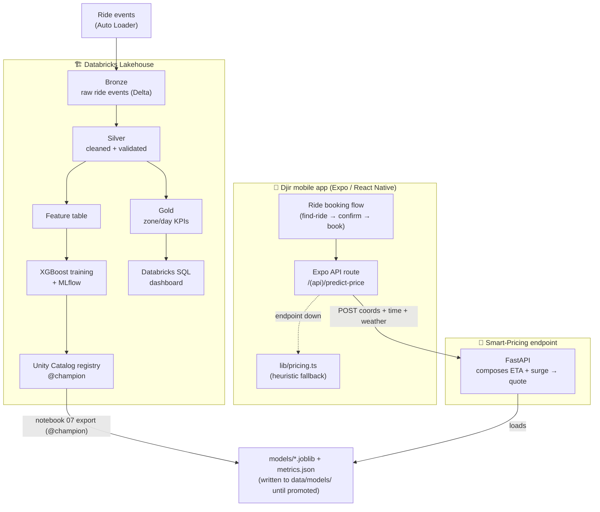
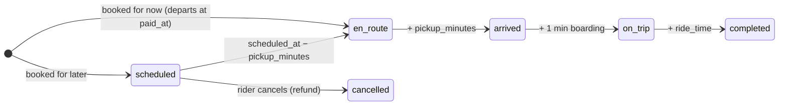

# Djir — Architecture & Decision Records

This document covers both halves of Djir:

- **The ML platform** (§1–§4, ADR-001 to ADR-008): the lakehouse and models that price rides.
- **The app** (§6–§7, ADR-009 to ADR-014): booking and payment, live tracking and scheduling.

For setup see the root [`README.md`](../README.md). The ML runbook is
[`ml-platform/README.md`](../ml-platform/README.md). The v1.1 work is planned in
[`BUILD_PLAN.md`](BUILD_PLAN.md) and was motivated by [`REVIEW.md`](REVIEW.md).

---

## 1. System context



## 2. The closed loop (request → price)

```mermaid
sequenceDiagram
    participant U as Rider
    participant A as App (useDriverQuotes)
    participant R as /(api)/predict-price
    participant M as ML endpoint
    U->>A: pick destination (and a pickup time)
    A->>R: POST pickup, dropoff, scheduled_at?
    alt ML_ENDPOINT_URL set and answers within 2.5 s
        R->>M: pickup, dropoff, when (UTC instant)
        M->>M: Zagreb clock → features → ETA + surge models
        M-->>R: {eta, surge, total_fare}
    else unset, slow or failing
        R->>R: lib/pricing.ts (a cent-exact port of djir_ml/pricing.py)
    end
    R-->>A: fare_cents, ETA, surge + a signed quote_token (10 min)
    A->>U: one fare on every driver card; paying books exactly that fare
```

## 3. Medallion data flow

| Layer | Table | Contract | Notebook |
|---|---|---|---|
| Bronze | `bronze_rides` | raw events + ingest metadata, append-only | `01_ingest_bronze` |
| Silver | `silver_rides` | typed, deduped, cancelled/null dropped, `CHECK` constraint | `02_transform_silver` |
| Gold | `gold_zone_hourly`, `gold_daily_kpis`, `gold_zone_flows` | business aggregates | `03_aggregate_gold` |
| Feature | `features_rides` | the model features and labels, plus `ride_id`, `requested_at` (the time split), `fare_amount_eur` and `payment_status` (the paid filter) | `04_feature_engineering` |

## 4. Models

Both are scikit-learn `Pipeline`s (`OneHotEncoder` → `XGBRegressor`), so the saved
artifact carries its own preprocessing and serving just passes raw features.

| | **ETA model** | **Surge model** |
|---|---|---|
| Target | `duration_min` | `surge_multiplier` |
| Features | distance, hour, day, weekend, rush, traffic, pickup/dropoff zone, weather | hour, day, weekend, rush, pickup zone, weather |
| Why these | all derivable from a request at quote time | all observable when the rider opens the app |
| Naive baseline | flat-speed ETA: MAE 7.58 min | global mean surge: MAE 0.263× |
| Informed baseline | Djir's heuristic ETA: MAE 3.12 min | Djir's heuristic surge: MAE 0.193× |
| Result | MAE 3.18 min (−58% vs naive, **+2% vs informed**), R² 0.883 | MAE 0.065× (−75% vs naive, −66% vs informed), R² 0.938 |

The fare is then deterministic:
`base = 2.00 + 0.80·km + 0.20·min`, `total = max(3.50, base · surge)` (EUR).

---

## 5. Architecture Decision Records

### ADR-001 — Generate data with real latent structure, not noise
**Decision.** The simulator models commute flows (residential→centre AM,
reverse PM), a double-peaked demand curve, weekend nightlife, per-day weather
that slows traffic and lifts demand, and an inelastic driver supply.
**Why.** A model is only as interesting as the signal in its data. Random data
would yield a meaningless model; structured data lets XGBoost learn genuine
patterns and lets the dashboard tell a real story.

### ADR-002 — Medallion architecture on Delta
**Decision.** Bronze (raw) → Silver (clean) → Gold (aggregates), each a Delta
table, with Auto Loader ingestion and a Delta `CHECK` constraint.
**Why.** It is the standard, legible lakehouse pattern and separates concerns:
provenance in Bronze, data quality in Silver, business shaping in Gold. The ~3.5%
cancelled/null rides give the Silver layer real cleaning work.

### ADR-003 — Be explicit that the data is synthetic; report both baselines
**Decision.** Document the synthetic nature prominently. Evaluate on a
**time-based** hold-out and compare each model with two baselines: a **naive**
one (flat-speed ETA, mean surge) and the **informed** heuristic Djir ships as
its fallback. `scripts/evaluate_baselines.py` re-scores the committed models
against both.
**Why.** Reporting only the naive baseline flattered the ETA model. The informed
heuristic shares the generator's physics, so on synthetic data the ETA model
cannot beat it: 3.18 vs 3.12 min. We report that rather than hide it. The surge
model beats the informed heuristic by 66%, but not only because demand depends
on zones and interactions the formula ignores: the heuristic's surge is also
known to be miscalibrated against the data (R62, deferred: Friday nights too
low, Sunday nights too high), so part of the gap is plain hour × day × weather
calibration. How much each explains is not measured; a third baseline, the
training mean per (hour, day, weather), would separate them. Real ride logs
would replace the generator, and then the ETA comparison becomes the one to
watch. That is not a drop-in swap: the app's `rides` table lacks most of the
columns Silver needs, so a ride-event data contract has to come first (R72,
deferred; see §8).

### ADR-004 — Two serving paths: managed + portable
**Decision.** Support **Databricks Model Serving** (managed, autoscaling) *and* a
**FastAPI** container that loads the same model artifacts and composes the ETA +
surge predictions into one quote.
**Why.** Free Databricks tiers may not expose managed serving, and a reviewer
should be able to `docker run` the demo in seconds. The mobile app needs a single
*composed* quote (ETA + surge + fare), which the FastAPI layer provides; the
artifacts are identical to the registered models.

### ADR-005 — Default weather to "clear" at serving time
**Decision.** The quote endpoint accepts an optional `weather` field, defaulting
to `clear`.
**Why.** The app has no live weather feed today. Defaulting keeps the contract
simple; wiring a weather API into the Expo route later is a drop-in change because
weather is already a first-class model feature.

### ADR-006 — One shared library + a verified TypeScript port
**Decision.** `djir_ml` is the single source of truth for the zone table, pricing
physics, features and training. The app's `lib/pricing.ts` fallback is a
line-for-line port of `djir_ml/pricing.py`. `scripts/export_parity_fixtures.py`
exports 442 golden trips from Python (30 of them straddling the DST switches,
12 with an ETA on a rounding tie where `Math.round` and Python's `round`
disagree) plus 30 rounding cases for `pyRound` itself. Jest asserts the port
against them to the cent, and pytest fails if the committed fixture goes stale.
Parity needs Python's half-even `round()` (`pyRound`) and distance rounded to
3 dp, as `features.py` does. No trip can do the same for the fare: for every
speed and surge the heuristic uses and every whole-metre distance up to 60 km,
`Math.round` and Python's `round` give the same fare (pytest checks all of
them), so the rounding ties are all in the ETA.
**Why.** Eliminates drift between how data is generated, how models are trained,
how serving falls back, and how the app falls back.

### ADR-007 — Localize to Zagreb in EUR
**Decision.** Real Zagreb zones; all money in EUR.
**Why.** Croatia adopted the euro in 2023, and a concrete city makes the demand
model and dashboard tangible and distinctive instead of generic.

### ADR-008 — Databricks Free Edition over the legacy Community Edition
**Decision.** Target **Databricks Free Edition** (serverless; Unity Catalog +
MLflow + Databricks SQL).
**Why.** Community Edition is legacy, lacks Unity Catalog and managed serving, and
is being wound down. Free Edition matches the modern stack the notebooks use.

---

## 6. App architecture

```
app/        screens and API routes: thin (route() → auth → parse → act → return)
components/ UI: props in, JSX out; every state has a testID
hooks/      React state and effects; logic is delegated to lib/
lib/        PURE: no React, no I/O, no current time (the clock is a parameter)
services/   client I/O: fetchAPI, quotes, booking, reminders, auth
server/     server only: auth, quote tokens, rides/payments, db, stripe
store/      Zustand: location · drivers · booking, each with reset()
```

ESLint enforces these layers (`.eslintrc.js`, overrides per folder). `lib/`
can't import React, Expo, services or the server, and can't read the clock. App
code can't import `server/`, `stripe` or the database driver. Only
`lib/zagreb-time.ts` may turn an instant into wall-clock time.

**A ride's phase** is derived from the ride row and a clock. Nothing stores it:



## 7. App decision records

### ADR-009 — A ride's state is a pure function of (ride row, clock)
**Decision.** `lib/tracking.ts` derives the phase, the minutes left and the
progress through the current leg from `paid_at` or `scheduled_at`,
`pickup_minutes`, `ride_time` and `cancelled_at`, plus the current time.
Windows are half-open `[start, end)`. Every ETA rounds up, so the first
"Arriving in N Mins" equals the pickup time the rider was quoted.
**Why.** There is no status column and no background job. Reopening the app
after a crash recomputes the same answer. The history badges, the Home banner,
the tracker and the reminders can't disagree, because they all call one
function. The app uses the server's clock (`server_time`), so a phone whose
clock is off still shows the right phase.

### ADR-010 — A simulated driver behind a `PositionSource`
**Decision.** Djir has no driver app, so the car's position is simulated along
straight legs (driver start → pickup → destination). The tracking sheet says so
on every platform: "Simulated driver · Djir has no driver app yet" (F8). On the
web, where the route is drawn on a plain grid, the map also carries the pill
"Simulated position · map in the iOS and Android app". Each driver's start is
seeded by the driver id on a 1.5–4 km ring around the pickup, so the car you
picked is the car you track. The source sits behind a
`PositionSource(ride, legs, nowMs)` seam.
**Why.** The timeline comes from real booking data; only the dot on the map is
invented, and the UI says so. A GPS feed would implement the same signature.
Road geometry (Directions) was cut: it needs a server-side key proxy, and it
would have made the tests non-deterministic. Figma 14's title "Choose a Rider"
is a copy artefact; the screen says "Your Ride".

### ADR-011 — A Zagreb service clock without `Intl`
**Decision.** `lib/zagreb-time.ts` implements the EU daylight-saving rule
directly: last Sunday of March and of October at 01:00 UTC. Hour, weekday and
labels come only from it. Python converts aware instants with `zoneinfo`.
**Why.** Pricing depends on rush hour, and v1.0 read the hour in UTC on one side
and the server's zone on the other (R06). Hermes' `Intl` time-zone support differs
between platforms and versions, so a dependency-free rule is safer. A test compares it with Node's
`Intl` for every hour from 2020 to 2035, and the suite runs under
`TZ=America/Los_Angeles` to catch any leak of the machine's zone.

### ADR-012 — Scheduling: a 15-minute grid, a free cancel, local reminders
**Decision.** Slots are UTC instants every 15 minutes, labelled in Zagreb time.
They run from 30 minutes to 7 days ahead, and the server allows 5 minutes of
grace. The repeated hour on the October DST switch is labelled "02:15 CEST" and
"02:15 CET". A scheduled ride is prepaid and can be cancelled for a full refund
until its driver sets off. Rides booked for now can't be cancelled. A scheduled
ride gets a local notification 10 minutes before its driver sets off. The
reminders are re-derived from ride history on every load, so they follow a
cancel, a new device or a sign-out.
**Why.** Charging up front keeps one payment path for both kinds of ride, and a
free cancel makes that fair. Local notifications need no push server and work in
Expo Go; remote push is §11 of the build plan. History shows absolute times
("3 Oct 2026, 23:30", 24 h) and sorts Live → Upcoming → past. Figma 15's 12 h
format and "Ascending" sort are deliberate deviations.

### ADR-013 — Reserve-first booking with a signed quote
**Decision.** `/predict-price` returns an HMAC-signed quote: fare in cents,
trip, slot, valid for 10 minutes. `/ride/book` takes only that token, the
driver, the addresses and a payment method. It then runs these steps in order:
1. insert the ride as `pending`;
2. create an unconfirmed, card-only PaymentIntent (idempotency key
   `ride-{id}-{uuid}`);
3. save the PaymentIntent id on the ride;
4. confirm the PaymentIntent;
5. mark the ride `paid`, with `paid_at` = the charge time (Stripe's
   `latest_charge.created`), the same rule `/ride/confirm` and reconcile use.
   A ride booked for now departs at `paid_at`.

`GET /rides` reconciles pending rides, and paid rides with an open cancel
(`cancel_requested_at`, X23), through one transition table
(`nextPaymentState`): at most 3 per read, in parallel within 2 s. Rows never
checked come first, newest first (by booking or cancel request, so the ride
the rider just paid for settles on the next read); then the least recently
checked (`reconciled_at`, stamped before every attempt); then the oldest. A row
Stripe keeps failing on therefore can't block the others. An abandoned 3-D
Secure challenge is cancelled at Stripe after 30 minutes; a payment still
`processing` is left alone; a PaymentIntent Stripe no longer knows
(`resource_missing`) fails the ride. When the outcome of a booking is unknown,
the 502 names the ride, and the app confirms that ride itself.
**Trade-off.** There is no Stripe webhook yet, so a payment or refund whose
answer was lost settles when the rider next reads their history, not on its
own (plan §11).
**Why.** v1.0 charged whatever amount the client sent, and it could charge
without ever recording a ride (R04, R05). Now no money can move before a ride
row exists that points at the PaymentIntent, and an unknown outcome is settled
later instead of guessed. The invariant "every succeeded payment ↔ exactly one
visible ride" is tested against a real Postgres (PGlite) through 11 crash,
race and starvation scenarios (`__tests__/api/booking.test.ts`, M1–M11).

### ADR-014 — Clerk session tokens verified without a network call
**Decision.** API routes verify the Clerk JWT with WebCrypto against
`CLERK_JWT_KEY`. The checks are: RS256 only, `exp`/`nbf` within ±5 s, a
non-empty `sub`, and `iss` equal to the issuer encoded in the publishable key.
If the issuer can't be derived, verification fails closed. Only `GET /driver`
and `POST /predict-price` are public; a test fails if a new route appears
without a decision.
**Why.** v1.0's payment and ride routes trusted a `user_id` in the body (R01).
Networkless verification adds no latency or dependency to each request, and it
runs the same in Node and in Expo's server runtime.

## 8. Limitations & next steps

* **Synthetic data** — the headline result is "the platform works end-to-end",
  not a novel ML finding (ADR-003). On ETA the model only matches the informed
  heuristic.
* **Surge ≠ true market clearing** — surge is demand-pressure-driven, not a real
  supply/demand equilibrium with driver repositioning.
* **No live weather / traffic** at serving time (ADR-005).
* **No real ride feed yet** — the app's `rides` table stores a booking and its
  payment, not the event schema Silver reads: it has no surge multiplier,
  weather or measured trip duration (`ride_time` is the quoted one), and its
  other columns have different names. Streaming app rides into Bronze needs a
  ride-event data contract first (R72).
* **Simulated drivers** — positions are simulated (ADR-010); there is no driver
  app, so chat with a driver is not built (build plan §11).
* **Next:** define that contract and stream real ride events into Bronze; add a
  demand-forecasting model for driver positioning; A/B the ML price vs. the
  heuristic; move the feature table into the Databricks Feature Store.
