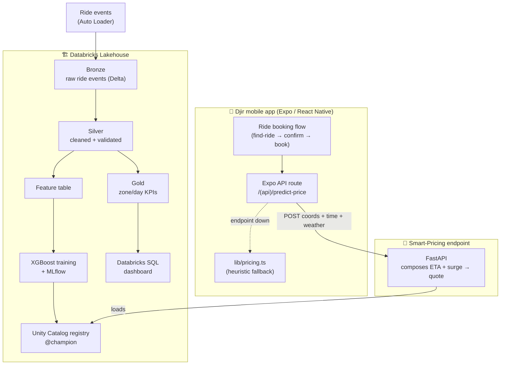
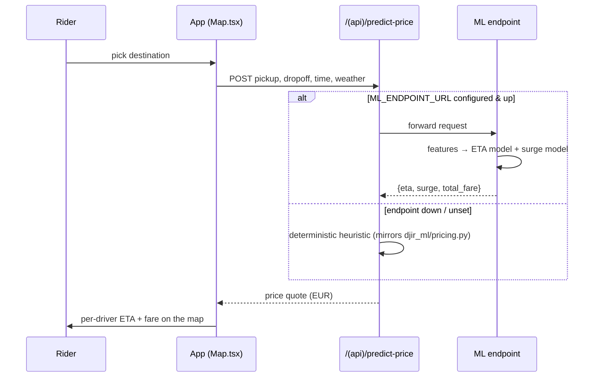

# Djir — Architecture & Decision Records

This document covers the **Djir ML Platform**: the lakehouse + ML system that
prices rides for the mobile app. For the app itself see the root
[`README.md`](../README.md); for the runbook see
[`ml-platform/README.md`](../ml-platform/README.md).

---

## 1. System context

## 2. The closed loop (request → price)

## 3. Medallion data flow

| Layer | Table | Contract | Notebook |
|---|---|---|---|
| Bronze | `bronze_rides` | raw events + ingest metadata, append-only | `01_ingest_bronze` |
| Silver | `silver_rides` | typed, deduped, cancelled/null dropped, `CHECK` constraint | `02_transform_silver` |
| Gold | `gold_zone_hourly`, `gold_daily_kpis`, `gold_zone_flows` | business aggregates | `03_aggregate_gold` |
| Feature | `features_rides` | exact union of model features + labels | `04_feature_engineering` |

## 4. Models

Both are scikit-learn `Pipeline`s (`OneHotEncoder` → `XGBRegressor`), so the saved
artifact carries its own preprocessing and serving just passes raw features.

| | **ETA model** | **Surge model** |
|---|---|---|
| Target | `duration_min` | `surge_multiplier` |
| Features | distance, hour, day, weekend, rush, traffic, pickup/dropoff zone, weather | hour, day, weekend, rush, pickup zone, weather |
| Why these | all derivable from a request at quote time | all observable when the rider opens the app |
| Baseline | naive flat-speed ETA | global mean surge |
| Result | MAE 3.18 min (−58%), R² 0.883 | MAE 0.065× (−75%), R² 0.938 |

The fare is then deterministic:
`base = 2.00 + 0.80·km + 0.20·min`, `total = max(3.50, base · surge)` (EUR).

---

## 5. Architecture Decision Records

### ADR-001 — Generate data with real latent structure, not noise
**Decision.** The simulator models commute flows (residential→centre AM,
reverse PM), a double-peaked demand curve, weekend nightlife, per-day weather
that slows traffic and lifts demand, and an inelastic driver supply.
**Why.** A model is only as interesting as the signal in its data. Random data
would yield a meaningless model; structured data lets XGBoost learn genuine
patterns and lets the dashboard tell a real story.

### ADR-002 — Medallion architecture on Delta
**Decision.** Bronze (raw) → Silver (clean) → Gold (aggregates), each a Delta
table, with Auto Loader ingestion and a Delta `CHECK` constraint.
**Why.** It is the standard, legible lakehouse pattern and separates concerns:
provenance in Bronze, data quality in Silver, business shaping in Gold. The ~3.5%
cancelled/null rides give the Silver layer real cleaning work.

### ADR-003 — Be explicit that the data is synthetic; pick honest baselines
**Decision.** Document the synthetic nature prominently. Evaluate on a
**time-based** hold-out and compare each model to a **naive** baseline (flat-speed
ETA; mean surge) — never to the generator's own formula.
**Why.** Comparing against the generating function would be circular and the model
could not "win". A naive baseline is what a real app would actually do, so the
reported improvement (−58% / −75%) reflects real added value. On real ride logs
the generator is simply removed; nothing else changes.

### ADR-004 — Two serving paths: managed + portable
**Decision.** Support **Databricks Model Serving** (managed, autoscaling) *and* a
**FastAPI** container that loads the same model artifacts and composes the ETA +
surge predictions into one quote.
**Why.** Free Databricks tiers may not expose managed serving, and a reviewer
should be able to `docker run` the demo in seconds. The mobile app needs a single
*composed* quote (ETA + surge + fare), which the FastAPI layer provides; the
artifacts are identical to the registered models.

### ADR-005 — Default weather to "clear" at serving time
**Decision.** The quote endpoint accepts an optional `weather` field, defaulting
to `clear`.
**Why.** The app has no live weather feed today. Defaulting keeps the contract
simple; wiring a weather API into the Expo route later is a drop-in change because
weather is already a first-class model feature.

### ADR-006 — One shared library + a verified TypeScript port
**Decision.** `djir_ml` is the single source of truth for the zone table, pricing
physics, features and training. The app's `lib/pricing.ts` fallback is a
line-for-line port of `djir_ml/pricing.py`, checked to agree to the cent.
**Why.** Eliminates drift between how data is generated, how models are trained,
how serving falls back, and how the app falls back.

### ADR-007 — Localize to Zagreb in EUR
**Decision.** Real Zagreb zones; all money in EUR.
**Why.** Croatia adopted the euro in 2023, and a concrete city makes the demand
model and dashboard tangible and distinctive instead of generic.

### ADR-008 — Databricks Free Edition over the legacy Community Edition
**Decision.** Target **Databricks Free Edition** (serverless; Unity Catalog +
MLflow + Databricks SQL).
**Why.** Community Edition is legacy, lacks Unity Catalog and managed serving, and
is being wound down. Free Edition matches the modern stack the notebooks use.

---

## 6. Limitations & next steps

* **Synthetic data** — the headline result is "the platform works end-to-end",
  not a novel ML finding (ADR-003).
* **Surge ≠ true market clearing** — surge is demand-pressure-driven, not a real
  supply/demand equilibrium with driver repositioning.
* **No live weather / traffic** at serving time (ADR-005).
* **Next:** stream real app ride events into Bronze; add a demand-forecasting
  model for driver positioning; A/B the ML price vs. the heuristic; move the
  feature table into the Databricks Feature Store.
